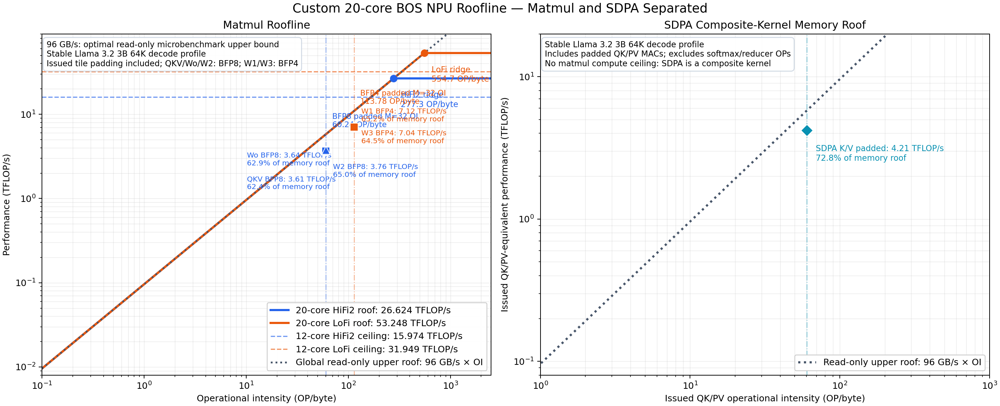

# BOS 1/2-reader single-bank DRAM-sharded saturation

## 요약

Custom 20-core BOS NPU에서 실제 single-view DRAM-sharded buffer와 endpoint-adjacent reader 하나를
사용했다. 단일 reader의 최고 측정치는 28.454 GB/s였다. 안정 plateau는 다음 조건에서 형성됐다.

- NoC packet: 4 KiB
- tagged issue batch: 32--128 KiB, 최고점 64 KiB
- pipeline depth: 2
- working set: 1 MiB
- payload: 100.663 MB/run

이 결과는 single-reader software/data-path ceiling이었다. 같은 physical bank의 두 endpoints에 reader를
하나씩 배치하자 aggregate bandwidth는 51.297 GB/s까지 증가했다. 16 KiB coalesced request 기준 세 bank는
51.30--52.50 GB/s였다. 따라서 28.45 GB/s는 physical-bank ceiling이 아니며, endpoint-level concurrency가
bank bandwidth 활용에 필수다.

## 장치와 topology

- board: custom 20-core BOS NPU
- runtime/code architecture: Blackhole
- available worker grid: 5x4
- physical DRAM: 3 banks
- worker NoC endpoints: bank당 2개, 총 6개
- allocation: 선택한 runtime DRAM view 하나에 `BufferDistributionSpec`으로 직접 shard
- reader: 선택 endpoint와 Manhattan distance 1인 worker 하나

표준 P100/P150 SKU로 판정하지 않았다. UMD의 P100 warning은 board identity 근거로 사용하지 않는다.

## 구현

소스:

```text
/home/iris_hb4/tt-metal-hb4/tests/tt_metal/tt_metal/perf_microbenchmark/
12_dram_20_core_6_noc_read/test_dram_20_core_6_noc.cpp
```

새 opt-in:

```text
--reader-config one-reader-sharded
--reader-config two-reader-sharded
--physical-bank {0,1,2}
--endpoint-side {0,1}
```

Patch:

```text
/home/iris_hb4/tmp/codex-patches/20260816-020000-one-reader-single-bank-sharded-auto.patch
```

기존 `reader_dram.cpp`의 full-barrier/tagged, depth 1/2/3, timestamp breakdown을 재사용했다. 각 page는
`noc_async_read_one_packet` 한 건이다. `pages-per-block`은 coalesced DRAM transaction 크기가 아니라 같은
transaction ID로 issue한 뒤 retire하는 packet batch 크기다.

## 측정법

- 1 MiB unique working set 고정
- 96 iterations
- warmup 1회
- measured 5회
- host enqueue-to-finish 시간으로 bandwidth 계산
- 각 구성에서 final L1 block validation
- 모든 run exit 0, validation pass, normal device close
- 각 process에 `timeout --signal=INT --kill-after=15s 60s` 적용

## Packet-size sweep

Tagged depth2와 issue batch 16 KiB를 고정했다.

| packet | pages/batch | bandwidth |
|---:|---:|---:|
| 512 B | 32 | 10.423 GB/s |
| 1 KiB | 16 | 19.709 GB/s |
| 2 KiB | 8 | 26.081 GB/s |
| 4 KiB | 4 | 27.753 GB/s |
| 8 KiB | 2 | 27.217 GB/s |
| 16 KiB | 1 | 27.035 GB/s |

4 KiB가 최고다. 512 B와 1 KiB는 packet issue overhead가 크다. 8--16 KiB는 추가 이득이 없었다.

## Tagged batch sweep

Packet 4 KiB, depth2를 고정했다.

| tagged batch | packets/batch | bandwidth |
|---:|---:|---:|
| 4 KiB | 1 | 12.063 GB/s |
| 8 KiB | 2 | 19.313 GB/s |
| 16 KiB | 4 | 27.457 GB/s |
| 32 KiB | 8 | 28.192 GB/s |
| 64 KiB | 16 | 28.358 GB/s |
| 128 KiB | 32 | 28.080 GB/s |

32 KiB부터 plateau다. 64 KiB가 최고지만 32--128 KiB 차이는 약 1%다. 128 KiB로 늘려도 개선되지
않으므로 issue batch 부족은 이 범위에서 해소됐다.

## Pipeline depth sweep

Packet 4 KiB, tagged batch 64 KiB를 고정했다.

| depth | bandwidth | depth2 대비 |
|---:|---:|---:|
| 1 | 22.783 GB/s | -19.92% |
| 2 | 28.452 GB/s | 기준 |
| 3 | 28.221 GB/s | -0.81% |

Depth1에서 depth2는 +24.88%다. Depth3는 추가 이득이 없다. 두 tagged batches가 latency hiding에
충분하다.

같은 geometry의 full-barrier는 22.872 GB/s였다. Tagged depth2는 full-barrier보다 +24.39%다.

## Bank와 endpoint sweep

Packet 4 KiB, batch 64 KiB, depth2를 고정했다.

| physical bank | endpoint side | endpoint | NoC | reader | bandwidth |
|---:|---:|---:|---:|---|---:|
| 0 | 0 | x0 | 0 | (0,2) | 28.154 GB/s |
| 0 | 1 | x1 | 1 | (1,2) | 28.388 GB/s |
| 1 | 0 | x5 | 0 | (4,2) | 28.452 GB/s |
| 1 | 1 | x2 | 1 | (2,2) | 28.454 GB/s |
| 2 | 0 | x4 | 0 | (4,2) | 28.175 GB/s |
| 2 | 1 | x3 | 1 | (3,2) | 28.061 GB/s |

최대/최소 spread는 약 1.40%다. 이 배치에서는 bank나 NoC 선택보다 single-reader issue/service cadence가
더 큰 변수다.

## Timestamp breakdown

Bank1, endpoint side1, packet 4 KiB, batch 64 KiB, depth2:

| component | kernel cycles 비율 |
|---|---:|
| issue | 52.33% |
| retire wait | 40.30% |
| tail drain | 0.06% |
| other | 7.31% |

- observed latency mean: 2,115 cycles
- latency min/max: 1,142/2,606 cycles
- wait p50/p95: 601/649 cycles
- ready-on-arrival estimate: 1.56%

Reader는 대부분 batch retire 시점에 아직 완료를 기다린다. 동시에 issue 자체도 수행시간 절반을
차지한다. Depth3가 성능을 높이지 않은 점과 함께 보면 outstanding 부족 하나만의 병목은 아니다.

## Same-layout 16 KiB coalescing A/B

DRAM allocation page는 4 KiB로 유지했다. 연속 4 pages를 실제 16 KiB one-packet command 하나로
병합했다. Working set, 주소, 64 KiB tagged batch, depth2와 payload는 동일하다.

| coalesce | NoC request | requests/64 KiB batch | bandwidth |
|---:|---:|---:|---:|
| 1 page | 4 KiB | 16 | 28.185 GB/s |
| 2 pages | 8 KiB | 8 | 28.055 GB/s |
| 4 pages | 16 KiB | 4 | 28.196 GB/s |

16 KiB coalescing은 request count를 4분의 1로 줄였지만 throughput을 높이지 않았다.

Timestamp breakdown:

| request | total cycles | issue | retire wait | tail |
|---:|---:|---:|---:|---:|
| 4 KiB | 2,279,256 | 52.36% | 40.27% | 0.06% |
| 16 KiB | 2,278,173 | 13.48% | 79.09% | 0.06% |

Coalescing은 issue 비율을 38.88 percentage points 줄였다. 절약된 시간이 retire wait로 이동했고 total
cycles는 사실상 같았다. Host command queue나 BRISC command 생성이 single-reader throughput 상한은
아니다. 16 KiB request의 service completion을 기다리는 시간이 지배한다.

## Two-reader single-bank 결과

같은 physical bank의 두 worker endpoints에 endpoint-adjacent reader를 하나씩 배치했다. 두 reader는
서로 다른 DRAM shard를 읽고, NoC0과 NoC1을 하나씩 사용한다. 각 reader payload는 100.663 MB이며 합산
payload는 201.327 MB/run이다. Packet 4 KiB, tagged batch 64 KiB, depth2를 고정했다.

Bank1 coalescing A/B:

| readers | request | bandwidth | single-reader 16 KiB 대비 |
|---:|---:|---:|---:|
| 1 | 16 KiB | 28.196 GB/s | 기준 |
| 2 | 4 KiB | 49.412 GB/s | +75.25% |
| 2 | 16 KiB | 51.297 GB/s | +81.93% |

두 reader에서 16 KiB coalescing은 4 KiB request 대비 +3.81%다. Single-reader에서는 coalescing 효과가
없었지만, endpoint concurrency가 늘어난 상태에서는 issue 절감이 작게나마 aggregate throughput을 높였다.

Bank sweep, 16 KiB request:

| physical bank | endpoints | readers | aggregate bandwidth |
|---:|---|---|---:|
| 0 | x0/x1 | (0,2)/(1,2) | 52.113 GB/s |
| 1 | x5/x2 | (4,2)/(2,2) | 51.297 GB/s |
| 2 | x4/x3 | (4,2)/(3,2) | 52.495 GB/s |

최대/최소 spread는 2.31%다. 세 bank 모두 약 52 GB/s에 수렴했다.

Bank1 breakdown 재측정은 51.454 GB/s였다.

| component | 두 reader 합산 core-cycle 비율 |
|---|---:|
| issue | 11.22% |
| retire wait | 81.95% |
| tail drain | 0.06% |
| other | 6.76% |

- reader별 observed latency mean: 3,010/2,971 cycles
- aggregate latency mean: 2,990 cycles
- wait p50/p95: 1,353/1,505 cycles
- start skew: 23 cycles
- finish skew: 2,675 cycles

두 endpoint가 동시에 요청하면서 single-reader보다 aggregate BW는 1.82배가 됐지만, service latency와
retire wait도 증가했다. 두 reader가 한 physical bank의 service capacity를 경쟁하는 상태다. 51--52 GB/s가
bank plateau인지 확정하려면 같은 bank에 3개 이상 reader를 붙여 추가 plateau를 확인해야 한다.

## Six-reader three-bank 동시 결과

세 physical banks를 동시에 구동했다. 각 bank의 두 endpoints에 reader를 하나씩 배치해 총 6 readers를
사용했다. NoC0/NoC1은 3 readers씩이며, 각 endpoint payload는 100.663 MB, 합산 payload는
603.980 MB/run이다. Allocation은 6 runtime DRAM views에 각각 독립 shard를 배치했다.

| depth | breakdown | average | min--max |
|---:|---|---:|---:|
| 2 | off | 96.051 GB/s | 94.029--97.342 GB/s |
| 2 | on | 96.461 GB/s | 95.139--97.526 GB/s |
| 3 | off | 95.977 GB/s | 93.739--97.921 GB/s |

독립 single-bank 결과의 단순합은 155.905 GB/s다. 실제 동시 실행 96.051 GB/s는 그 값의 61.61%다.
Depth3는 depth2보다 -0.08%로 차이가 없다.

Depth2 breakdown:

| component | 6 readers 합산 core-cycle 비율 |
|---|---:|
| issue | 7.08% |
| retire wait | 88.61% |
| tail drain | 0.05% |
| other | 4.27% |

- aggregate latency mean: 4,893 cycles
- wait p50/p95: 2,296/2,640 cycles
- ready-on-arrival estimate: 8.85%
- start skew: 29 cycles
- finish skew: 128,556 cycles

Bank1 단독 two-reader latency mean 2,990 cycles와 비교하면 세 bank 동시 구동에서 +63.65%다. Issue 비율은
11.22%에서 7.08%로 줄고 retire wait는 81.95%에서 88.61%로 증가했다. 6 endpoints와 두 NoC의 traffic은
균등하므로 단순 bank/NoC load imbalance는 아니다. 공유 DRAM service path, NoC fabric 또는 endpoint 이후
공유 자원에서 발생한 backpressure를 현재 timestamp만으로 분리할 수 없다.

### Global placement와 VC coloring A/B

초기 six-reader 배치는 endpoint 순서 greedy였다. Endpoint x5 reader가 virtual (4,1)에 배치되어 최대
Manhattan distance 3, 총 거리 8이었다. 또한 같은 NoC0/worker-row의 x0과 x4가 VC0을 공유했다.

Dynamic-programming assignment로 최대 거리를 먼저 최소화하고 총 거리를 두 번째로 최소화했다. 결과는
최대 거리 2, 총 거리 7이다. Endpoint x5 reader는 virtual (4,4)로 이동했다. 같은 endpoint 또는
same-row route가 같은 VC를 쓰지 않도록 edge coloring도 적용했다.

| placement | bandwidth | 변화 |
|---|---:|---:|
| endpoint-order greedy | 96.051 GB/s | 기준 |
| global min-max + VC coloring | 96.115 GB/s | +0.067% |

Global placement breakdown run은 96.154 GB/s였다.

| metric | greedy | global |
|---|---:|---:|
| aggregate latency mean | 4,893 cycles | 4,931 cycles |
| retire wait | 88.61% | 88.69% |
| finish skew | 128,556 cycles | 11,607 cycles |

Global placement는 reader 종료 불균형을 크게 줄였지만 steady-state bandwidth와 service latency는 개선하지
못했다. Cross-shard 접근, endpoint 거리, 명시적 VC collision은 six-reader 96 GB/s 지점의 지배 원인이
아니다. 다만 reader 수를 6개보다 늘리지 않았으므로 이 값이 hard ceiling인지는 미확정이다.

## Bank-reader matrix

같은 16 KiB one-packet request와 depth2에서 active physical bank 수와 bank당 reader 수를 독립적으로
바꿨다. 각 reader는 endpoint-local DRAM shard만 읽었다. 표 값은 5회 평균이다.

| physical banks | readers per bank | total readers | bandwidth | single-reader 선형합 대비 |
|---:|---:|---:|---:|---:|
| 1 | 1 | 1 | 28.146 GB/s | 100.0% |
| 1 | 2 | 2 | 51.990 GB/s | 92.4% |
| 2 | 1 | 2 | 52.004 GB/s | 92.4% |
| 2 | 2 | 4 | 75.075 GB/s | 66.7% |
| 3 | 1 | 3 | 64.639 GB/s | 76.6% |
| 3 | 2 | 6 | 96.115 GB/s | 56.9% |

핵심 대조는 `1 bank × 2 readers = 51.990 GB/s`와 `2 banks × 1 reader = 52.004 GB/s`다.
차이는 0.03%다. 두 readers를 한 physical bank에 붙이거나 두 banks에 나눠도 aggregate가 같다.
따라서 현재 path의 scaling은 단순한 독립 bank bandwidth 합이 아니라 total outstanding reader concurrency와
공유 service path의 영향을 강하게 받는다.

Timestamp breakdown도 reader 수가 늘수록 service latency와 completion wait가 증가했다.

| total readers | tested topology | latency mean | retire wait | ready on arrival |
|---:|---|---:|---:|---:|
| 1 | 1 bank × 1 | 2,689 cycles | 79.09% | - |
| 2 | 1 bank × 2 | 2,990 cycles | 81.95% | - |
| 3 | 3 banks × 1 | 3,584 cycles | 85.01% | 40.62% |
| 4 | 2 banks × 2 | 4,108 cycles | 86.56% | 23.83% |
| 6 | 3 banks × 2 | 4,931 cycles | 88.69% | - |

Reader 1→6에서 평균 latency는 +83.4% 증가했다. Issue 비율이 아니라 retire wait가 커졌다.
이는 queue/shared-service backpressure와 일치한다. 현재 endpoint timestamp만으로 DRAM controller, endpoint
arbitration, aggregate NoC path 중 정확한 위치는 분리할 수 없다.

Request fragmentation도 주원인으로 보기 어렵다. Kernel은 `page_size × coalesce_pages = 16 KiB`를
`noc_async_read_one_packet_with_state` 한 번으로 issue한다. Blackhole `NOC_MAX_BURST_SIZE`도 16 KiB이며,
low-level API는 `NOC_AT_LEN_BE`에 16 KiB를 직접 기록한다. TT dataflow API가 이를 네 개 4 KiB request로
분할하지 않는다. DRAM 내부 beat/burst 분할은 정상 controller 동작이며 별도 NoC command fragmentation이 아니다.

## Single-bank reader-count saturation

Physical bank0의 두 endpoints x0/x1에 readers를 균등 배치했다. Endpoint x0는 NoC0, x1은 NoC1을
사용한다. 모든 reader는 해당 endpoint-local shard를 unit-stride 16 KiB one-packet으로 읽었다.

| total readers | readers per endpoint | bandwidth | min--max | retire wait (timestamp run) | latency mean (timestamp run) | 2-reader 대비 |
|---:|---:|---:|---:|---:|---:|---:|
| 1 | 1:0 | 28.209 GB/s | 28.104--28.301 | 79.09% | 2,689 cycles | -45.78% |
| 2 | 1:1 | 52.023 GB/s | 51.959--52.099 | 81.72% | 2,949 cycles | 기준 |
| 4 | 2:2 | 51.569 GB/s | 51.525--51.641 | 90.99% | 6,272 cycles | -0.87% |
| 6 | 3:3 | 51.378 GB/s | 51.275--51.503 | 94.03% | 9,634 cycles | -1.24% |
| 8 | 4:4 | 51.316 GB/s | 51.282--51.376 | 95.51% | 12,943 cycles | -1.36% |

Retire wait는 profiler-free bandwidth 10회 평균과 별도의 timestamp breakdown run이다. 4-reader와
6-reader breakdown은 각각 51.727 GB/s, 51.268 GB/s에서 측정했다. 로그:

`/home/iris_hb4/benchmark_runs/dram_bank0_reader_retire_wait_2026_08_16_09_00_00/readers4.log`
`/home/iris_hb4/benchmark_runs/dram_bank0_reader_retire_wait_2026_08_16_09_00_00/readers6.log`

1→2 readers는 +84.42%다. 2→4/6/8은 개선하지 않는다. 이 access path에서 한 physical bank를
포화시키는 최소 구성은 총 2 readers, 즉 두 endpoints에 reader 하나씩이다.

| readers | breakdown bandwidth | issue | retire wait | latency mean | wait p50/p95 |
|---:|---:|---:|---:|---:|---:|
| 2 | 52.128 GB/s | 11.37% | 81.72% | 2,949 cycles | 1,312/1,456 |
| 6 | 51.268 GB/s | 3.69% | 94.03% | 9,634 cycles | 4,664/4,873 |
| 8 | 51.397 GB/s | 2.76% | 95.51% | 12,943 cycles | 6,329/6,529 |

2→8 readers에서 latency는 4.39배가 되고 retire wait는 +13.79 percentage points지만 bandwidth는
-1.40%다. 추가 readers는 bank throughput을 높이지 않고 queue/service wait만 늘린다. 이 결과는 bank0와
현재 unit-stride read path에 대한 값이다. 다른 physical banks도 기존 two-reader 결과는 약 51.3--52.5 GB/s로
비슷하지만, 4/6/8 sweep을 각각 반복하지는 않았다.

## Per-bank ceiling과 aggregate scaling

Bank0와 같은 조건으로 bank1/2에서 total reader 2/4/6/8 sweep을 반복했다. 각 bank의 두 endpoints에
reader를 균등 배치했다. Request는 unit-stride 16 KiB one-packet, tagged batch 64 KiB, depth2다.

| physical bank | 2 readers | 4 readers | 6 readers | 8 readers |
|---:|---:|---:|---:|---:|
| 0 | 52.023 GB/s | 51.569 GB/s | 51.378 GB/s | 51.316 GB/s |
| 1 | 51.666 GB/s | 51.395 GB/s | 51.076 GB/s | 49.935 GB/s |
| 2 | 51.967 GB/s | 51.608 GB/s | 51.279 GB/s | 51.269 GB/s |

세 bank 모두 2 readers에서 최고점이다. 2-reader ceiling의 최대/최소 차이는 0.357 GB/s, 평균 대비
0.69%다. Bank1의 8-reader 값은 2-reader 대비 -3.35%이고 나머지도 추가 reader로 개선되지 않았다.
따라서 bank별 최소 포화 구성은 동일하게 endpoint당 reader 하나, physical bank당 총 2 readers다.

각 bank를 위 포화점으로 고정하고, 선택 bank 조합을 동시에 실행했다. bank-mask는 bit0/1/2가
physical bank0/1/2를 뜻한다. Ideal은 같은 run에서 얻은 각 single-bank 2-reader ceiling의 합이다.

| active banks | mask | readers | measured | independent-bank ideal | scaling efficiency |
|---|---:|---:|---:|---:|---:|
| bank0+bank1 | 0x3 | 4 | 75.055 GB/s | 103.689 GB/s | 72.39% |
| bank0+bank2 | 0x5 | 4 | 77.704 GB/s | 103.990 GB/s | 74.72% |
| bank1+bank2 | 0x6 | 4 | 74.427 GB/s | 103.633 GB/s | 71.82% |
| bank0+bank1+bank2 | 0x7 | 6 | 96.139 GB/s | 155.656 GB/s | 61.76% |

Pair spread는 3.277 GB/s다. Endpoint 거리 합이 가장 짧은 bank0+2가 가장 높지만, 현재 1회 조합
sweep만으로 route distance가 원인이라고 확정하지 않는다. 단일 bank 평균 51.885 GB/s 대비 pair 평균은
75.729 GB/s, all-bank는 96.139 GB/s다. 즉 active bank를 1→2→3으로 늘릴 때 aggregate scaling은
1.00×→1.46×→1.85×이며 ideal 1×→2×→3×보다 크게 낮다.

여기서 3-bank는 BOS의 물리 DRAM bank 전체이며, 각 bank의 두 endpoint를 사용하므로 all-bank와
all-6-endpoint가 같은 구성이다. 각 run은 exit 0, validation pass, normal device close였다.

관측상 bank 자체의 개별 ceiling은 균일하지만 여러 bank를 동시에 켤 때 scaling efficiency가 감소한다.
이는 bank별 raw capacity 차이보다 bank 이후 또는 bank들 사이의 shared service path backpressure와
일치한다. 정확한 위치가 aggregate NoC인지 DRAM endpoint/controller arbitration인지는 아직 분리되지 않았다.

## Native ring isolation

Bank당 endpoint 하나만 사용해 total readers를 3으로 고정했다. Native control은 기존 endpoint 선택으로
NoC0:NoC1이 2:1이다. NoC0-only와 NoC1-only는 각 physical bank에서 해당 native ring endpoint를 하나씩
선택한다. Reader가 endpoint를 비-native ring으로 강제 접근하지 않는다.

| endpoint selection | NoC readers | bandwidth | issue | retire wait | latency mean | finish skew |
|---|---:|---:|---:|---:|---:|---:|
| native control | 2:1 | 65.014 GB/s | 9.15% | 85.09% | 3,606 cycles | 53,167 cycles |
| NoC0-only | 3:0 | 61.299 GB/s | 8.76% | 85.32% | 3,522 cycles | 805,456 cycles |
| NoC1-only | 0:3 | 67.024 GB/s | 10.41% | 83.83% | 3,562 cycles | 14,535 cycles |

모두 timestamp-enabled 5-run 값이다. NoC 하나만 써도 61.3--67.0 GB/s로 native dual-ring control의
94.3--103.1%다. 따라서 이 reader count에서 one-NoC capacity가 aggregate를 절반으로 제한하지 않는다.
NoC0-only의 낮은 throughput은 평균 latency보다 finish skew와 같이 움직인다. Endpoint x0 reader는
2.35M cycles였지만 x4/x5 readers는 각각 약 3.16M cycles였다. NoC1-only는 finish skew가 작았다.

NoC0/NoC1 차이는 ring의 고유 raw bandwidth 차이로 단정하지 않는다. 선택 endpoint set도 함께
바뀌기 때문이다. 후속 controlled placement에서 worker-row route overlap 영향은 기각됐다. Six-reader
95--96 GB/s ceiling을 단순히 단일 NoC bandwidth ceiling으로 설명하는 가설도 약해졌다.

### 2026-08-18 same-session dual-NoC 단독 A/B

Request `8 KiB`, tagged batch `64 KiB`, depth-2, DRAM-sharded, 3 physical banks, bank당 reader 1개,
`1 MiB/reader`를 고정했다. Dual control은 native endpoints `x0/x2/x4`를 사용해 NoC reader load가 `2:1`이다.
Single-ring controls는 각 bank의 native endpoint만 골라 NoC0 `x0/x5/x4`, NoC1 `x1/x2/x3`을 사용했다.
따라서 non-native ring 강제 접근은 없지만 endpoint set과 route는 NoC 선택과 함께 변한다.

실행 순서 편향을 줄이기 위해 `dual→NoC0→NoC1`과 `NoC1→NoC0→dual` 두 순서로 각 30회씩,
구성당 60회를 profiler 없이 측정했다. 모든 run은 validation pass, normal device close, exit 0이었다.
95% CI는 60개 host enqueue-to-finish 표본에 대한 normal approximation이다.

| Configuration | Native endpoints | NoC readers | Mean bandwidth | SD | 95% CI | Min--max | Dual 대비 |
|---|---|---:|---:|---:|---:|---:|---:|
| Dual native | x0/x2/x4 | 2:1 | 65.350 GB/s | 0.343 | ±0.087 | 64.639--66.269 | 기준 |
| NoC0-only | x0/x5/x4 | 3:0 | 60.977 GB/s | 0.124 | ±0.031 | 60.644--61.440 | -6.69% |
| NoC1-only | x1/x2/x3 | 0:3 | 67.644 GB/s | 1.132 | ±0.286 | 64.579--69.973 | +3.51% |

별도의 timestamp-enabled 1-run은 원인 attribution에만 사용했다.

| Configuration | Issue | Retire wait | Latency mean | Finish skew | Instrumented bandwidth |
|---|---:|---:|---:|---:|---:|
| Dual native | 16.75% | 77.45% | 3,430 cycles | 84,043 cycles | 64.926 GB/s |
| NoC0-only | 15.02% | 79.10% | 3,431 cycles | 777,012 cycles | 60.946 GB/s |
| NoC1-only | 22.12% | 71.64% | 3,073 cycles | 5,255 cycles | 70.923 GB/s |

이 3-reader synthetic path에서 dual-NoC는 standalone throughput optimization이 아니다. Best single-ring인
NoC1-only가 dual보다 3.51% 높았고, NoC0-only도 dual의 93.31%를 유지했다. NoC0-only의 퇴행은 aggregate
latency mean이 아니라 9.25배 큰 finish skew와 함께 나타났다. 따라서 결과를 `NoC1 ring이 본질적으로 더 빠르다`로
일반화하지 않는다. Endpoint set, route 및 service-tail imbalance가 결합되어 있기 때문이다.

이 실험은 `dual-NoC가 bandwidth를 두 배로 만든다`는 가설을 기각한다. 다만 all-6-endpoint 경로는 native
endpoint 6개를 쓰는 순간 두 NoC를 함께 사용하므로, six-reader/all-endpoint에서 endpoint 수를 고정한 채 NoC
수만 바꾸는 완전한 A/B는 아니다. Application SDPA의 dual-NoC 단독 기여도 여전히 endpoint mapping bundle과
분리되지 않았다.

Artifact root:
`/home/iris_hb4/benchmark_runs/dram_noc_dual_isolation_8kreq_64kbatch_2026_08_18_07_20_00`

- 측정 binary SHA-256: `ebbb3f0171d99f301071ad7b3e52fa174c2a8a2d5cc15719f92a29581b9f91a1`
- benchmark source SHA-256: `097ce7bb38399cd34ba447f55a9c2fcfba371a48ab3890f8eacb38f408ab7482`
- reader kernel SHA-256: `76d9c534821d7806d110bb647695a00769d15c0b17d4387b1fa093b0f0efe781`

새 opt-in:

    --single-reader-noc native
    --single-reader-noc noc0
    --single-reader-noc noc1

Patch:

    /home/iris_hb4/tmp/codex-patches/20260816-074500-single-reader-noc-ring.patch

## Controlled worker-row placement A/B

Endpoint set, physical banks, NoC ring, payload와 request geometry를 고정하고 worker placement만 바꿨다.

- nearest: 최대/총 Manhattan distance 최소화
- distinct-rows: 세 readers를 서로 다른 virtual worker rows에 배치
- same-row: 세 readers를 같은 virtual worker row에 배치

NoC0-only profiler 없는 10-run:

| placement | worker virtual coordinates | route total distance | bandwidth |
|---|---|---:|---:|
| nearest | (0,2)/(4,2)/(4,4) | 4 | 61.212 GB/s |
| distinct-rows | (0,4)/(4,1)/(4,2) | 5 | 61.349 GB/s |
| same-row | (0,2)/(3,2)/(4,2) | 5 | 61.236 GB/s |

최대/최소 spread는 0.137 GB/s, 0.22%다. 세 배치는 측정상 동일하다.

NoC1-only에서 nearest와 same-row는 동일한 (1,2)/(2,2)/(3,2) 좌표가 선택되므로 독립 A/B가 아니다.
서로 다른 좌표인 nearest와 distinct-rows를 30회 비교했다.

| placement | worker virtual coordinates | bandwidth |
|---|---|---:|
| nearest | (1,2)/(2,2)/(3,2) | 66.901 GB/s |
| distinct-rows | (1,4)/(2,2)/(3,1) | 66.623 GB/s |

Distinct-rows는 -0.42%다. 역시 측정 편차 수준이다.

Timestamp breakdown:

| ring | placement | latency mean | finish skew | bandwidth |
|---|---|---:|---:|---:|
| NoC0 | nearest | 3,509 cycles | 835,263 cycles | 61.603 GB/s |
| NoC0 | distinct-rows | 3,522 cycles | 809,204 cycles | 61.527 GB/s |
| NoC1 | nearest | 3,372 cycles | 5,286 cycles | 67.089 GB/s |
| NoC1 | distinct-rows | 3,568 cycles | 19,950 cycles | 66.586 GB/s |

NoC0의 약 0.81M-cycle finish skew는 worker rows를 분리해도 유지됐다. 따라서 worker-row route overlap은
NoC0-only 저하의 원인이 아니다. NoC0/NoC1 차이는 고정된 endpoint set 이후의 endpoint/DRAM service,
ring 방향에 따른 downstream arbitration 또는 아직 노출되지 않은 shared path에서 형성된다.

새 opt-in:

    --single-reader-placement nearest
    --single-reader-placement distinct-rows
    --single-reader-placement same-row

Patch:

    /home/iris_hb4/tmp/codex-patches/20260816-083000-controlled-route-placement.patch

## Pair route/skew breakdown

2-bank pair를 32 KiB tagged batch, 16 KiB request, depth2로 timestamp 재측정했다.

| banks | mask | route total distance | bandwidth | latency mean | finish skew |
|---|---:|---:|---:|---:|---:|
| bank0+bank1 | 0x3 | 5 | 75.537 GB/s | 2,014 cycles | 174,792 cycles |
| bank0+bank2 | 0x5 | 4 | 76.817 GB/s | 2,008 cycles | 46,620 cycles |
| bank1+bank2 | 0x6 | 5 | 74.562 GB/s | 1,981 cycles | 296,418 cycles |

Pair bandwidth 순서는 이전 64 KiB batch 측정과 같다. 평균 latency spread는 1.7%뿐이지만 finish skew는
6.36배다. 가장 짧은 route와 작은 finish skew를 가진 bank0+2가 가장 높다. 이는 slowest-reader completion이
aggregate 차이에 기여한다는 관측이다. Route distance 자체가 원인인지 endpoint arbitration인지 분리되지는
않았다.

## Aggregate transaction-window characterization

All-bank, all-6-endpoint, 16 KiB request, depth2에서 tagged batch를 sweep했다. 각 값은 profiler 없는
10-run 평균이다.

| tagged batch | requests per batch | bandwidth |
|---:|---:|---:|
| 16 KiB | 1 | 92.114 GB/s |
| 32 KiB | 2 | 95.792 GB/s |
| 64 KiB | 4 | 95.548 GB/s |
| 128 KiB | 8 | 95.052 GB/s |
| 256 KiB | 16 | 95.528 GB/s |

16→32 KiB는 +3.99%다. 32--256 KiB는 0.78% 범위의 plateau다. Aggregate path도 32 KiB tagged
window면 충분하다. 더 큰 burst window가 ceiling을 높이지 않는다.

32 KiB batch의 pipeline/barrier A/B:

| mode | bandwidth | tagged depth2 대비 |
|---|---:|---:|
| tagged depth2 | 95.792 GB/s | 기준 |
| tagged depth3 | 94.861 GB/s | -0.97% |
| full barrier | 67.673 GB/s | -29.35% |

Tagged depth2는 full barrier보다 +41.55%다. Depth3는 개선하지 않는다. Pending transaction을 두 개
유지하는 것은 중요하지만, 세 번째 slot은 불필요하다.

Request size는 32 KiB와 64 KiB batch에서 각각 30회 측정했다. 8개 점은 같은 current
binary/session에서 측정했고 모두 30/30 `Test Passed`, normal device close, exit 0이었다. 동일한 총 payload와
working-set bytes를 사용했다. 2 KiB 점은 allocation
page도 2 KiB이고, 4/8/16 KiB 점은 4 KiB base page에서 각각 1/2/4 pages를 coalesce했다.

| request | batch | requests/batch | mean bandwidth | min--max |
|---:|---:|---:|---:|---:|
| 2 KiB | 32 KiB | 16 | 98.717 GB/s | 97.802--99.637 |
| 4 KiB | 32 KiB | 8 | 99.188 GB/s | 98.022--100.033 |
| 8 KiB | 32 KiB | 4 | 100.002 GB/s | 97.141--101.795 |
| 16 KiB | 32 KiB | 2 | 96.140 GB/s | 93.751--99.555 |
| 2 KiB | 64 KiB | 32 | 98.644 GB/s | 97.785--99.417 |
| 4 KiB | 64 KiB | 16 | 99.178 GB/s | 98.026--100.450 |
| 8 KiB | 64 KiB | 8 | 99.928 GB/s | 96.922--101.837 |
| 16 KiB | 64 KiB | 4 | 96.421 GB/s | 93.886--98.382 |

8 KiB는 2 KiB 대비 두 batch 모두 약 +1.30%, 4 KiB 대비 +0.76--0.82%, 16 KiB 대비
+3.64--4.02%다. 따라서 2/4/8 KiB는 약 1.3% 폭의 near-plateau이고 8 KiB가 수치상 최고다.
Single-reader packet sweep만으로 2 KiB를 aggregate factorial에서 제외한 것은 과도한 screening이었다.
Maximum 16 KiB packet은 aggregate optimum이 아니다. 이 표는 같은 세션에서 재측정했으므로 이전 3×2
factorial의 절대값을 대체한다.

64 KiB batch의 timestamp breakdown은 issue/service trade-off를 보여준다. 각 값은 원인 attribution용
instrumented 1-run이며, 최종 bandwidth 비교에는 위 profiler-off 30-run 평균을 사용했다.

| request | issue | retire wait | other | latency mean | instrumented bandwidth |
|---:|---:|---:|---:|---:|---:|
| 2 KiB | 60.04% | 35.61% | 4.32% | 3,466 cycles | 98.645 GB/s |
| 4 KiB | 25.92% | 69.80% | 4.25% | 4,333 cycles | 99.146 GB/s |
| 8 KiB | 13.57% | 82.05% | 4.36% | 4,574 cycles | 100.637 GB/s |
| 16 KiB | 6.98% | 88.85% | 4.16% | 4,973 cycles | 96.615 GB/s |

Request가 커질수록 issue overhead는 감소하지만 observed service latency와 retire wait는 증가한다.
2 KiB는 issue 비중이 크지만 낮은 latency가 대부분 상쇄했고, 16 KiB는 service wait 증가로 퇴행했다.
8 KiB는 두 비용의 수치상 최적점이지만 2--8 KiB를 폭넓은 plateau로 해석해야 한다.

Artifact root:
`/home/iris_hb4/benchmark_runs/dram_allbank_request_batch_factorial_2026_08_18_06_56_29`

- 측정 binary SHA-256: `ebbb3f0171d99f301071ad7b3e52fa174c2a8a2d5cc15719f92a29581b9f91a1`
- benchmark source SHA-256: `097ce7bb38399cd34ba447f55a9c2fcfba371a48ab3890f8eacb38f408ab7482`
- reader kernel SHA-256: `76d9c534821d7806d110bb647695a00769d15c0b17d4387b1fa093b0f0efe781`

현재 source에는 기존 미커밋 변경이 있으므로 과거 표와 현재 표의 절대값 차이를 단일 원인에 귀속하지 않는다.
이 bandwidth는 synthetic read-only transport의 effective payload rate이며 physical DRAM utilization이 아니다.

## Reader-density sweep

6 endpoints에 endpoint당 한 reader인 6-reader control을 유지하고, 추가 reader가 기존 endpoint-local
DRAM shard를 함께 읽도록 total readers를 8/10/12로 늘렸다. Request geometry는 16 KiB one-packet,
64 KiB tagged batch, depth2다. 각 값은 5회 평균이다.

| readers | endpoint density | bank readers | NoC readers | bandwidth | min--max |
|---:|---|---|---|---:|---:|
| 6 | 1:1:1:1:1:1 | 2:2:2 | 3:3 | 94.914 GB/s | 94.667--95.366 |
| 8 | 2:1:2:1:1:1 | 3:3:2 | 4:4 | 78.800 GB/s | 78.486--79.036 |
| 10 | 2:2:2:1:2:1 | 4:3:3 | 5:5 | 88.370 GB/s | 87.980--89.015 |
| 12 | 2:2:2:2:2:2 | 4:4:4 | 6:6 | 94.911 GB/s | 93.562--96.092 |

완전히 균형인 6-reader와 12-reader의 차이는 -0.003%다. Reader 수를 두 배로 늘려도 bandwidth가
증가하지 않았다. 8/10-reader 값이 낮은 이유는 NoC 수는 균형이지만 bank별 작업량이 불균형하고, 전체
시간이 가장 늦게 끝나는 reader/bank에 의해 정해지기 때문이다. 그러므로 이를 중간 density의 ceiling 값으로
해석하지 않는다.

동일 조건의 timestamp breakdown은 downstream backpressure를 더 직접적으로 보인다.

| readers | bandwidth | issue | retire wait | latency mean | wait p50/p95 |
|---:|---:|---:|---:|---:|---:|
| 6 | 94.969 GB/s | 6.96% | 88.80% | 4,984 cycles | 2,297/2,713 |
| 12 | 95.741 GB/s | 3.49% | 94.36% | 10,200 cycles | 4,929/5,408 |

12 readers에서 latency는 +104.7%이고 retire wait는 +5.56 percentage points다. Bandwidth는 측정 편차
범위에서 같다. 따라서 six-reader injection 부족 가설은 기각된다. 6 readers가 이미 이 access path의
downstream ceiling을 채운다. 다만 ceiling 위치가 aggregate NoC capacity인지 DRAM endpoint/controller
service인지는 reader sweep만으로 구분되지 않는다.

## Physical-row locality probe (2026-08-19)

### 질문과 방법

복수 reader가 같은 physical bank의 같은 open row를 공유하는지, 또는 서로 다른 row를 교차해
row conflict를 만드는지 확인하려고 fixed-view DRAM-sharded reader에 opt-in `alternating` 주소 패턴을
추가했다. 한 reader는 `A -> B -> A -> B`를 반복한다. 같은 endpoint의 두 reader 구성에서는 reader
lane을 반대 위상으로 두어 같은 시점에 한쪽은 A, 다른 쪽은 B를 읽는다.

공통 조건은 physical bank0, 256 B request, packed fixed-view access다. `address_stride`는 DRAM shard 안의
API-visible byte offset이며 physical DRAM row address라고 가정하지 않았다. 각 run은 correctness readback과
device close까지 통과했다.

| 구성 | sweep | bandwidth | latency mean | retire wait | 관측 |
|---|---|---:|---:|---:|---|
| 1 reader, depth2 | stride 256 B--64 KiB, 9점 | 0.827--0.830 GB/s | 전부 269 cycles | 18.97--18.98% | knee 없음 |
| 2 readers, same endpoint/NoC, depth2 | stride 256 B--64 KiB, 9점 | 1.655--1.657 GB/s | 전부 269 cycles | 18.97--18.98% | 동시 A/B penalty 없음 |
| 1 reader, depth1 | stride 256 B--64 KiB, 9점 | 0.419--0.444 GB/s | 253--274 cycles | 59.60--61.79% | 변동은 있으나 비단조 |

depth2는 두 outstanding block이 latency를 가리므로 depth1도 측정했다. 초기 depth1 sweep에서 512 B가
274 cycles인 반면 4 KiB는 253 cycles였고, stride 증가에 따른 단조 penalty나 반복되는 경계는 없었다.

### Base-alignment 확인

stride를 256 B로 고정하고 base offset을 0--8 KiB에서 256 B씩 이동한 33점 single-run sweep에서는 일부
위치가 느려 보였다. 그러나 outlier와 인접 control 13점을 각각 30회 재측정하자 다음처럼 범위가 모두
겹쳤다.

| 재측정 항목 | 결과 |
|---|---:|
| 13개 base의 30-run 평균 범위 | 0.427--0.436 GB/s |
| 모든 base를 합친 min--max envelope | 0.414--0.440 GB/s |

같은 process 안에서도 약 0.436 GB/s에서 0.414 GB/s로 단계적으로 변하는 구간이 관측됐다. 따라서
초기 base outlier는 주소 경계보다 시간에 따른 endpoint/controller service state 변동으로 해석하는 편이
타당하다.

### Timestamp sampling 교정

기존 16-block sample stride는 alternating 패턴의 한 위상만 표본화했다. 홀수 17로 바꾸는 방식은
RISC-V modulo 비용으로 전체 실행을 약 5% 교란해 폐기했다. 최종 구현은 32-block window마다 인접한 두
block을 표본화해 A와 B를 모두 포함한다. 저비용 최종 표본의 대표 결과도 단일 경계를 만들지 않았다.

| A--B stride | bandwidth | latency mean | sampled latency p50/p95 |
|---:|---:|---:|---:|
| 256 B | 0.438 GB/s | 258 cycles | 255/263 |
| 4 KiB | 0.443 GB/s | 254 cycles | 255/263 |
| 64 KiB | 0.429 GB/s | 269 cycles | 255/319 |

64 KiB 대표점은 4 KiB보다 느렸지만, 앞선 동일 64 KiB run에서는 0.437--0.438 GB/s도 관측됐다. 따라서
이 한 점만으로 row boundary를 선언하지 않는다.

### 64 B randomized single-open sweep

시간에 따른 service-state drift와 request-size 혼입을 제거하기 위해 request는 64 B로 고정하고,
`A -> A` control(stride 0)과 64 B--32 KiB의 10개 `A -> B` stride를 같은 device-open 및 같은 compiled
program 안에서 측정했다. Stride만 runtime argument로 변경했다. 11개 조건을 각각 한 번 warmup한 뒤,
고정 seed로 순서를 매 round shuffle하고 조건당 30회 측정했다.

공통 조건은 physical bank0, endpoint x0, NoC0, one reader, tagged depth1, DRAM-sharded fixed-view,
64 B request, 6.291 MB/run이다. Host elapsed bandwidth와 device 내부 request-completion latency mean을 함께
수집했다.

| A--B stride | samples | bandwidth avg | min--max | device latency mean |
|---:|---:|---:|---:|---:|
| 0 B (`A -> A`) | 30 | 0.115376 GB/s | 0.115332--0.115458 | 237.855 cycles |
| 64 B | 30 | 0.115315 GB/s | 0.113632--0.115473 | 238.038 cycles |
| 128 B | 30 | 0.115320 GB/s | 0.113619--0.115464 | 238.038 cycles |
| 256 B | 30 | 0.115311 GB/s | 0.113448--0.115455 | 238.077 cycles |
| 512 B | 30 | 0.115377 GB/s | 0.115334--0.115443 | 237.992 cycles |
| 1 KiB | 30 | 0.115378 GB/s | 0.115341--0.115453 | 237.993 cycles |
| 2 KiB | 30 | 0.115336 GB/s | 0.114189--0.115469 | 237.978 cycles |
| 4 KiB | 30 | 0.115375 GB/s | 0.115325--0.115470 | 237.722 cycles |
| 8 KiB | 30 | 0.115372 GB/s | 0.115333--0.115455 | 237.988 cycles |
| 16 KiB | 30 | 0.115334 GB/s | 0.114282--0.115454 | 237.976 cycles |
| 32 KiB | 30 | 0.115329 GB/s | 0.114224--0.115410 | 237.977 cycles |

조건별 평균 bandwidth 범위는 0.115311--0.115378 GB/s로 0.058% 폭이고, device latency 범위는
237.722--238.077 cycles로 0.15% 폭이다. Stride 증가에 따른 단조 변화나 반복 경계가 없다. 따라서
프로세스 간 drift를 제거한 64 B probe에서도 API-visible stride로 physical row-size knee를 찾지 못했다.
이 낮은 GB/s는 depth1의 64 B 개별 요청과 timestamp 계측을 포함한 latency probe 값이며 transport
saturation 수치가 아니다.

### 결론과 한계

- 같은 endpoint의 두 reader가 256 B--64 KiB A/B를 반대 위상으로 읽어도 평균 throughput과 latency가
  변하지 않았다. 적어도 이 request 크기와 concurrency에서는 row sharing/thrashing이 지배 병목이 아니다.
- API-visible contiguous offset을 physical DRAM row index로 변환하는 controller mapping은 노출되지 않았다.
  내부 bank/channel striping, address hashing, request reordering 또는 close-page policy가 row 효과를 가릴 수
  있다.
- 이 실험은 physical row size를 확정하지 못했다. row-buffer hit counter나 controller address mapping이
  확보되기 전에는 interleaved 주소를 `다른 row`라고 단정하지 않는다.
- 256 B latency probe는 8--16 KiB saturation benchmark와 목적과 denominator가 다르다. 여기의 GB/s를
  transport ceiling과 비교하지 않는다.

재현 예시:

```bash
build_home_release/test/tt_metal/perf_microbenchmark/12_dram_20_core_6_noc_read/test_dram_20_core_6_noc \
  --reader-config one-reader-sharded --physical-bank 0 --endpoint-side 0 \
  --page-size 256 --pages-per-core 512 --pages-per-block 1 --coalesce-pages 1 \
  --pipeline-depth 1 --iteration-quanta 4 --num-tests 3 --measure-breakdown 1 \
  --address-pattern alternating --address-base-offset 0 --address-stride 4096
```

64 B same-open randomized sweep:

```bash
build_home_release/test/tt_metal/perf_microbenchmark/12_dram_20_core_6_noc_read/test_dram_20_core_6_noc \
  --reader-config one-reader-sharded --physical-bank 0 --endpoint-side 0 \
  --page-size 64 --pages-per-core 1024 --pages-per-block 1 --coalesce-pages 1 \
  --pipeline-mode tagged --pipeline-depth 1 --address-pattern alternating \
  --address-base-offset 0 --address-stride 0 --row-stride-sweep 1 \
  --measure-breakdown 1 --iteration-quanta 4 --num-tests 30
```

Artifact:

- `/home/iris_hb4/benchmark_runs/dram_row_stride_2026_08_19_06_40_00`
- `/home/iris_hb4/benchmark_runs/dram_row_stride_2026_08_19_07_15_00/randomized_64b_single_open`

## 결론

### 관측

- Single-reader plateau: 약 28.1--28.5 GB/s
- 모든 physical bank saturation: bank당 2 readers (endpoint당 1), 51.666--52.023 GB/s
- 2-bank pair aggregate: 74.427--77.704 GB/s, 독립 bank 합 대비 71.82--74.72%
- All-bank/all-6-endpoint aggregate: 96.139 GB/s, 독립 bank 합 대비 61.76%
- Balanced 6/12-reader aggregate ceiling: 약 95--96 GB/s
- Bank1 single-to-two-reader: 28.196 -> 51.297 GB/s, +81.93%
- Single-bank 권장: 16 KiB request, 32--64 KiB tagged batch, depth2
- All-bank 수치상 최적: 8 KiB request, 32--64 KiB tagged batch, depth2; 2--8 KiB는 약 1.3% 폭의
  plateau
- 6 endpoints 간 편차 작음
- All-bank full barrier는 tagged depth2보다 29.35% 느림
- 256 B probe와 same-open randomized 64 B probe 모두 0--64 KiB API-visible stride에서 재현 가능한
  latency knee를 보이지 않음

### 추론

- 2 KiB는 issue overhead 비중이 크지만 aggregate throughput은 8 KiB보다 약 1.3%만 낮다. 1 KiB 이하는
  single-reader에서 명확히 퇴행한다.
- 32 KiB 이상 batch와 depth2면 단일 reader latency hiding은 포화된다.
- Single-reader ceiling은 reader/endpoint concurrency가 제한했다.
- Two-reader에서는 issue보다 DRAM service completion 대기가 지배한다.
- 세 physical banks 모두 2 readers에서 포화된다. 4/6/8 readers는 bandwidth를 높이지 않는다.
- Bank별 ceiling 차이는 평균 대비 0.69%지만, 2-bank와 all-bank scaling은 각각 약 72--75%, 61.76%다.
- Three-bank 동시 실행은 per-reader service latency를 +63.65% 증가시킨다.
- `1 bank × 2 readers`와 `2 banks × 1 reader`가 약 52.0 GB/s로 같아 독립-bank 합 모델과 맞지 않는다.
- Reader 1→6에서 latency와 retire wait가 단조 증가해 shared-service backpressure가 지배한다.
- Balanced 6→12 readers에서 bandwidth는 같고 latency만 +104.7%여서 six-reader injection은 충분하다.
- Depth3가 개선하지 못하므로 단순 outstanding depth 부족만으로 설명되지 않는다.
- Global min-max placement와 VC coloring도 +0.067%뿐이므로 평균 route distance는 지배 병목이 아니다.
- Pair별 평균 latency는 비슷하지만 finish skew가 bandwidth 순서와 일치해 slowest-reader imbalance는 기여한다.
- Controlled worker-row placement spread가 NoC0 0.22%, NoC1 0.42%여서 route-distance/row-overlap은 기각된다.
- NoC0 finish skew가 배치 변경 뒤에도 약 0.81M cycles여서 endpoint set 이후 service/arbitration이 남은 후보이다.
- Same-session 60-run에서 one-NoC는 dual control의 93.31--103.51%였다. Dual-NoC는 3-reader synthetic path의 standalone throughput optimization이 아니다.
- All-bank 8 KiB 수치상 최적점은 command issue 절감과 request service latency 증가의 절충이며, 2--8 KiB는 near-plateau다.

### 미검증

- 약 95--96 GB/s ceiling의 정확한 형성 위치: aggregate NoC 또는 DRAM/endpoint service.
- 실제 weight reader의 CB/compute cadence에서도 같은 geometry가 최적이다.
- BOS controller의 physical row size, address-to-row mapping 및 open/close-page policy.

## 다음 실험

Endpoint, DRAM controller 또는 fabric performance counter가 노출되면 NoC0/NoC1 endpoint set의 arbitration
stall과 service queue occupancy를 비교한다. Counter가 없으면 reader별 launch offset을 sweep해 동시 요청
경합을 완화했을 때 finish skew와 aggregate bandwidth가 함께 변하는지 확인한다.

## Roofline



사용한 ceiling:

- measured read-only DRAM payload ceiling: 96 GB/s
- theoretical HiFi2 compute ceiling: 26.624 TFLOP/s
- theoretical LoFi compute ceiling: 53.248 TFLOP/s
- clock assumption: 650 MHz, 20 active cores

Memory roof는 다음 식이다.

```text
Performance [TFLOP/s] = 0.096 × operational intensity [OP/byte]
```

Ridge point:

| compute path | ridge point |
|---|---:|
| HiFi2 | 277.3 OP/byte |
| LoFi | 554.7 OP/byte |

Decode MLP 참고선은 BFP8 weight 기준 useful OI 약 1.88 OP/byte와 padded `M=32` executed-operation
OI 약 60.24 OP/byte다. 두 값은 numerator 정의가 다르므로 같은 workload 성능점 두 개가 아니다.
Useful FLOP/s에는 useful OI를, padded/executed FLOP/s에는 hardware OI를 사용해야 한다.

96 GB/s는 DRAM-sharded, unit-stride, read-only synthetic transport ceiling이다. Write traffic, paged KV
addressing, CB synchronization, compute cadence가 있는 실제 operation의 attainable bandwidth와 동일하지 않다.
26.624/53.248 TFLOP/s도 650 MHz 기반 theoretical ceiling이며 sustained application peak가 아니다.

산출물:

- `assets/2026-08-16-bos-roofline-96gbps.png`
- `assets/2026-08-16-bos-roofline-96gbps.svg`
- `assets/2026-08-16-bos-roofline-96gbps.py`

