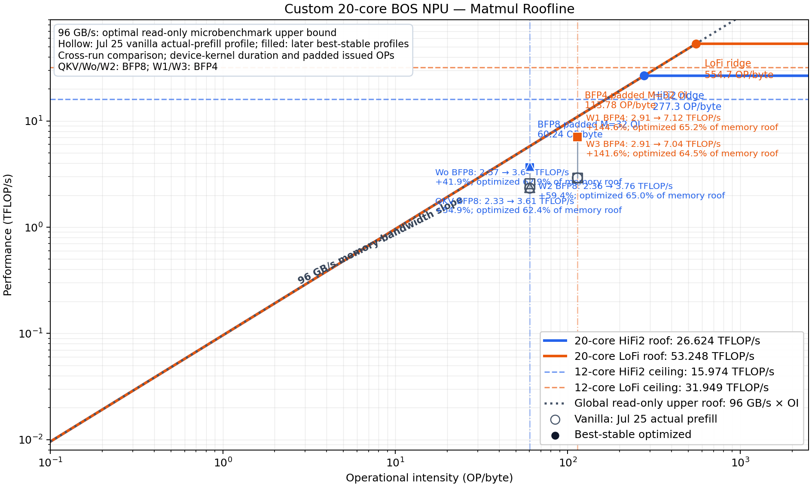
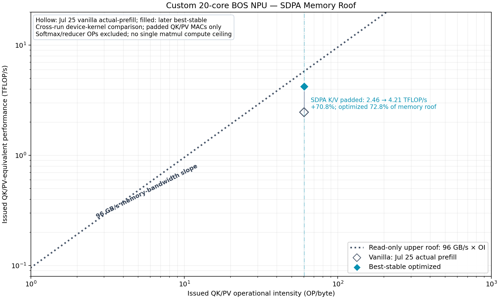

# BOS stable optimization justification from DRAM characterization and roofline

날짜: 2026-08-16 UTC

## 결론

현재 Llama 3.2 3B 64K decode best-stable 구성은 무작위 parameter 조합이 아니다. BOS의 read-only
DRAM transport ceiling을 먼저 측정하고, 실제 SDPA와 matmul을 같은 operational-intensity 정의로
roofline에 배치한 뒤, memory-service 병목을 직접 줄인 변경만 유지한 결과다.

증거 사슬은 다음과 같다.

```text
DRAM microbenchmark
  3 banks / 6 endpoints / dual-NoC의 95--96 GB/s plateau 확인
        ↓
Roofline
  SDPA와 모든 decode matmul이 compute ridge보다 memory side에 위치
        ↓
Kernel A/B
  endpoint parallelism, DRAM sharding, reader balance, request granularity 채택
        ↓
Negative controls
  reader 과증설, depth3, route-only 배치, helper, K512의 낮은 가치 확인
        ↓
Layer / full-model validation
  5.124290 → 8.207842 tok/s, +60.18%; PCC 약 0.9993, bit-exact 아님
```

핵심 판정:

| 영역 | Stable 선택 | 정당화 |
|---|---|---|
| SDPA | K256, 6 endpoints, dual-NoC, 16 active readers | paged K/V byte는 유지하면서 endpoint service parallelism과 chunk-level 고정비 개선 |
| MLP | DRAM width-sharded weight, fanout-2, 12 reader/compute, 4:4:4, tagged depth2 | 규칙적인 weight stream을 endpoint에 고르게 배치하고 충분한 outstanding traffic 유지 |
| QKV/Wo | DRAM-sharded balanced fanout-2 | 같은 BFP8 OI에서 vanilla 대비 roofline 접근률 상승 |
| Post-SDPA | grouped concat | DRAM bandwidth 확대가 아니라 불필요한 layout/data-movement pipeline 제거 |
| 제외 | K512, depth3, helper, reader-packed, route-only placement | plateau, regression, 미미한 이득 또는 안전 실패가 관측됨 |

## 범위와 장치

- board identity: custom 20-core BOS NPU
- runtime/code architecture: Blackhole
- available worker topology: `5×4 = 20 cores`
- physical DRAM: 3 banks
- worker NoC endpoints: bank당 2개, 총 6개
- NoCs: NOC0, NOC1
- model: `meta-llama/Llama-3.2-3B-Instruct`
- primary workload: batch-1, 64K paged-KV decode

Program grid 20과 실제 active compute cores를 구분한다. Stable SDPA는 8 KV heads × 2 cores/head로
16 active reader/compute cores다. MLP와 DRAM-sharded projection의 program 범위와 실제 reader/compute
worker 수도 구분한다. `Dram Interface Workers: 6`은 physical bank 수나 active compute-core 수가 아니다.

## 1. Empirical DRAM ceiling

### 관측 사실

DRAM-sharded, unit-stride, read-only microbenchmark에서 확인한 값:

| 구성 | 결과 |
|---|---:|
| 1 bank, 1 reader | 약 28.2 GB/s |
| 1 bank, 2 readers | 약 52.0 GB/s |
| all banks, 6 readers | 약 95--96 GB/s |
| all banks, 12 readers | bandwidth 동일, latency +104.7% |
| all-bank request sweet spot | 8 KiB |
| tagged batch sweet spot | 32--64 KiB |
| outstanding depth | depth2 포화, depth3 -0.65% |
| full barrier | tagged depth2보다 29.35% 느림 |

All-bank 최고 재현값은 96.139 GB/s다. 6 endpoints 사이 편차는 작았다. 6 readers에서 이미 aggregate
transport ceiling에 도달했고, 12 readers는 더 많은 bandwidth를 만들지 못했다.

### 해석

1. 단일 reader는 bank/endpoint service를 포화하지 못한다.
2. endpoint당 reader 하나, 총 6 readers면 packed sequential transport injection은 충분하다.
3. 그 이상 reader와 depth는 latency hiding이 아니라 service queueing과 backpressure를 늘린다.
4. 4 KiB 이하는 issue overhead가 크다.
5. all-bank에서는 8 KiB request가 command overhead와 service latency의 sweet spot이다.
6. 약 96 GB/s의 정확한 형성 위치가 DRAM controller인지 shared NoC/service path인지는 미검증이다.

따라서 96 GB/s는 이 장치의 이론 스펙이 아니라 실측 read-only transport roof다. Paged addressing,
write traffic, CB synchronization, compute cadence를 포함한 application이 반드시 96 GB/s에 도달해야 하는
것은 아니다.

근거: [1-reader/1-bank saturation report](../benchmark-results/2026-08-16-bos-one-reader-one-bank-dram-sharded-saturation.md)

## 2. Roofline model

> **2026-08-18 metric clarification:** 발표 roofline은 padding을 포함한 issued OI와 issued TFLOP/s를
> 일관되게 사용한다. Padding 때문에 algorithmic/effective OI는 더 낮다는 caveat를 함께 표시한다.
> 최신 그림과 exact source-duration 재계산값은
> [2026-08-17 통합 보고서](2026-08-17-bos-dram-characterization-to-sdpa-mlp.md)의 Section 7.1 및
> Appendix C를 사용한다. Compute reference는 `3×4 = 12` active-worker large-GEMM 직접 측정
> `14.3573/27.6356 TFLOP/s`이며, memory reference는 `95.262--96.139 GB/s` empirical band다.

Memory roof:

```text
P_memory [TFLOP/s] = 0.096 × OI [OP/byte]
```

Matmul용 theoretical compute ceiling:

| 경로 | 20-core ceiling | 12-core 참고 ceiling | ridge point |
|---|---:|---:|---:|
| HiFi2 | 26.624 TFLOP/s | 15.974 TFLOP/s | 277.3 OP/byte |
| LoFi | 53.248 TFLOP/s | 31.949 TFLOP/s | 554.7 OP/byte |

Decode의 padded issued-operation OI:

| dtype/path | OI | 96 GB/s memory roof |
|---|---:|---:|
| BFP8, padded M=32 | 60.24 OP/byte | 5.783 TFLOP/s |
| BFP4, padded M=32 | 113.78 OP/byte | 10.923 TFLOP/s |

두 OI 모두 compute ridge보다 낮다. QKV, Wo, W2, W1, W3는 현재 shape에서 compute ceiling보다 memory
roof가 먼저 제한한다. Core 수만 늘리는 변경보다 weight service와 producer-consumer cadence를 먼저
고치는 것이 맞다.



SDPA는 QK/PV matmul, online softmax, reducer, CB/NoC wait가 섞인 복합 kernel이다. Matmul compute roof에
직접 배치하지 않는다. Padding을 포함한 issued QK/PV MAC equivalent와 96 GB/s memory roof만 비교한다.



## 3. Vanilla와 best-stable의 roofline 이동

동일한 padded issued-OP numerator와 `DEVICE KERNEL DURATION`을 사용한 비교:

| Op | OI | Vanilla | Best stable | 변화 | Stable memory-roof 도달률 |
|---|---:|---:|---:|---:|---:|
| QKV BFP8 | 60.24 | 2.33 TFLOP/s | 3.61 TFLOP/s | +54.9% | 62.4% |
| Wo BFP8 | 60.24 | 2.57 | 3.64 | +41.9% | 63.0% |
| W2 BFP8 | 60.24 | 2.36 | 3.76 | +59.4% | 65.0% |
| W1 BFP4 | 113.78 | 2.91 | 7.12 | +144.6% | 65.2% |
| W3 BFP4 | 113.78 | 2.91 | 7.04 | +141.6% | 64.5% |
| SDPA issued QK/PV equivalent | 60.24 | 2.46 | 4.21 | +70.8% | 72.8% |

Vanilla 점은 2026-07-25 actual-prefill single-layer profile이다. Best-stable 점은 후속 stable profile과
operator A/B에서 가져왔다. 같은 shape와 operation definition이지만 동일-session 통제 A/B는 아니다.
따라서 이 표는 병목 방향과 roof 접근을 보여주는 evidence이며, 최종 end-to-end 개선폭은 같은-session
waterfall로 따로 검증한다.

## 4. Stable SDPA 정당화

### 4.1 6 endpoints와 dual-NoC

Vanilla K128 SDPA는 약 3.47 ms, effective K/V 41.12 GB/s였다. 16 readers를 두 NoC와 6 worker
endpoints에 분산한 K128은 2.519 ms, 56.61 GB/s였다.

Stable mapping:

- active readers/compute: 16
- endpoint load: `3/2/3/3/3/2`
- NoC reader load: `8/8`
- physical banks: 3
- worker endpoints: 6

Microbenchmark는 두 번째 endpoint가 단일-bank bandwidth를 약 28→52 GB/s로 높이고, 모든 endpoint를
사용해야 aggregate ceiling에 접근함을 보였다. 실제 SDPA도 세 endpoint만 집중하던 vanilla보다 six-endpoint
bundle이 빨랐다. 따라서 6-endpoint 선택은 spatial service parallelism에 근거한다.

`dual-NoC` 단독 기여는 분리되지 않았다. 발표와 문서에서는 `dual-NoC + six-endpoint reader distribution`
bundle로 표현한다.

### 4.2 K chunk 128→256

K256은 전체 K/V traffic을 줄이지 않는다. Chunk iteration 수, current-softmax update, online merge를
절반으로 줄인다. Phase decomposition에서 K256-K128 net `-150.176 us`가 독립 kernel 감소
`151.937 us`의 98.84%를 설명했다.

6-endpoint 환경에서는 K128 2.51933 ms→K256 2.03641 ms, `-19.17%`였다. K512는 K256보다 1.67%만
추가 개선됐다. K256이 algorithmic fixed cost와 CB/resource risk의 sweet spot이다.

### 4.3 Stable에서 제외한 SDPA 변경

| 변경 | 관측 | 판정 |
|---|---:|---|
| tagged cross-chunk prefetch | 56.500→56.374 GB/s | 중립, 제외 |
| static endpoint rebalance | 0.18--0.38% 느림 | 제외 |
| directed-link overlap 최소화 | wall +0.362% | 제외 |
| K512 | K256 대비 +1.67% | 기본값 승격 근거 부족 |
| reduce-only helper | deadlock 이력 | 금지 |

Stable SDPA는 가장 공격적인 구성이 아니라, 실제 critical path를 개선하고 반복 검증된 최소 구성이다.

## 5. Stable MLP 정당화

### 5.1 DRAM width-sharded weights

MLP weight는 KV cache와 달리 static하고 규칙적이다. 어느 output-column partition을 어느 reader가 소비할지
사전에 안다. DRAM width sharding은 shard ownership을 endpoint와 reader partition에 맞춰 불필요한
interleaved address traversal과 multicast 불균형을 줄인다.

Interleaved→DRAM-sharded 전환은 isolated MLP latency를 2.229688→1.899062 ms로 줄였다. Endpoint
balance `6:5:1→4:4:4`는 1.875653→1.472280 ms였다. Direct weight bandwidth는 48.60→62.93 GB/s로
29.47% 증가했다.

### 5.2 Request geometry

실제 stable requests:

- W1/W3 BFP4: 22 tiles × 576 B = 12,672 B
- W2 BFP8: 8 tiles × 1,088 B = 8,704 B
- cap: 16 KiB
- tagged pending depth: 2 blocks

이는 microbenchmark의 all-bank 8 KiB sweet spot과 8--16 KiB plateau 범위에 있다. Application은
activation multicast, CB reservation, compute cadence가 있으므로 microbenchmark의 8 KiB를 기계적으로
복사하지 않는다. Stable은 작은-request issue overhead를 피하면서 16 KiB를 넘는 service-latency 증가도
제한한다.

Depth2는 microbenchmark와 MLP 모두에서 충분했다. Microbenchmark depth3는 -0.65%, MLP tagged depth3는
+0.224% latency regression이었다.

### 5.3 12 reader/compute의 의미

Synthetic transport는 6 readers에서 이미 포화된다. Stable MLP의 12 readers를 `DRAM에 12 readers가
필요하다`고 설명하면 틀린다.

12-reader fanout-2는 6 interface-worker groups의 weight를 12 compute partitions에 전달하는 matmul
partition이다. 목적은 raw injection 증가가 아니라 compute parallelism과 endpoint ownership의 균형이다.
6-compute helper는 remote L1 hop과 compute-core 감소로 느렸고, 18-compute fanout-3도 성능 또는 안전성
근거가 부족했다.

### 5.4 남은 MLP gap

Stable W1/W3/W2는 memory roof의 약 64--65%다. Consumer input wait는 kernel 시간의 약 67%다. 그러나
pending request는 projection 내부에서 대부분 유지됐다. 남은 gap은 단순 request-empty가 아니라 DRAM
service completion, CB publish/consume cadence, activation multicast, compute phase가 섞인 결과다.

따라서 더 많은 reader, triple buffering, helper를 stable에 추가하지 않는다.

## 6. QKV/Wo와 grouped concat 정당화

QKV와 Wo도 static weight matmul이다. MLP에서 검증한 DRAM-sharded balanced fanout-2 reader를 적용했다.

| Op | Interleaved baseline | DRAM-sharded stable | kernel 변화 |
|---|---:|---:|---:|
| QKV | 433.448 us | 278.943 us | -35.64% |
| Wo | 236.042 us | 165.835 us | -29.74% |

QKV effective weight bandwidth는 38.55→59.91 GB/s, Wo는 42.48→60.46 GB/s였다. Roofline에서도 같은
BFP8 OI에서 각각 3.61/3.64 TFLOP/s, memory roof의 62.4/63.0%에 도달한다.

Grouped concat은 DRAM roof를 높이는 기법이 아니다. SDPA output의 generic layout pipeline을 줄이고
Wo가 소비할 flattened shard를 12 cores에서 직접 구성한다. Exact grouped A/B에서 layer mean은
4.469103→4.352791 ms, `-2.60%`였다.

## 7. Negative controls가 stable을 정당화하는 방식

| 가설 | 반증 또는 제한 |
|---|---|
| reader를 계속 늘리면 bandwidth가 오른다 | all-bank 6→12 readers에서 BW 동일, latency +104.7% |
| outstanding depth가 부족하다 | depth2 plateau, depth3 regression |
| Manhattan distance가 주 병목이다 | controlled placement spread 0.22--0.42% |
| route overlap만 최소화하면 SDPA가 빨라진다 | wall +0.362% |
| tagged prefetch가 SDPA gap을 없앤다 | 실제 SDPA에서 중립 |
| packed multiblock만으로 MLP wait가 사라진다 | W2 +0.39%, W1 sustained -2.46% |
| helper가 DRAM read를 대신하면 빨라진다 | remote-L1 cost와 compute 감소가 이득 상쇄 |
| depth3/triple buffer가 항상 유리하다 | service queueing과 CB backpressure 증가 |

이 negative controls 때문에 stable은 최대 core 수, 최대 outstanding request, 최소 route distance를 한꺼번에
켠 구성이 아니다. 측정 plateau 이전까지만 concurrency를 늘리고, plateau 이후 복잡도는 제거했다.

## 8. End-to-end 검증

같은 server session, 같은 source/build, synthetic 64K KV, profiler off 50-token waterfall:

| 단계 | tok/s | 직전 대비 | vanilla 대비 |
|---|---:|---:|---:|
| Vanilla-equivalent K128 | 5.124290 | 기준 | 기준 |
| + SDPA K256/6EP bundle | 6.414458 | +25.18% | +25.18% |
| + DRAM-sharded MLP | 7.643245 | +19.16% | +49.16% |
| + grouped concat, QKV/Wo | 8.207842 | +7.39% | +60.18% |

과거 독립 run과 편차는 0.07% 이하였다. 따라서 isolated roofline 이동이 full-model critical path 개선으로
이어졌음을 확인했다.

근거: [64K optimization waterfall](../benchmark-results/2026-08-09-bos-llama32-3b-64k-optimization-waterfall.md)

## 9. 정확성 및 주장 한계

- final stable은 bitwise exact가 아니다.
- fixed-input full logits PCC는 약 0.9993이다.
- top-1 동일, top-5 overlap 5/5였다.
- QKV/Wo stable-vs-exact fallback PCC는 0.9992725다.
- Roofline vanilla 점은 actual-prefill, optimized 점은 후속 stable run이다.
- End-to-end waterfall은 synthetic zero KV다.
- 96 GB/s는 read-only sequential transport ceiling이다.
- SDPA TFLOP/s는 padded issued QK/PV-equivalent다. Softmax/reducer OP를 세지 않는다.
- Matmul theoretical peak는 sustained application peak가 아니다.
- 약 96 GB/s ceiling의 controller/NoC 형성 위치는 미검증이다.

따라서 발표 문장:

> We characterized the BOS memory subsystem first, then retained only optimizations that moved the target
> kernels toward the measured 96 GB/s roof and improved the full-model critical path.

다음 문장은 사용하지 않는다.

> All kernels saturate DRAM.

Stable kernels는 memory roof의 약 62--73%다. 개선됐지만 synthetic transport ceiling을 완전히 포화하지
않는다.

## 10. 현재 stable 유지 기준

변경을 stable로 유지하려면 다음을 모두 만족해야 한다.

1. Isolated kernel 또는 layer critical-path 개선.
2. Matching roofline에서 병목 방향과 일치.
3. Full-model throughput 개선.
4. 정상 device completion/close, timeout 없음.
5. Correctness/PCC와 exact 여부 기록.
6. 복잡한 helper나 더 큰 concurrency는 단순 구성보다 유의미하게 빨라야 함.

현재 구성은 이 기준을 만족한다. 추가 최적화의 우선순위는 reader 수 확대가 아니라 다음이다.

1. SDPA padding/GQA redundant issued work 감소.
2. MLP consumer CB cadence와 service-completion 분해.
3. Exact grouped concat/L1 handoff의 남은 data movement 제거.
4. Read/write 및 workload-specific DRAM roof 추가 측정.

## 근거 문서와 artifact

- [DRAM saturation](../benchmark-results/2026-08-16-bos-one-reader-one-bank-dram-sharded-saturation.md)
- [Architecture characterization method](2026-08-13-empirical-architecture-characterization-and-bottleneck-guided-optimization.md)
- [SDPA reasoning](2026-08-11-bos-sdpa-optimization-effect-reasoning.md)
- [MLP investigation](2026-08-04-bos-mlp-optimization-investigation.md)
- [Stable layer-0 profile](../benchmark-results/2026-08-09-bos-llama32-3b-64k-stable-layer0-profile.md)
- [QKV/Wo A/B](../benchmark-results/2026-08-09-bos-attention-qkv-wo-dram-sharded-ab.md)
- [Optimization waterfall](../benchmark-results/2026-08-09-bos-llama32-3b-64k-optimization-waterfall.md)
- Roofline generator: `benchmark-results/assets/2026-08-16-bos-roofline-96gbps.py`
- Vanilla actual-prefill run: `/home/iris_hb4/profiler_runs/llama32_3b_64k_actual_prefill_single_layer_decode_performance_mode_perf_2026_07_25_08_51_04`
- Stable layer profile: `/home/iris_hb4/profiler_runs/llama32_3b_64k_stable_layer0_visualizer_2026_08_09_14_27_41`
