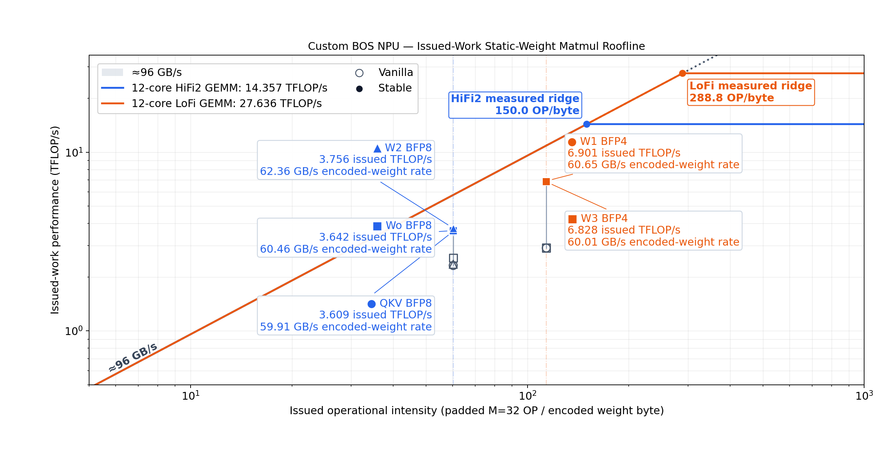
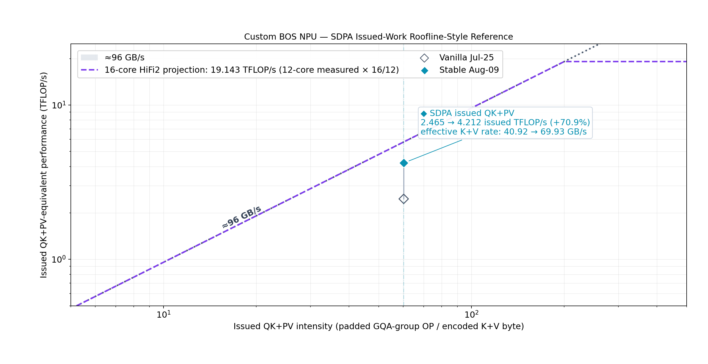

# BOS DRAM characterization에서 SDPA·MLP 최적화까지

## 목적

이 문서는 BOS DRAM microbenchmark에서 얻은 memory-parallelism 조건을 실제 Llama 3.2 3B 64K decode의
SDPA, MLP, QKV 및 Wo에 어떻게 적용했는지 발표용 논리와 근거 수치로 정리한다.

핵심 주장은 다음과 같다.

> We first characterized the BOS memory subsystem, identified where the model failed to expose the same
> parallelism, applied workload-compatible corrections, and validated the gains from microbenchmark to kernel
> to full-model throughput.

Microbenchmark의 96 GB/s는 read-only sequential transport ceiling이다. 실제 kernel이 반드시 이 값을
달성해야 한다는 뜻이 아니다. Microbenchmark는 포화에 필요한 최소 spatial resources, transaction geometry,
outstanding depth를 찾는 도구다. 실제 kernel에는 paging, activation multicast, circular-buffer 계약, compute,
reduction 및 output 처리가 추가된다.

## 1. 측정 대상과 용어

- board identity: custom 20-core BOS NPU
- runtime/code architecture: Blackhole
- available worker grid: `5×4 = 20 cores`
- physical DRAM banks: 3
- worker-visible NoC endpoints: bank당 2개, 총 6개
- target workload: Llama 3.2 3B, batch 1, 64K paged-KV decode

Physical bank, worker NoC endpoint, runtime logical DRAM grid, DRAM-interface worker 및 active compute core는
서로 다른 개념이다. `Dram Interface Workers: 6`을 6 physical banks 또는 6 active compute cores로 해석하지
않는다. SDPA stable은 16 active reader/compute cores이고, MLP stable fanout-2는 12 reader/compute workers다.

## 2. Microbenchmark가 밝힌 포화 조건

### 2.1 Transaction size와 issue overhead

Single-reader, tagged depth-2, 16 KiB issue batch에서 packet size를 바꿨다.

| Packet | Bandwidth |
|---:|---:|
| 512 B | 10.423 GB/s |
| 1 KiB | 19.709 GB/s |
| 2 KiB | 26.081 GB/s |
| 4 KiB | 27.753 GB/s |
| 8 KiB | 27.217 GB/s |
| 16 KiB | 27.035 GB/s |

512 B와 1 KiB는 command issue overhead가 크다. Single-reader 조건에서는 4 KiB가 최고였고 8--16 KiB는
추가 이득이 없었다. 그러나 all-bank aggregate에서는 endpoint/service concurrency가 달라져 최적점도
달라졌다.

All-bank, all-6-endpoint에서는 공간 조건을 다음과 같이 고정했다.

- 3 physical banks, bank당 2 endpoints
- endpoint당 reader 1개, 총 6 readers
- endpoint density `1:1:1:1:1:1`, bank reader load `2:2:2`, NoC reader load `3:3`
- endpoint-local DRAM shard, unit-stride access, tagged depth-2

그 위에서 request size `2/4/8/16 KiB`와 tagged batch `32/64 KiB`의 `4×2` full factorial, 총 8개
permutation을 측정했다. 각 permutation은 profiler 없이 30회 반복했고, 8개 점 모두 30/30 `Test Passed`, normal device close, exit 0이었다.
모든 점은 동일한 총 payload와
working-set bytes를 사용했다. 2 KiB 점은 allocation page도 2 KiB이며, 4/8/16 KiB 점은 4 KiB base page에서
각각 1/2/4 pages를 coalesce했다.

| Request | Tagged batch | Requests/batch | Mean bandwidth | Min--max |
|---:|---:|---:|---:|---:|
| 2 KiB | 32 KiB | 16 | 98.717 GB/s | 97.802--99.637 |
| 4 KiB | 32 KiB | 8 | 99.188 GB/s | 98.022--100.033 |
| 8 KiB | 32 KiB | 4 | 100.002 GB/s | 97.141--101.795 |
| 16 KiB | 32 KiB | 2 | 96.140 GB/s | 93.751--99.555 |
| 2 KiB | 64 KiB | 32 | 98.644 GB/s | 97.785--99.417 |
| 4 KiB | 64 KiB | 16 | 99.178 GB/s | 98.026--100.450 |
| 8 KiB | 64 KiB | 8 | 99.928 GB/s | 96.922--101.837 |
| 16 KiB | 64 KiB | 4 | 96.421 GB/s | 93.886--98.382 |

8 KiB는 2 KiB 대비 두 batch 모두 약 1.30%, 4 KiB 대비 0.76--0.82%, 16 KiB 대비
3.64--4.02% 높았다. 따라서 2/4/8 KiB는 약 1.3% 폭의 near-plateau이고 8 KiB는 수치상 최적이다.
Maximum packet size가 항상 최적은 아니다. 이전 3×2 표는 single-reader screening으로 2 KiB를 제외했지만,
aggregate 결과는 그 제외가 과도했음을 보여준다. 위 8개 점은 같은 current binary/session에서 다시 측정했으며
이 subsection의 이전 6개 절대값을 대체한다.

아래 timestamp breakdown은 64 KiB batch의 네 request size를 각각 한 번 별도 계측했다. 계측 run은 원인
attribution에만 사용하고 위 profiler-off 30-run 평균을 최종 bandwidth로 사용한다.

| Request | Issue | Retire wait | Other | Observed latency mean |
|---:|---:|---:|---:|---:|
| 2 KiB | 60.04% | 35.61% | 4.32% | 3,466 cycles |
| 4 KiB | 25.92% | 69.80% | 4.25% | 4,333 cycles |
| 8 KiB | 13.57% | 82.05% | 4.36% | 4,574 cycles |
| 16 KiB | 6.98% | 88.85% | 4.16% | 4,973 cycles |

Request가 커지면 issue overhead는 감소하지만 service completion latency와 retire wait는 증가한다.
2 KiB는 issue 비중이 크지만 짧은 latency가 이를 대부분 상쇄했고, 16 KiB는 service wait 증가로 퇴행했다.
All-bank path에서 8 KiB는 두 비용의 수치상 최적점이지만 2--8 KiB를 폭넓은 plateau로 해석해야 한다.

재현 artifact는
`/home/iris_hb4/benchmark_runs/dram_allbank_request_batch_factorial_2026_08_18_06_56_29`에 있다.
측정 binary SHA-256은 `ebbb3f0171d99f301071ad7b3e52fa174c2a8a2d5cc15719f92a29581b9f91a1`이다.
현재 source에는 기존 미커밋 변경이 있으므로, 과거 표와 현재 표의 절대값 차이를 단일 원인에 귀속하지 않는다.
또한 이 수치는 synthetic transport benchmark의 effective payload rate이며 physical DRAM utilization이 아니다.

### 2.2 Tagged window와 outstanding depth

All-bank, 16 KiB request, depth-2에서 tagged batch를 sweep했다.

| Tagged batch | Requests/batch | Bandwidth |
|---:|---:|---:|
| 16 KiB | 1 | 92.114 GB/s |
| 32 KiB | 2 | 95.792 GB/s |
| 64 KiB | 4 | 95.548 GB/s |
| 128 KiB | 8 | 95.052 GB/s |
| 256 KiB | 16 | 95.528 GB/s |

16→32 KiB는 +3.99%였지만 32--256 KiB는 0.78% 범위의 plateau였다. 더 큰 window는 ceiling을 높이지
않았다.

32 KiB batch에서 barrier와 outstanding depth를 비교했다.

| Mode | Bandwidth | Depth-2 대비 |
|---|---:|---:|
| Tagged depth-2 | 95.792 GB/s | 기준 |
| Tagged depth-3 | 94.861 GB/s | -0.97% |
| Full barrier | 67.673 GB/s | -29.35% |

Depth-2는 full barrier 대비 +41.55%였다. 세 번째 pending slot은 개선하지 않았다. 결론은 maximum queue
depth가 아니라 latency를 숨길 수 있는 최소 depth를 유지하는 것이다.

### 2.3 Reader와 endpoint parallelism

Physical bank0의 두 endpoints에 readers를 균등 배치하고 unit-stride 16 KiB one-packet read를 수행했다.

| Total readers | Readers/endpoint | Bandwidth | Retire wait | Observed latency mean |
|---:|---:|---:|---:|---:|
| 1 | 1:0 | 28.209 GB/s | 79.09% | 2,689 cycles |
| 2 | 1:1 | 52.023 GB/s | 81.72% | 2,949 cycles |
| 4 | 2:2 | 51.569 GB/s | 90.99% | 6,272 cycles |
| 6 | 3:3 | 51.378 GB/s | 94.03% | 9,634 cycles |
| 8 | 4:4 | 51.316 GB/s | 95.51% | 12,943 cycles |

1→2 readers는 +84.42%였다. 두 endpoints에 reader 하나씩 배치하면 single bank가 포화됐다. 2→8
readers에서는 bandwidth가 1.36% 감소하고 observed latency는 4.39배, retire wait는 13.79 percentage
points 증가했다. 추가 concurrency는 throughput이 아니라 queue/service wait만 늘렸다.

#### Dual-NoC 단독 효과 통제

2026-08-18에는 3 physical banks와 bank당 reader 1개를 고정하고, 각 bank의 native endpoint만 사용해
`dual 2:1`, `NoC0-only 3:0`, `NoC1-only 0:3`을 같은 세션에서 비교했다. Request는 8 KiB, tagged batch는
64 KiB, depth-2, working set은 1 MiB/reader다. 정순과 역순으로 각각 30회씩, 구성당 60회 측정했다.

| Configuration | Mean bandwidth | 95% CI | Dual 대비 |
|---|---:|---:|---:|
| Dual native | 65.350 GB/s | ±0.087 | 기준 |
| NoC0-only | 60.977 GB/s | ±0.031 | -6.69% |
| NoC1-only | 67.644 GB/s | ±0.286 | +3.51% |

Dual-NoC는 이 synthetic 3-reader path의 standalone throughput optimization이 아니다. NoC0-only breakdown의
finish skew는 777,012 cycles로 dual 84,043 cycles의 9.25배였지만 latency mean은 각각 3,431/3,430 cycles로
같았다. 따라서 NoC0 퇴행도 raw ring bandwidth보다 endpoint/route별 service-tail imbalance와 일치한다.
Endpoint set이 함께 변하므로 NoC1 ring 자체가 더 빠르다고 일반화하지 않는다.

이 결과는 `dual-NoC가 bandwidth를 두 배로 만든다`는 설명을 기각한다. 반면 all-6-endpoint path는 native
endpoint를 모두 쓰는 순간 두 NoC를 함께 사용하므로, endpoint 수를 고정한 six-reader single-vs-dual A/B는
아니다. SDPA application bundle에서 dual-NoC만의 기여는 여전히 endpoint mapping과 분리되지 않았다.
Artifact는 `/home/iris_hb4/benchmark_runs/dram_noc_dual_isolation_8kreq_64kbatch_2026_08_18_07_20_00`에 있다.

### 2.4 Bank aggregate scaling

각 physical bank의 two-reader ceiling은 51.666--52.023 GB/s로 균일했다. 그러나 여러 bank를 동시에
활성화하면 독립 bank 합보다 낮았다.

| Active banks | Readers | Measured | Independent-bank ideal | Scaling efficiency |
|---|---:|---:|---:|---:|
| bank0+bank1 | 4 | 75.055 GB/s | 103.689 GB/s | 72.39% |
| bank0+bank2 | 4 | 77.704 GB/s | 103.990 GB/s | 74.72% |
| bank1+bank2 | 4 | 74.427 GB/s | 103.633 GB/s | 71.82% |
| bank0+bank1+bank2 | 6 | 96.139 GB/s | 155.656 GB/s | 61.76% |

Single-bank 평균 51.885 GB/s에서 all-bank 96.139 GB/s로 1.85배 증가했다. Ideal 3배 scaling은
아니었다. 관측은 shared service path backpressure와 일치하지만, 정확한 위치가 aggregate NoC인지 DRAM
endpoint/controller arbitration인지는 분리되지 않았다.

### 2.5 Microbenchmark 결론

1. 모든 physical banks와 endpoints를 사용해야 aggregate roof에 접근한다.
2. Single bank는 endpoint당 reader 하나, 총 2 readers면 포화된다.
3. All-bank request는 2--8 KiB에서 약 1.3% 폭의 plateau이며, 8 KiB가 수치상 최고다.
4. Tagged window는 32--64 KiB면 충분하다.
5. Pending depth-2는 중요하지만 depth-3는 불필요하다.
6. Plateau 이후 reader, burst 및 queue depth 증가는 latency와 복잡도만 증가시킨다.

## 3. Vanilla SDPA가 포화 조건에서 벗어난 부분

Vanilla K128 SDPA는 16 readers가 있어도 traffic이 세 endpoints에 집중됐다. Reader 수 자체보다 endpoint
service parallelism이 부족했다. Paged KV abstraction 자체가 항상 비연속 주소를 뜻하지는 않는다. 그러나 이 문서의 full-model 및 isolated SDPA runner는 physical blocks를 permutation하여 page table을 만든다.
따라서 page 경계에서 source tile ID가 점프하고, TensorAccessor가 선택하는 endpoint 또는 local address도 달라질
수 있다. 아래 3.1에서 주소 변환과 측정 경로를 분리한다. K128은 64K context에서 chunk-level online
softmax update와 merge를 많이 수행했다.

| 항목 | Microbenchmark 포화 조건 | Vanilla SDPA |
|---|---|---|
| Spatial service | 3 banks, 6 endpoints | 세 endpoints 집중 |
| Reader balance | endpoint bundle 균형 | endpoint별 부하 불균형 |
| Address stream | unit-stride | paged KV translation |
| Request cadence | pure continuous read | chunk/reducer/compute cadence |
| Consumer | 없음 | online softmax와 reducer 존재 |

### 3.1 Paged-KV locality 요약

32-token page에서 한 KV head의 K 또는 V payload는 `4 tiles = 4.25 KiB`다. 현재 shuffled page table은
page 경계마다 physical block을 바꾸고, interleaved layout은 page 내부 tiles도 runtime DRAM views에 분산할 수
있다. 따라서 sharding만으로 큰 request가 생기지 않는다.

V는 page-head sharding 뒤 page 내부 tiles를 직접 burst할 수 있다. K는 DRAM에서 row-major로 읽고 L1의
transposed tile-grid 위치에 배치하므로 contiguous staging read와 L1 stride scatter가 필요하다. 주소 수식,
page-size별 payload, `interleaved/sharded × sequential/shuffled` 실험표와 K staging 설계는 Appendix A에 둔다.

## 4. SDPA에 적용한 교정과 효과

### 4.1 Historical stable bundle

초기 stable 이력은 vanilla K128에서 dual-NoC와 6-endpoint distribution을 함께 적용한 bundle 비교다.

| Configuration | Effective K/V bandwidth | SDPA latency |
|---|---:|---:|
| Vanilla K128 | 41.12 GB/s | 약 3.47 ms |
| K128, dual-NoC + 6-endpoint distribution | 56.61 GB/s | 2.519 ms |
| 변화 | +37.67% | 약 -27.4% |

Stable mapping은 16 active reader/compute cores, endpoint load `3/2/3/3/3/2`, NoC load `8/8`, 3 physical
banks 및 6 worker endpoints를 사용했다. 이 표는 production-oriented bundle 효과를 보여주지만 endpoint 수의
독립 기여를 뜻하지 않는다.

### 4.2 Controlled K128 endpoint-count A/B

최신 통제 실험은 K128과 dual-NoC를 양쪽에 고정하고 endpoint count만 `3→6`으로 바꿨다.

| Metric | 3 endpoints | 6 endpoints | Effect |
|---|---:|---:|---:|
| Endpoint load | `5/0/5/6/0/0` | `3/3/2/3/3/2` | 6개 service point 사용 |
| NoC reader load | `5/11` | `8/8` | mapping bundle 내 균형화 |
| Profiled critical span | 3.014568 ms | 2.408938 ms | -20.09% |
| Effective K/V bandwidth | 47.306 GB/s | 59.199 GB/s | +25.14% |
| Reader K+V barrier mean | 1669.096 us | 556.299 us | -66.67% |
| Compute K+V input wait mean | 396.584 us | 22.817 us | -94.25% |

양쪽 PCC는 `0.9998791594607118`로 같았다. 이 A/B는 6-endpoint를 허용한 현재 mapping 전체가 DRAM
service tail과 exposed compute wait를 줄였음을 입증한다. Endpoint 수와 그 결과 생긴 NoC load balance는
분리되지 않았다. `dual-NoC`는 양쪽 공통이므로 이 application A/B의 단독 효과도 아니다. 별도의 synthetic 3-reader
통제에서는 dual이 best single-ring보다 빠르지 않았다.

발표에서는 historical `+37.67%` bundle과 controlled `+25.14%` endpoint-count A/B를 같은 막대로 합치지
않는다. Microbenchmark의 spatial parallelism 원리가 paged SDPA에서도 유효했다는 인과 근거에는 controlled
A/B를 사용한다.

### 4.3 K chunk 128→256은 별도 algorithmic optimization

K-chunk 확대에 대한 증거는 **6-endpoint 성능 A/B**와 **phase-attribution A/B**로 나눈다.
두 측정은 opt-in 구성과 latency denominator가 다르므로, 절대 latency나 감소폭을 서로 직접
합산하지 않는다. 세부 phase 계측의 canonical source는
[`2026-08-10-bos-sdpa-kchunk-fixed-cost-decomposition.md`](../benchmark-results/2026-08-10-bos-sdpa-kchunk-fixed-cost-decomposition.md)다.

#### 4.3.1 6-endpoint 성능 A/B

| K chunk | SDPA latency | Effective K/V rate | K128 대비 latency |
|---:|---:|---:|---:|
| 128 tokens | 2.51933 ms | 56.605 GB/s | baseline |
| 256 tokens | 2.03641 ms | 70.028 GB/s | -19.17% |
| 512 tokens | 2.00242 ms | 71.217 GB/s | -20.52% |

K128→K256에서 latency는 `482.92 us` 감소했다. K512는 K256보다 `33.99 us`, 즉 `1.67%`만
추가로 빨랐다. 따라서 실용 선택은 대부분의 이득을 확보하면서 L1/CB 점유와 shape-specific
리스크를 덜 늘리는 K256이다. 표의 GB/s는 고정된 logical K/V payload를 latency로 나눈
**effective application rate**다. K256이 DRAM byte를 줄이거나 physical DRAM utilization을 70 GB/s로
올렸다는 뜻은 아니다.

#### 4.3.2 어떤 일이 줄었는가

64K decode에서 전체 K+V payload는 두 구성 모두 `136 MiB`이고, 전체 QK/PV algorithmic work도
같다. 변하는 것은 전체 데이터 양이 아니라 한 chunk에서 처리하는 token 수와 chunk boundary
수다.

| Static work item | K128 | K256 | 변화 |
|---|---:|---:|---:|
| Chunks per active core | 256 | 128 | -50% |
| QK calls | 256 | 128 | -50% |
| Current-softmax calls | 256 | 128 | -50% |
| PV calls | 256 | 128 | -50% |
| Online merges | 255 | 127 | -50.20% |
| K+V payload | 136 MiB | 136 MiB | 불변 |

각 chunk는 `Q@K`, mask/current max·softmax·sum, `P@V`를 수행한 뒤 running `(m, l, O)`를
이전 chunk 결과와 merge한다. K256은 한 호출의 token-proportional work를 늘리는 대신 이 호출과
online recurrence boundary 수를 거의 절반으로 줄인다. 따라서 “softmax arithmetic을 절반으로
줄였다”가 아니라, “chunk-level update/merge 횟수와 호출 고정비를 줄였다”가 정확한 설명이다.

#### 4.3.3 Phase attribution

별도 phase run은 six-endpoint, dual-NoC, tagged, inner-K streaming, helper opt-in을 끄고 K-chunk만
변경했다. Empty-zone overhead를 보정한 16 active-core 평균 critical phase는 다음과 같다.

| Phase | K128 | K256 | K256 - K128 |
|---|---:|---:|---:|
| QK | 550.922 us | 917.908 us | +366.986 us |
| PV | 617.582 us | 739.639 us | +122.057 us |
| Current softmax | 1014.236 us | 794.670 us | -219.566 us |
| Online merge | 844.290 us | 424.637 us | -419.653 us |
| **Phase sum** | **3027.030 us** | **2876.854 us** | **-150.176 us** |

이를 합치면 current-softmax/merge에서 `639.219 us`를 절약했지만, 더 큰 chunk의 QK/PV
실행이 `489.043 us`를 다시 사용했다. 그 결과 net 절약이 `150.176 us`다. Online merge는
chunk boundary에 직접 연동하여 `49.72%` 줄었지만, current-softmax는 chunk 내 token work가
늘어 `21.56%`만 줄었다.

같은 측정 계열의 독립 whole-device-kernel capture는 `3.482728→3.330791 ms`, 즉
`151.937 us (-4.36%)`를 보였다. Phase sum의 `150.176 us`는 이 감소의 `98.84%`를 설명하고,
잔차는 `1.761 us`다. **이 98.84%는 별도 phase run의 151.937 us에 대한 값이며, 앞의
6-endpoint run의 19.17% 전체를 설명하는 비율이 아니다.**

#### 4.3.4 Correctness, 한계 및 발표 표현

6-endpoint cur-pos-only initialized-KV 테스트에서 K256과 K512는 K128 대비 `max_abs=0`이었다.
Phase profiler의 PCC도 K128 `0.9998791595`, K256 `0.9999178293`으로 통과했다. 다만 phase
표의 각 모드/K 조합은 단일 measured capture이고, 서로 다른 capture의 phase를 합성한 것이다.
QK/PV zone에는 `cb_matmul_blocks` wait가 포함되며, random page table과 full-model accuracy 전체를
이 isolated 결과만으로 증명하지는 않는다.

발표에서는 endpoint `3→6`을 **memory-service parallelism 개선**, K128→K256을
**chunk-level recurrence/fixed-overhead amortization**으로 분리한다. “DRAM read를 절반으로
줄였다” 또는 “softmax 연산을 절반으로 줄였다”는 표현은 사용하지 않는다.

## 5. Actual vanilla MLP: 많은 core가 endpoint parallelism을 보장하지 않았다

비교 기준은 별도 vanilla-like kernel이 아니라 full-model waterfall에서 사용한 **실제 vanilla opt-in-off
경로**다. 이 run은 K128을 사용하고 SDPA endpoint override, grouped concat, QKV/Wo 및 MLP optimization을
모두 껐다. 수정된 source tree 안에 opt-in 구현이 존재하더라도 해당 분기는 활성화하지 않았다.

### 5.1 Vanilla 실행 구조

Actual vanilla는 W1/W3/W2를 DRAM-interleaved layout에 두고 4×4 generic matmul program으로 실행했다.
동일한 16개 Tensix core에서 BRISC reader와 TRISC compute zone이 함께 관측됐으므로, 별도 reader core
16개와 compute core 16개가 아니라 **동일한 16개 core가 각각 weight read와 matmul을 모두 수행**했다.

| 항목 | Actual vanilla에서 확인한 값 |
|---|---|
| Weight layout | DRAM interleaved |
| Reader / compute | 동일한 16 cores에서 `16 / 16` |
| Physical worker set | `(x=0..3, y={0,1,2,4})`; logical 4×4 grid |
| Weight-read endpoint | 6개 중 `(2,3)`, `(3,3)` 두 곳에 `8:8` 집중 |
| Reader NoC | 두 endpoint 모두 NoC1 |
| Request | W1/W3 BFP4 576 B/tile, W2 BFP8 1,088 B/tile |
| Cadence | reader당 16 full-barrier epochs, epoch당 96 tile reads; tagged read 없음 |
| Isolated layer-0 MLP | mean `1.939326 ms`, median `1.933155 ms` (performance preset, 30회) |
| Full-model layer-0 MLP sublayer | `3129.095 us` (same-session waterfall) |

`Dram Interface Workers: 6`은 runtime이 구성한 interface-worker 수이지, 여섯 endpoint에서 실제 weight-read
traffic이 관측됐다는 뜻이 아니다. `(2,3)`과 `(3,3)`은 0-based physical NoC 좌표의 DRAM endpoints이며
worker compute cores가 아니다.

### 5.2 Endpoint trace가 보여준 집중

2026-08-18 performance-datatype matched capture에서 W1/W3/W2는 모두 같은 endpoint mapping을 보였다.
16 BRISC readers가 두 endpoint에 8개씩 연결됐고 나머지 네 endpoint에는 measured weight-read event가
없었다.

| Projection | Endpoint `(2,3)` | Endpoint `(3,3)` | Reader/endpoint | Active endpoint/NoC |
|---|---:|---:|---:|---|
| W1 BFP4 | 12,288 req / 7,077,888 B | 12,288 req / 7,077,888 B | 8 / 8 | 2 of 6 / NoC1 only |
| W3 BFP4 | 12,288 req / 7,077,888 B | 12,288 req / 7,077,888 B | 8 / 8 | 2 of 6 / NoC1 only |
| W2 BFP8 | 12,288 req / 13,369,344 B | 12,288 req / 13,369,344 B | 8 / 8 | 2 of 6 / NoC1 only |

Accuracy control도 같은 16-reader core set과 endpoint `8:8`, NoC1-only mapping을 보였다. Performance
capture에서는 W1/W3 payload만 BFP8 control의 1,088 B에서 BFP4 576 B로 줄었다. 따라서 2-endpoint 집중은
accuracy-only artifact가 아니다.

### 5.3 Microbenchmark 포화 조건과의 차이

| 항목 | Microbenchmark 포화 조건 | Actual vanilla MLP |
|---|---|---|
| Weight ownership | endpoint-local shard | DRAM interleaved |
| Spatial service | 6 readers, endpoint `1:1:1:1:1:1` | 16 readers, 두 endpoint에 `8:8` |
| Transaction geometry | 2--8 KiB에서 near-plateau | one tile/read: 576 B 또는 1,088 B |
| Outstanding cadence | tagged depth-2 | full barrier로 block 종료 |
| Consumer | 없음 | activation multicast, CB 및 matmul compute 포함 |

핵심 문제는 reader 수가 부족했다는 것이 아니다. Vanilla에는 이미 16 reader/compute cores가 있었지만,
interleaved ownership과 generic routing 때문에 weight service가 두 endpoint와 한 NoC에 집중됐고 request도
tile 단위로 작았다. 따라서 core 수를 더 늘리기보다 weight ownership, endpoint distribution, request
granularity와 issue cadence를 함께 교정해야 했다.

### 5.4 근거 경계

Profiler-free performance run은 정상 종료했고 PCC는 `0.9869040195`였다. 이는 BF16 reference와 performance
preset을 비교한 값이며 accuracy-mode 통과율로 해석하지 않는다. 같은 입력과 precision을 사용한 layout A/B
세 구성의 PCC는 정확히 같았다. 이전 accuracy control은 PCC `0.9996410623`으로 correctness gate를 통과했다.

NoC capture 본체는 MLP completion까지 도달했지만 converter가 이후 `Invalid NoC transfer type on device: 0`에서
중단돼 complete JSON과 `DEVICE_CLOSED`가 없다. 위 endpoint 표는 invalid event가 없던 raw timer `12345`의
MLP records에서 복구한 **partial evidence**다. Performance raw CSV는 12,239,154 B, 164,578 lines,
SHA-256 `b1b4fd2532f1e6ba7f8924e40276360fc69e67a0ba6a1de23e23b8c349cd4a94`이며 artifact는
`/home/iris_hb4/profiler_runs/mlp_actual_vanilla_performance_endpoint_trace_2026_08_18`에 있다.

## 6. Vanilla 대비 도입한 stable MLP dataflow

Stable MLP는 vanilla의 각 문제에 대응하도록 memory layout과 matmul dataflow를 함께 바꿨다. 단순히 reader를
늘린 변경이 아니며, 실제 reader/compute 수는 `16→12`로 줄었다.

| Vanilla | Stable correction | 의도 |
|---|---|---|
| DRAM-interleaved weights | DRAM width-sharded weights | compute partition과 weight ownership 정렬 |
| 576 B/1,088 B one-tile reads | W1/W3 12,672 B, W2 8,704 B row reads | transaction 고정비 amortization |
| 16-core generic matmul | 12-reader/12-compute fanout-2 | 6 interface-worker views를 12 compute partitions에 직접 공급 |
| 두 endpoints `8:8`, NoC1 only | 세 destination groups `4:4:4` | spatial service와 destination load 균형화 |
| W2 automatic input block width | W2 `in0_block_w=16`, W1/W3와 정렬 | W2 compute/streaming granularity 확대 |
| block마다 full read barrier | tagged pending depth-2 | 현재 block compute 중 다음 block service overlap |

Stable의 `4:4:4`는 vanilla trace의 physical endpoint 좌표 표와 같은 종류의 숫자가 아니다. 이는
12-reader fanout-2가 사용하는 세 destination group의 reader 수이며, 여섯 interface-worker views를 pair로
공급하는 mapping이다. `6:5:1`은 vanilla가 아니라 이 fanout-2를 처음 도입했을 때의 **중간 불균형 mapping**이다.

### 6.1 Actual vanilla 대비 최종 효과

| 비교 범위 | Before | After | Effect | 측정 경계 |
|---|---:|---:|---:|---|
| Actual vanilla→final, layer-0 MLP sublayer | 3129.095 us | 1779.843 us | -43.15% | same-session waterfall |
| +SDPA→+MLP, layer-0 MLP sublayer | 3121.409 us | 1778.492 us | -43.02% | MLP만 더한 인접 단계 |
| +SDPA→+MLP, full-model throughput | 6.415537 tok/s | 7.637903 tok/s | +19.05% | same-session, 5-run mean |
| Actual vanilla→stable, isolated MLP mean | 1.939326 ms | 1.039521 ms | -46.40% | same-date performance preset, 30+30 |

Isolated 마지막 행은 같은 날짜와 performance preset에서 actual vanilla와 stable을 각각 30회 측정한
profiler-free host-observed MLP call latency다. Full-model waterfall의 device sublayer boundary와는 분모가
다르므로 `-46.40%`와 `-43.02%`를 같은 수치로 기대하지 않는다. Full-model의 `+19.05%`는 MLP sublayer
latency 감소가 전체 decode critical path에 반영된 결과이지 MLP kernel 자체의 throughput 비율이 아니다.

### 6.2 중간 A/B로 변경 원인 분해

아래 수치는 기존 accuracy preset에서 수집한 historical attribution이다. Performance-mode 최종 표의 절대
latency와 혼합하지 않고 각 변경의 방향성과 상대 기여를 설명하는 데만 사용한다.

| 중간 A/B | Before | After | Effect | 의미 |
|---|---:|---:|---:|---|
| Actual vanilla interleaved→DRAM-sharded, W2 auto | 2.229688 ms | 1.899062 ms | median -14.83% | layout/ownership 전환 |
| + W2 block width 16, vanilla 대비 누적 | 2.229688 ms | 1.872031 ms | median -16.04% | W2 granularity 포함 |
| Fanout-2 endpoint `6:5:1→4:4:4` | 1.875653 ms | 1.472280 ms | mean -21.51% | 이미 12-reader인 경로의 balance |
| Full barrier→tagged depth-2 | 1.472701 ms | 1.439071 ms | mean -2.28% | block 간 latency overlap |

Direct weight-rate 이력도 `6-reader DRAM-sharded 45.40 GB/s` → `12-reader fanout-2 6:5:1
48.60 GB/s` → `12-reader balanced 4:4:4 62.93 GB/s` 순서다. 따라서 `48.60→62.93 GB/s
(+29.47%)`는 vanilla→stable 비교가 아니라 **fanout-2 내부 endpoint-balance A/B**다.

### 6.3 왜 12 cores가 vanilla 16 cores보다 빨랐는가

Synthetic transport는 all-bank 6 readers에서 이미 plateau에 도달했다. 그러므로 fanout-2의 12 readers를
“DRAM 포화에 12 readers가 필요했다”고 설명하면 틀린다. 12-reader fanout-2는 여섯 interface-worker views의
weight shard를 12 compute partitions에 직접 공급해 compute parallelism과 endpoint ownership을 맞추는 구조다.

실제 stable request는 W1/W3 BFP4가 `22 tiles × 576 B = 12,672 B`, W2 BFP8이
`8 tiles × 1,088 B = 8,704 B`다. 둘 다 16 KiB cap 이하이며 vanilla의 one-tile request보다 transaction
고정비를 더 잘 amortize한다. Reader 수 감소보다 endpoint concentration 제거, 큰 row request, W2 block
교정과 tagged overlap의 결합 효과가 중요했다.

### 6.4 발표 범위

발표의 주 막대는 actual vanilla opt-in-off MLP와 stable MLP의 same-session layer/full-model 결과를 사용한다.
DRAM sharding, W2 block 16, fanout-2, `6:5:1→4:4:4`, tagged depth-2는 최종 개선폭을 설명하는 중간
attribution으로 배치한다. 특히 `6:5:1`을 vanilla의 속성으로 표시하지 않는다.

Application effective weight rate 약 `60--63 GB/s`는 개선됐지만 read-only synthetic roof 약
`95--100 GB/s`를 포화했다고 주장하지 않는다. Reader/compute decoupling과 추가 pipeline 계측은 Appendix B의
후속 과제로 둔다.

## 7. QKV와 Wo에 같은 원리를 확장

QKV와 Wo도 MLP의 W1/W2/W3처럼 decode마다 반복해 읽는 static-weight matmul이다. 따라서 MLP에서 검증한
DRAM width sharding, 12-reader/12-compute fanout-2, 6 interface-worker views, destination group `4:4:4`와
16 KiB-capped row read를 QKV와 Wo에도 확장했다.

### 7.1 Five-projection vanilla→stable before/after

아래 첫 표의 kernel latency는 같은 session의 layer-0 waterfall에서 actual vanilla opt-in-off와 final stable을
비교하므로 다섯 projection을 동일한 device-FW-duration 경계로 볼 수 있다. Weight-path mapping은 별도 raw
NoC 근거다. W1/W2/W3는 2026-08-18 actual-vanilla trace, QKV/Wo는 아래의 2026-07-26 historical
performance-mode trace에서 가져왔다.

| Projection | Vanilla weight path | Final stable weight path | Kernel latency | Effect |
|---|---|---|---:|---:|
| QKV | interleaved, 16 weight readers, endpoints `(2,1)/(3,1)`에 `8:8`, NoC1 | width-sharded, 12-reader/compute fanout-2, `4:4:4` | 434.942→273.228 us | -37.18% |
| Wo | interleaved, 20 weight readers, endpoints `(2,1)/(3,1)/(4,1)`에 `8:8:4`, NoC1 | width-sharded, 12-reader/compute fanout-2, `4:4:4` | 263.197→165.362 us | -37.17% |
| W1 | interleaved, 16 reader/compute cores, 2 endpoints `8:8`, NoC1 | width-sharded, 12-reader/compute fanout-2, `4:4:4` | 557.103→249.711 us | -55.18% |
| W2 | interleaved, 16 reader/compute cores, 2 endpoints `8:8`, NoC1 | width-sharded, 12-reader/compute fanout-2, `4:4:4`, `in0_block_w=16` | 683.003→430.562 us | -36.96% |
| W3 | interleaved, 16 reader/compute cores, 2 endpoints `8:8`, NoC1 | width-sharded, 12-reader/compute fanout-2, `4:4:4` | 583.411→437.097 us | -25.08% |

#### Recovered vanilla QKV/Wo endpoint evidence

기존 2026-07-26 performance-mode 64K single-layer NoC artifact에서 미계측으로 남아 있던 QKV/Wo endpoint
mapping을 복구했다. Host IDs `14336/38912`는 input weight shape `[3072,5120]`의 QKV이고,
`28672/53248`은 `[3072,3072]`의 Wo다. 두 weight 모두 DRAM-interleaved BFP8이며 1,088-byte READ만
분리해 activation과 output traffic을 제외했다.

| Projection | Repeated host IDs | Weight readers | Physical endpoint reader load | Observed/reconstructed weight requests | Reader NoC |
|---|---|---:|---|---|---|
| QKV | `14336`, `38912` | 16 | `(2,1)/(3,1) = 8:8` | `7,680/7,680`; 15 readers complete, `(0,0)` trace ring은 `119/960`만 보존되어 logical tile count로 복원 | NoC1 only |
| Wo | `28672`, `53248` | 20 | `(2,1)/(3,1)/(4,1) = 8:8:4` | `3,840/3,840/1,536`; 합계 9,216 requests가 logical weight tiles와 일치 | NoC1 only |

따라서 QKV의 endpoint 선택과 `8:8` reader mapping은 직접 관측값이고 request count만 한 core의 trace-ring
truncation을 보정했다. Wo의 `8:8:4`는 reader 수이며 byte/request load는 `3,840:3,840:1,536`이다. 마지막
reader `(4,4)`의 96 requests는 truncation이 아니라 `[3072,3072]` logical shape의 tail partition이다.

Artifact root는
`/home/iris_hb4/profiler_runs/llama32_3b_64k_curpos_only_single_layer_npe_bos_2026_07_26_07_16_04`다.
Individual QKV/Wo NoC JSON은 정상 파싱되지만 전체 historical NPE post-processing은 다른 merged op
`ID55`의 workload 생성 오류를 기록했다. 따라서 위 주장은 해당 네 Matmul JSON의 raw READ records와 tensor
metadata에 한정한다. 이 historical mapping은 current stable A/B의 latency 분모가 아니며, latency 비교는
계속 같은-session waterfall 값을 사용한다.

이 표의 변화는 endpoint balance만의 단독 효과가 아니다. MLP는 sharding, fanout-2, larger row request,
W2 block width와 tagged depth-2를 함께 포함하고, QKV/Wo는 sharded fanout-2 및 grouped L1 Wo-input
dataflow를 포함한다. 따라서 발표 label은 **Vanilla → final stable reader/memory path**로 쓰고
“endpoint balancing alone”이라고 쓰지 않는다.

#### Fanout-2와 sharding의 component A/B

두 요소의 attribution 수준은 서로 다르다. Sharding은 같은 current source/build, performance preset,
12-reader/12-compute fanout-2, balanced `4:4:4`, W2 `in0_block_w=16`, 16 KiB read-page cap을 고정하고
Operand B의 memory layout/address generator만 바꾼 30+30회 controlled A/B다. Tagged 경로와 PCC gate도
두 cell에서 동일하다.

| Component | Off | On | Samples | Mean latency | Effect | Evidence level |
|---|---|---|---:|---:|---:|---|
| DRAM width sharding | fanout-2 + interleaved weights | fanout-2 + width-sharded weights | 60 + 60 | 1.562370 → 1.057973 ms | -32.28% | controlled same-build ABBA |
| fanout-2 | width-sharded 6-reader/6-compute | width-sharded 12-reader/12-compute, balanced `4:4:4` | 5 + 1 | 1.879179 → 1.487526 ms | -20.84% | historical directional evidence only |

Fanout-2 행은 boolean 하나의 효과가 아니다. 이 implementation에서 fanout factor `1→2`는 reader와
compute partition을 `6/6→12/12`로 늘리고 endpoint mapping도 함께 바꾼다. 또한 두 historical cell은
같은 2026-08-03 계열 설정이지만 별도 process/session이고 fanout-2는 measured sample이 1개뿐이므로,
`-20.84%`를 standalone causal uplift나 발표의 확정 개선폭으로 사용하지 않는다.

2026-08-18에는 이를 current build에서 다시 통제하려고 tagged를 끄고 sharded layout, performance preset,
W2 block width 및 read-page 조건을 고정한 fanout-off → fanout-2 → interleaved 순서의 3-cell 실험을 시작했다.
첫 fanout-off cell은 log에서 `readers: 6, compute workers: 6` 진입을 확인했지만 180초 상한 뒤
`MLP_COMPLETED`와 `DEVICE_CLOSED` 없이 exit 137로 끝났다. 2026-08-05의 동일 계열 fanout-off도 90초
상한에서 exit 137이었으므로 장치를 격리하고 뒤의 두 cell은 실행하지 않았다. 따라서 현재 근거로 확정할
수 있는 component effect는 exact-stable ABBA의 sharding `-32.28%`이며, fanout-2는 방향성 근거와 반복 timeout을 함께
제시해야 한다.

Artifacts:

- controlled sharding A/B:
  `/home/iris_hb4/benchmark_runs/mlp_performance_remeasure_2026_08_18/{interleaved_30.log,sharded_30.log}`
- historical fanout-off:
  `/home/iris_hb4/profiler_runs/mlp_existing_six_compute_no_helper_2026_08_03_16_20_00/run.log`
- historical fanout-2:
  `/home/iris_hb4/profiler_runs/mlp_existing_fanout2_balanced_correctness_2026_08_03_13_41_50/run.log`
- current incomplete fanout-off:
  `/home/iris_hb4/benchmark_runs/mlp_fanout_sharding_factorial_2026_08_18/01_fanout1_sharded.log`

Effective encoded-weight rate도 모든 projection에서 같은 방향으로 증가했다.

| Projection | Vanilla/baseline | Stable | Change |
|---|---:|---:|---:|
| QKV BFP8 | 38.55 GB/s | 59.91 GB/s | +55.41% |
| Wo BFP8 | 42.48 GB/s | 60.46 GB/s | +42.33% |
| W1 BFP4 | 25.59 GB/s | 60.65 GB/s | about +137.0% |
| W2 BFP8 | 39.17 GB/s | 62.36 GB/s | about +59.2% |
| W3 BFP4 | 25.61 GB/s | 60.01 GB/s | about +134.3% |

QKV/Wo rate는 controlled projection A/B이고, W1/W2/W3 rate는 7월 25일 actual-prefill vanilla profile과
8월 9일 stable layer-0 profile을 대조한 cross-source 값이다. 따라서 rate 표는 방향과 roofline 위치를
보이는 근거이며, 최종 latency 개선폭은 위 same-session waterfall 표를 사용한다. 이 GB/s는 encoded weight
bytes를 kernel duration으로 나눈 effective application rate이지 physical DRAM utilization counter가 아니다.

QKV/Wo만 분리한 controlled A/B에서도 같은 방향이 재현됐다.

| Op | Interleaved latency | DRAM-sharded latency | Kernel change | Effective weight rate |
|---|---:|---:|---:|---:|
| QKV | 433.448 us | 278.943 us | -35.64% | 38.55→59.91 GB/s |
| Wo | 236.042 us | 165.835 us | -29.74% | 42.48→60.46 GB/s |

Grouped concat은 DRAM bandwidth 최적화가 아니다. SDPA output의 generic layout/data-movement pipeline을
줄이고 Wo가 소비할 flattened L1 shard를 12 cores에서 직접 만든다. Exact grouped A/B의 layer mean은
4.469103→4.352791 ms, -2.60%였다.

### 7.2 Static-weight matmul roofline reference



> **그래프 읽는 법:** `●`는 QKV/W1, `■`는 Wo/W3, `▲`는 W2이며 빈 점은 vanilla, 채운 점은
> stable이다. OI와 성능은 decode logical `M=1`이 아니라 hardware가 실제 issue한 padded `M=32` work를
> 사용한다. Compute reference는 3×4 12-core GEMM 실측값이고, 회색 memory band는 synthetic read-only
> transport reference이지 physical DRAM utilization counter가 아니다.

이 그래프는 발표의 일관성을 위해 **padded issued work**를 주축으로 사용한다. Matmul은 hardware가
실제로 issue하는 `M=32` OP를 encoded weight bytes로 나눈다. 따라서 BFP8 issued OI는
`60.235294 OP/B`, BFP4는 `113.777778 OP/B`다.

| Op | issued OI | issued TFLOP/s, baseline→stable | encoded-weight rate, baseline→stable |
|---|---:|---:|---:|
| QKV BFP8 | 60.235294 | 2.322385→3.608741 | 38.56→59.91 GB/s |
| Wo BFP8 | 60.235294 | 2.558781→3.642052 | 42.48→60.46 GB/s |
| W2 BFP8 | 60.235294 | 2.359585→3.755988 | 39.17→62.36 GB/s |
| W1 BFP4 | 113.777778 | 2.911211→6.900980 | 25.59→60.65 GB/s |
| W3 BFP4 | 113.777778 | 2.913855→6.828189 | 25.61→60.01 GB/s |

점은 shape, packed tile bytes와 source `DEVICE KERNEL DURATION`에서 generator가 다시 계산한다. QKV/Wo는
controlled projection A/B, W1/W3/W2 baseline은 7월 25일 actual-prefill profile, stable은 8월 9일 stable
layer-0 profile이다. 따라서 cross-source 방향 비교이며 최종 end-to-end 개선폭은 Section 10의 same-session
waterfall을 사용한다.

Compute reference는 실제 matmul과 같은 `3×4 = 12` active workers로 large-GEMM을 직접 측정한
BFP8×BFP8 HiFi2 `14.3573 TFLOP/s`와 BFP4×BFP4 LoFi `27.6356 TFLOP/s`다. 측정은 warmup 5회 뒤
100회 host non-trace steady-state 평균이며, 20-core 결과를 선형 환산한 값이 아니다. Raw 80-case CSV는
`/home/iris_hb4/profiler_runs/gemm_12core_compute_roof_2026_08_18/gemm_12core_results.csv`
(SHA-256 `1b8f129badb8e6694c5728a4c7cfd2ee25f060117b9027e4a5d569d44d3a222a`)에 있다.

발표 각주에는 “issued OI includes padded work; effective/useful OI is lower because decode logical M is
smaller”라고 쓴다. Logical `M=1`만 센 algorithmic 참고값은 BFP8 `1.882353 OP/B`, BFP4
`3.555556 OP/B`지만 본 그래프의 점과 혼합하지 않는다. Memory reference도 임의의 `96.0` 단일선 대신
두 all-bank 측정 `95.262--96.139 GB/s` band를 사용한다. 이 band는 synthetic read-only transport
reference이지 physical DRAM-utilization counter나 application-specific roof가 아니다.

## 8. Microbenchmark와 application 효과가 다른 이유

| Microbenchmark | SDPA/MLP application |
|---|---|
| Pure read-only | compute와 output 처리 포함 |
| Unit-stride contiguous | paged KV 또는 K-block traversal |
| 지속적인 request issue | chunk/K-block phase cadence |
| Consumer 없음 | CB reserve/push/wait/pop 계약 |
| Activation 없음 | activation multicast 필요 |
| Reduction 없음 | SDPA online softmax/reducer 존재 |
| 96.139 GB/s transport roof | stable kernels 약 60--70 GB/s |

Stable W1/W3/W2의 application-level effective weight bandwidth는 measured read-only transport roof
수치의 약 `64--65%`에 해당한다. 이는 hardware counter 기반 DRAM 또는 memory-bus utilization이 아니다.
Consumer input wait는 kernel 시간의 약 67%지만
pending request는 projection 내부에서 대부분 유지됐다. 남은 gap은 단순 reader 부족이 아니라 DRAM service
completion, CB publish/consume cadence, activation multicast 및 compute phase가 섞인 결과다.

SDPA도 약 70 GB/s로 synthetic ceiling보다 낮다. Paged addressing, online softmax, reducer 및 K/V compute가
없는 read-only benchmark와 같은 수치를 기대할 수 없다.

### 8.1 Metric boundary 요약

Microbenchmark GB/s, SDPA effective K/V GB/s, matmul effective weight GB/s와 full-model tok/s는 정의가 다르다.
본문에서는 같은 configuration의 A/B와 end-to-end waterfall만 인과 근거로 사용한다. Roof 대비 비율은
`application-level effective bandwidth relative to the measured read-only transport roof`라고만 표현하며 DRAM
utilization으로 부르지 않는다. 세부 정의와 금지 비교는 Appendix C에 둔다.

## 9. 제외한 변경

Tagged depth-3, cross-chunk prefetch, directed-link route 변경, DRAM-nearest placement는 개선이 없거나 regression을
보여 stable에서 제외했다. Reduce-only helper는 deadlock 이력 때문에 금지했다. 전체 수치와 판정은 Appendix D에
둔다.

## 10. Full-model 검증

같은 source/build와 host session에서 synthetic zero 64K KV, profiler off, warmup 3 tokens 뒤 50-token
window를 구성별 5회 측정했다. 첫 행은 모든 optimization opt-in을 끈 actual vanilla code path이며,
vanilla-like 대체 kernel을 사용하지 않았다. `±`는 sample standard deviation이다.

| 단계 | Throughput mean ± SD | CV | 직전 대비 | Vanilla 대비 |
|---|---:|---:|---:|---:|
| Actual vanilla K128, opt-ins off | 5.122967 ± 0.003086 tok/s | 0.0602% | 기준 | 기준 |
| + SDPA K256/6EP bundle | 6.415537 ± 0.004162 tok/s | 0.0649% | +25.23% | +25.23% |
| + DRAM-sharded MLP | 7.637903 ± 0.000543 tok/s | 0.0071% | +19.05% | +49.09% |
| + grouped concat, QKV/Wo | 8.204496 ± 0.003359 tok/s | 0.0409% | +7.42% | +60.15% |

모든 CV는 0.065% 이하이고 인접 단계 95% CI는 겹치지 않았다. 별도 single-run waterfall의
`5.124290→8.207842 tok/s`, `+60.18%`도 반복 평균과 일치했다. Microbenchmark에서 얻은 방향이 isolated
kernel 개선뿐 아니라 full-model critical path 개선으로 이어졌다. 단, 이 결과는 actual prefill이 아니라
zero-initialized synthetic paged KV decode다.

## 11. 발표 구성 권고

### Slide 1: Finding the minimum resources required to saturate DRAM

- 1→2 readers: 28.209→52.023 GB/s, +84.42%
- 2→8 readers: bandwidth 정체, latency 2,949→12,943 cycles
- all-bank/all-6-endpoint: 96.139 GB/s
- 결론: maximum concurrency가 아니라 minimum saturation point

### Slide 2: Why vanilla kernels fell below the roof

- SDPA: endpoint concentration, paged KV, chunk/reducer cadence
- MLP: actual vanilla 16 readers; captured control은 2 endpoints/NoC1에 `8:8` 집중
- `6:5:1`은 이후 12-reader fanout-2의 중간 imbalance로 별도 표시
- Microbenchmark 조건과 application 제약을 좌우 비교

### Slide 3: Workload-compatible corrections

- SDPA endpoint distribution과 K256을 원인별로 분리
- MLP DRAM sharding, balance, request geometry, depth-2; 검증된 stable 변경만 제시
- MLP의 약 60--63 GB/s와 남은 reader/compute decoupling은 후속 과제로 분리
- QKV/Wo static-weight 확장

### Slide 4: Synthetic Transport Roof vs. Application Data Delivery

- Read-only transport microbenchmark: 약 `95--96 GB/s`
- SDPA / static-weight matmul: 약 `60--70 GB/s` effective application rate
- Different denominators; not a physical DRAM utilization comparison
- Remaining difference includes paging, CB synchronization, activation delivery, compute, and reduction

### Slide 5: End-to-end waterfall

- 5.123→6.416→7.638→8.204 tok/s, 각 5-run mean
- 최종 +60.15%, 모든 CV ≤0.065%
- footnote: synthetic zero 64K KV, profiler off, actual vanilla opt-in-off baseline

## 12. 사용 가능한 주장과 피해야 할 주장

사용 가능:

> The microbenchmark identified the minimum spatial resources and transaction window required to approach the
> measured memory roof.

> Applying workload-compatible parts improved SDPA and static-weight matmul bandwidth, but application kernels
> retained compute and synchronization constraints absent from the synthetic benchmark.

> The final configuration improved synthetic-zero-KV 64K decode throughput by 60.15% over the actual vanilla opt-in-off path (five-run mean; all CVs at or below 0.065%).

피해야 함:

> All kernels saturate DRAM.

> Dual NoC doubled bandwidth.

> Twelve MLP readers were required to saturate DRAM.

> The 96.139 GB/s microbenchmark roof is the hardware specification.

## Appendix A. SDPA paged-KV 주소와 burst 설계


Paged KV cache의 논리 순서는 `token 0, 1, 2, ...`로 연속이다. 저장은 고정 크기 physical block pool을
사용한다. 현재 Python cache shape는 다음과 같다.

```text
[physical_block, kv_head, tokens_in_block, head_dim]
```

Page table은 logical block 번호를 physical block 번호로 바꾼다. `B`를 block당 token 수라 하면 논리 token
`t`의 block은 다음처럼 정해진다.

```text
logical_block = floor(t / B)
token_in_block = t % B
physical_block = page_table[logical_block]
```

TT tile은 sequence 방향 32 tokens를 묶는다. Kernel은 token 대신 sequence tile row `s`를 사용한다.
`block_size_t = B / 32`, head-dimension tile 수를 `Wt`라 하면 실제 source tile row의 시작 ID는 코드상 다음
수식이다.

```text
virtual_block   = floor(s / block_size_t)
physical_block  = page_table[virtual_block]
row_in_block    = s % block_size_t
block_stride    = num_kv_heads * block_size_t * Wt
head_offset     = kv_head * block_size_t * Wt
physical_tile_id = physical_block * block_stride
                 + head_offset
                 + row_in_block * Wt
```

이 수식은
`dataflow_common.hpp::virtual_seq_tile_id_to_physical_tile_id()`에 그대로 구현돼 있다. Reader는 K와 V의
각 sequence tile row마다 이 함수를 호출한 뒤 `noc_async_read_tile()`을 issue한다.

### Page 내부와 page 경계

같은 page 안에서는 `physical_block`과 `head_offset`이 고정되고 `row_in_block`만 증가한다. 따라서 한 head의
source tile rows는 page 내부에서 규칙적이다. Head dimension 128이면 `Wt=4`이고, 같은 row의 네 column tile은
`physical_tile_id, +1, +2, +3`이다. 다음 sequence row 시작은 `+4`다.

Page 경계에서는 `row_in_block`이 0으로 돌아가고 `physical_block`을 다시 page table에서 읽는다. 예를 들어
page table 앞부분이 `[17, 4, 29, 8]`이면 논리 page 순서는 연속이어도 source는 physical block
`17→4→29→8`로 이동한다. 이때 다음 tile ID가 이전 tile ID 바로 뒤라는 보장이 없다. TensorAccessor가 새
physical tile ID를 NoC 주소로 바꾸므로 DRAM endpoint와 local address도 바뀔 수 있다. 한 page에서 끝난 read를
다음 page까지 하나의 unit-stride burst로 단순 연장할 수 없다.

반대로 page table이 `[0, 1, 2, 3, ...]`이고 allocator layout도 연속이라면 page 경계에서도 연속성이 유지될
수 있다. 따라서 정확한 표현은 다음과 같다.

> Paged attention preserves locality within a physical page, but does not guarantee locality across page
> boundaries; cross-page locality is determined by the page table and allocator placement.

### 현재 측정에서 실제로 비연속인 이유

이 문서의 64K full-model runner는 `PAGE_BLOCK_SIZE=32`를 사용한다. `create_tt_page_table()`은
`torch.randperm(max_num_blocks)`과 그 inverse permutation으로 logical→physical mapping을 만든다. 32-token page는
sequence tile row 하나와 같아 `block_size_t=1`이다. 따라서 인접한 sequence tile row마다 page-table lookup과
임의 physical-block 전환이 발생한다. 이는 paged API의 가능성만이 아니라 해당 benchmark의 실제 조건이다.

Controlled isolated SDPA runner도 shuffled page table을 사용한다. 다만 그 실험의 page block이 128 tokens면
`block_size_t=4`이므로 네 sequence tile rows 동안은 같은 physical block에 머물고 다섯 번째 row에서 점프한다.
즉 page 크기가 커지면 cross-page jump 빈도는 줄지만, page 내부 head layout, K의 transposed L1 destination, CB
cadence와 online-softmax 비용은 그대로 남는다.

### 32-token page가 제공하는 실제 연속 구간

현재 performance KV dtype은 BFP8_B이고 raw tile은 `1,088 B`다. Head dimension 128은 tile width 네 개이므로
한 sequence tile row, 즉 32 tokens × 한 KV head × K 또는 V 하나는 다음 크기다.

```text
4 tiles × 1,088 B = 4,352 B = 4.25 KiB
```

Page 크기를 늘렸을 때 한 head의 한 K 또는 V tensor 안에서 page 경계 전까지 이어지는 logical source-tile
payload는 다음과 같다.

| Page tokens | Sequence tile rows | Tiles/head/page | K 또는 V/head/page | K 또는 V/8 heads/page | K+V/8 heads/page |
|---:|---:|---:|---:|---:|---:|
| 32 | 1 | 4 | 4.25 KiB | 34 KiB | 68 KiB |
| 64 | 2 | 8 | 8.5 KiB | 68 KiB | 136 KiB |
| 128 | 4 | 16 | 17 KiB | 136 KiB | 272 KiB |
| 256 | 8 | 32 | 34 KiB | 272 KiB | 544 KiB |

SDPA reader는 보통 한 KV head의 K와 V를 별도 phase와 별도 tensor에서 읽는다. 따라서 32-token page의
reader 관점 연속 구간은 `68 KiB`가 아니라 K 또는 V 각각 `4.25 KiB`다. 위 표도 logical tile-ID run을
뜻한다. Interleaved TensorAccessor가 이를 하나의 physical DRAM byte run으로 유지하는지는 별도 문제다.

### Page 확대가 자동으로 큰 request를 만들지는 않는다

Stable generic paged reader는 sequence row와 head-dimension column을 순회하며 tile마다
`noc_async_read_tile()`을 호출한다. BFP8에서는 개별 issue가 `1,088 B`다. Page를 32→64/128로 바꾸면 page-table
lookup과 physical-block jump 빈도는 각각 1/2, 1/4로 줄지만, reader를 바꾸지 않으면 NoC request 수는 그대로다.

Page-head ND-sharded experimental V path는 page 경계를 넘지 않는 범위에서 최대 8 tiles를
`noc_async_read()` 한 건으로 합친다. 최대 payload는 다음과 같다.

```text
8 tiles × 1,088 B = 8,704 B = 8.5 KiB
```

이는 all-bank microbenchmark의 약 8 KiB request sweet spot과 가깝다. 그래서 현재 가장 강한 가설은
`64-token page + page-head sharding + 8-tile V coalescing`이다. 64-token page의 한 head subpage가 정확히 8
tiles라 한 request로 처리할 수 있고, 32-token 대비 page transition도 절반이다.

K는 source의 같은 row 네 tiles가 연속이어도 L1 destination을 transpose 형태로 채워야 해 destination pointer가
strided다. 현재 K path가 tile별 read를 유지하는 이유다. 따라서 page 확대와 sharding의 이득은 먼저 V에서
크게 나타날 가능성이 높고, K에는 scatter-capable read 또는 별도 transpose staging이 필요할 수 있다.

### K 연속 read와 L1 stride scatter 설계

현재 cache K는 DRAM에 transpose 형태로 저장되지 않는다. Model은 `transpose_k_heads=False`를 사용하고 K와 V를
모두 `[physical block, KV head, token, head_dim]` 순서로 저장한다. Stable reader는 같은 sequence row의 네
BFP8 tiles를 `noc_async_read_tile()` 네 건으로 읽되, destination을 `col * chunk_rows + row`만큼 띄워 K compute
CB의 transposed tile-grid 순서를 만든다. 즉 transpose는 DRAM layout이 아니라 reader의 L1 destination 배치에서
발생한다.

NoC의 단일 contiguous read는 한 source run을 한 destination run으로 복사한다. 연속 source 네 tiles를
transposed CB의 strided destinations로 직접 scatter할 수 없다. 따라서 K를 coalesce하려면 다음 staging이
필요하다.

```text
page-head DRAM shard: K00 K01 K02 K03
             4,352-B contiguous read
                         ↓
row-major L1 staging: K00 K01 K02 K03
                         ↓ local-L1/NoC strided tile copies
transposed compute CB: K00 ... K01 ... K02 ... K03
```

32-token page에서 staging buffer는 core당 `4 × 1,088 B = 4.25 KiB`, double buffer는 `8.5 KiB`다. 값이나
산술 순서는 바꾸지 않고 tile 위치만 순열 변경하므로 dataflow contract가 맞으면 exactness를 유지할 수 있다.
다음 page burst를 issue하는 동안 현재 staging slot을 scatter하도록 double buffering해야 DRAM 절감이 L1 reorder
대기로 치환되지 않는다.

동일한 16 KiB tagged batch의 single-reader synthetic sweep은 `1 KiB 19.709`, `2 KiB 26.081`, `4 KiB
27.753 GB/s`였다. 이는 1→4 KiB request에서 bandwidth `+40.8%`인 transport 상한 사례다. 별도의
SDPA-shaped all-endpoint reference는 `1,088 B` packet에서 `53.60 GB/s`, 4 KiB packet에서 `66.50 GB/s`였지만
두 행의 burst geometry가 완전히 같지 않아 exact request-size A/B로 취급하지 않는다. 현재의 보수적 가설은
K-read phase `약 +20--25%`, K와 V를 합친 memory phase `약 +10%`, 전체 SDPA `약 +3--8%`다. L1 scatter,
CB synchronization 및 compute overlap이 이 범위를 낮출 수 있다.

필수 A/B는 다음과 같다.

| 변수 | 값 |
|---|---|
| DRAM layout | interleaved / page-head sharded |
| K request | 1 / 2 / 4 BFP8 tiles (`1,088/2,176/4,352 B`) |
| Page table | sequential / shuffled |
| K destination | direct tile scatter / contiguous staging + L1 scatter |
| 관측값 | K-read cycles, issue count, barrier/retire wait, L1-reorder cycles, SDPA latency, PCC |

`page-head sharding + 4-tile K read`는 32-token page 내부에서만 burst한다. Shuffled page table이어도 page 내부
4.25 KiB run은 보존할 수 있지만 page 경계를 넘는 coalescing은 하지 않는다. V는 같은 layout에서 destination도
row-major 연속이므로 staging 없이 직접 4/8-tile burst가 가능하다.

### 메모리 측 최적화 종료 판정

KV sharding은 SDPA 전용이다. MLP에는 KV가 없으며 별도의 static-weight DRAM sharding, fanout-2 reader,
12 compute workers, endpoint/NoC balance와 W2 block-width 교정을 사용한다. 따라서 K staging을 구현했다고
SDPA와 MLP 커널 전체 최적화가 자동으로 끝나는 것은 아니다.

다만 다음 조건을 모두 만족하면 memory-side layout/request optimization은 사실상 종료 후보로 분류할 수 있다.

1. SDPA의 page-head sharded K/V가 page 내부 `4--8 KiB` request를 만들고 shuffled page table에서도 정확성을
   유지한다.
2. K staging의 L1 scatter가 DRAM issue 절감을 상쇄하지 않으며 K/V wait와 endpoint finish skew가 감소한다.
3. MLP의 sharded weight reader가 workload-matched roofline 대비 충분한 bandwidth에 도달하고 input-CB
   starvation이 더 이상 지배적이지 않다.
4. Request size, tagged depth, reader 수를 더 늘려도 end-to-end latency가 plateau를 보인다.

이후 남은 병목은 memory placement보다 matmul utilization, online-softmax/reduction cadence, CB synchronization,
operator gap과 host/CQ overlap으로 분류한다. 즉 이 작업은 DRAM 최적화의 마지막 큰 후보지만 전체 kernel
optimization의 종료 선언은 측정 뒤에만 가능하다.

Generic height-sharded KV는 과거 약 24 GB/s대로 악화됐다. 이는 `(physical page, KV head)`를 하나의 subpage
shard로 정의하는 page-head sharding과 다른 layout이다. Generic failure를 page-head 방식의 실패 근거로 쓰지
않지만, “sharding이면 자동으로 빨라진다”는 주장도 하지 않는다.

Page 확대의 비용도 있다. Multi-user 동적 allocator에서는 마지막 page의 internal fragmentation이 user당 최대
`page_size-1` tokens까지 증가하고, 작은 sequence 사이의 block 재사용 유연성이 낮아진다. Batch 1의 고정 64K
context는 page size로 나누어떨어지므로 이 비용이 작지만 deployment 일반값을 결정하려면 workload별 검증이
필요하다.

### Interleaved와 sharded를 별도로 봐야 하는 이유

Page-table discontinuity와 DRAM memory layout은 다른 층이다. Page table은 어떤 physical block을 읽을지 정한다.
Interleaved/sharded TensorAccessor는 선택된 physical tile ID를 어느 DRAM view와 local address로 보낼지 정한다.
따라서 다음 네 경우가 모두 가능하다.

| Page table | DRAM layout | 예상 특성 |
|---|---|---|
| sequential | interleaved | logical pages는 순차지만 tiles가 views에 분산될 수 있음 |
| shuffled | interleaved | page jump와 view 분산이 함께 존재 |
| sequential | sharded | allocator와 shard ownership이 맞으면 긴 local run 가능 |
| shuffled | sharded | page 내부 local run은 가능하지만 page 사이 shard/address jump 가능 |

Sharding만 켠다고 shuffled page table이 정렬되는 것은 아니다. 반대로 page table만 sequential하게 만들어도
interleaved endpoint striping은 남을 수 있다. 그래서 후속 실험은 `page-table order × memory layout`의 `2×2`
factorial이 가장 명확하다.

| Page-table order | Memory layout | 목적 |
|---|---|---|
| sequential | interleaved | interleaved 자체 비용 기준 |
| shuffled | interleaved | page permutation 비용 |
| sequential | sharded | sharding의 최대 locality 이득 |
| shuffled | sharded | 실제 paged 조건에서 sharding 잔여 이득 |

현재 결과로 확정 가능한 것은 shuffled page-table runner가 page 경계 source continuity를 깨뜨린다는 사실이다.
DRAM row-buffer hit rate와 physical burst 길이는 counter 또는 address trace 없이 확정하지 않는다.

이 차이를 “SDPA가 memory rule을 위반했다”고 단정하지 않는다. 정확한 표현은 다음과 같다.

> The vanilla SDPA kernel did not expose the endpoint-level parallelism observed in the saturation benchmark.

## Appendix B. MLP 후속 pipeline 조사


이번 발표의 주 비교는 actual vanilla opt-in-off MLP와 stable MLP다.

- Same-session layer-0 MLP sublayer: `3129.095→1779.843 us`, `-43.15%`
- SDPA를 고정한 MLP-only incremental layer step: `3121.409→1778.492 us`, `-43.02%`
- 같은 단계의 full-model throughput: `6.415537→7.637903 tok/s`, `+19.05%`

다음 수치는 vanilla 자체의 속성이 아니라 최종 개선을 설명하는 중간 attribution이다.

- Actual vanilla interleaved→DRAM-sharded, W2 auto: median latency `2.229688→1.899062 ms`, `-14.83%`
- W2 block width 16까지 포함한 vanilla 대비 누적: `2.229688→1.872031 ms`, `-16.04%`
- 이미 12-reader인 fanout-2의 endpoint balance `6:5:1→4:4:4`: mean latency `-21.51%`
- 같은 fanout-2 내부 direct effective weight rate: `48.60→62.93 GB/s`, `+29.47%`
- Full barrier→tagged depth-2: mean latency `1.472701→1.439071 ms`, `-2.28%`

Actual vanilla performance profile은 16 reader/compute cores를 직접 확인했다. 별도 opt-in-off BFP8 NoC
control은 이 16 readers가 두 endpoints에 `8:8`, NoC1-only로 집중됨을 보였다. `6:5:1`은 vanilla가 아니라
후속 12-reader fanout-2의 중간 mapping이다. 6-reader DRAM-sharded, 12-reader `6:5:1`, 12-reader
`4:4:4`는 모두 vanilla 이후의 최적화 이력이다.

발표에서는 이를 “MLP가 DRAM을 포화했다”거나 “12 readers가 transport 포화에 필요했다”고 표현하지 않는다.
Application effective weight bandwidth 약 `60--63 GB/s`는 read-only synthetic roof 약 `95--100 GB/s`보다 낮고,
양쪽 metric도 consumer가 없는 transport와 matmul 전체 duration이라는 차이가 있다. 안전한 결론은 actual
vanilla 대비 stable MLP latency와 full-model throughput이 개선됐고, 중간 A/B가 sharding, request
packetization, endpoint balance와 overlap의 기여 방향을 설명하지만 memory delivery와 consumer pipeline 사이에
추가 headroom이 남는다는 것이다.

추가 최적화는 발표 이후 후속 조사로 미룬다. 우선순위는 다음과 같다.

1. 동일 shard와 주소에서 reader-only kernel과 full matmul을 A/B하여 pure delivery와 consumer backpressure를
   분리한다.
2. `weight issue`, `retire wait`, `CB reserve wait`, `compute input wait`, `pack/write` cycles를 별도 계측한다.
3. 현재 block을 계산하는 동안 다음 weight block을 issue하는 2/3-block staging ring을 검토한다.
4. 실제 weight request가 endpoint-local `4--8 KiB` contiguous packet인지 주소와 request count로 확인한다.
5. Request 확대보다 CB starvation과 math-engine utilization이 먼저 개선되는지 검증한다.

Reader-only bandwidth가 높고 full matmul만 낮으면 compute/CB backpressure가 주원인이다. Reader-only도 낮으면
request geometry, shard ownership 또는 endpoint service가 남은 원인이다. 이 attribution 전에는 fused kernel,
더 큰 pool 또는 reader 증설을 stable로 승격하지 않는다.

## Appendix C. Metric 정의와 비교 경계


| Metric | 분자/분모 | 포함 범위 | 사용 목적 |
|---|---|---|---|
| Microbenchmark GB/s | 실제 read payload / kernel time | read-only transport | measured memory roof |
| SDPA effective K/V GB/s | logical K+V payload / critical span | paging, compute, reduction 포함 | 같은 SDPA A/B |
| Matmul effective weight GB/s | logical weight bytes / op duration | activation, CB, compute 포함 | 같은 projection A/B |
| Device FW duration 합 | profiler op durations 합 | overlap 시 wall time과 다름 | layer attribution |
| Full-model tok/s | measured decode tokens / wall time | 28 layers, profiler off | end-to-end 결과 |

서로 다른 metric의 GB/s를 같은 물리 counter처럼 빼거나 나누지 않는다. Microbenchmark 96.139 GB/s와 SDPA
59--70 GB/s의 비율은 roof gap을 설명하는 참고값이지 DRAM utilization counter가 아니다.

### SDPA roofline-style reference



> **그래프 읽는 법:** `◆` 빈 점은 vanilla, 채운 점은 stable이다. Numerator는 3-query GQA group을
> `M=32`로 padding한 QK+PV issued work이며 useful algorithmic OI는 `5.647059 OP/B`, plotted issued OI는
> `60.235294 OP/B`다. Softmax, reducer, paging과 CB work는 OP count에서 제외되지만 duration에는 포함된다.
> 보라색 점선은 12-core HiFi2 GEMM 실측치 `14.3573 TFLOP/s`를 16 active cores로 선형 환산한
> provisional compute reference (`19.1431 TFLOP/s`)이며, SDPA 자체에서 실측한 compute roof는 아니다.

SDPA는 QK/PV matmul, paging, online softmax, reducer와 CB synchronization이 섞인 composite kernel이다.
발표 그래프는 matmul과 동일하게 padded issued work를 사용한다. GQA group의 query rows 3개를 `M=32`로
padding한 QK+PV numerator와 8 KV heads의 encoded K+V bytes를 사용하므로 issued OI는
`60.235294 OP/B`다. Issued QK+PV-equivalent rate는 `2.464847→4.212353 TFLOP/s`, 같은
bytes/duration으로 계산한 effective K+V rate는 `40.92→69.93 GB/s`다.

발표 각주에는 padding 때문에 algorithmic/effective OI가 더 낮다고 명시한다. 24 query heads의 실제 QK+PV
algorithmic OP만 세면 useful 참고 OI는 `5.647059 OP/B`이며 issued/useful 비율은 `32/3`이다. 이 값은
padding 영향 설명용이고 issued roofline 점과 섞지 않는다.

두 점은 각각 7월 25일 vanilla `3,484,977 ns`와 8월 9일 stable `2,039,225 ns` device-kernel duration에서
재계산했다. Softmax/reducer OP는 numerator에서 제외하지만 그 시간과 paging/CB wait는 duration에 포함된다.
그래프에는 비교를 돕기 위해 12-core HiFi2 GEMM 실측치를 active-core 수에 선형 비례한다고 가정한
16-core provisional roof (`14.3573 × 16/12 = 19.1431 TFLOP/s`)를 겹쳐 표시한다. 이 선은 paging,
softmax, reducer와 CB synchronization을 재현하지 않으므로 SDPA compute ceiling의 실측값으로 인용하지
않는다. 정확한 compute roof가 필요하면 16 active cores와 HiFi2를 고정하고, 가능하면 SDPA의 QK/PV tile
shape 및 accumulation cadence에 맞춘 GEMM microbenchmark를 별도로 측정해야 한다. Memory band와 점의
간격 역시 physical DRAM utilization으로 읽지 않는다.

## Appendix D. Negative controls


최적화는 최대값을 무조건 선택하지 않았다.

| 변경 | 관측 | 판정 |
|---|---:|---|
| Single-bank readers 2→8 | BW -1.36%, latency 4.39× | 2 readers에서 중단 |
| Aggregate tagged depth 2→3 | -0.97% | depth-2 유지 |
| MLP tagged depth-3 | latency +0.224% | 제외 |
| SDPA tagged cross-chunk prefetch | 56.500→56.374 GB/s | 제외 |
| SDPA directed-link overlap 최소화 | wall +0.362% | 제외 |
| MLP DRAM-nearest placement | 유의미한 개선 없음 | 제외 |
| SDPA reduce-only helper | deadlock 이력 | 금지 |

이 negative controls가 “무작위로 모든 optimization을 켰다”는 해석을 막는다. Plateau 이전까지만
parallelism을 늘리고 plateau 이후 복잡도는 제거했다.

## Appendix E. 관측, 추론, 미검증 가설

### 관측 사실

- Single bank는 two readers/two endpoints에서 약 52 GB/s plateau에 도달했다.
- All-bank/all-6-endpoint read-only ceiling은 약 96 GB/s였다.
- SDPA 6-endpoint bundle, MLP DRAM sharding/balance, QKV/Wo sharding은 각각 measured latency를 줄였다.
- Five-run full-model mean은 5.122967→8.204496 tok/s, +60.15%였고 모든 CV는 0.065% 이하였다.

### 근거가 강한 추론

- Vanilla SDPA의 endpoint concentration은 spatial service parallelism을 제한했다.
- Static MLP/QKV/Wo weights는 DRAM width sharding과 endpoint ownership 정렬에 적합하다.
- Plateau 이후 reader/depth 증가는 유효 latency hiding보다 queueing 비용을 더 늘린다.

### 미검증 가설

- Multi-bank scaling efficiency 61.76%를 형성하는 정확한 shared bottleneck 위치.
- Application의 남은 27--38% roof gap에서 DRAM controller, NoC arbitration, CB cadence 및 compute가 각각
  차지하는 비율.
- Page-aware KV placement가 paged SDPA의 unit-stride locality를 얼마나 회복할 수 있는지.

## Appendix F. 근거 문서와 artifact

- [Single-bank/all-bank DRAM saturation](../benchmark-results/2026-08-16-bos-one-reader-one-bank-dram-sharded-saturation.md)
- [Stable roofline justification](2026-08-16-bos-stable-optimization-roofline-justification.md)
- [Presentation-safe static-weight matmul roofline](../benchmark-results/assets/2026-08-17-bos-roofline-matmul-reference.png)
  ([SVG](../benchmark-results/assets/2026-08-17-bos-roofline-matmul-reference.svg))
- [Presentation-safe SDPA roofline-style reference](../benchmark-results/assets/2026-08-17-bos-roofline-sdpa-reference.png)
  ([SVG](../benchmark-results/assets/2026-08-17-bos-roofline-sdpa-reference.svg))
- Roofline generator: `../benchmark-results/assets/2026-08-17-bos-roofline-presentation-safe.py`
- Paged tile mapping: `/home/iris_hb4/tt-metal-hb4/ttnn/cpp/ttnn/operations/transformer/sdpa_decode/device/kernels/dataflow/dataflow_common.hpp`
- Paged K/V reader: `/home/iris_hb4/tt-metal-hb4/ttnn/cpp/ttnn/operations/transformer/sdpa_decode/device/kernels/dataflow/reader_decode_all.cpp`
- 64K page size: `/home/iris_hb4/tt-metal-hb4/models/bos_model/llama32/tests/benchmark_llama32_3b_64k_decode.py`
- Random page mapping: `/home/iris_hb4/tt-metal-hb4/models/bos_model/llama32/run_llama32.py`
- [SDPA 3EP vs 6EP metrics](../benchmark-results/2026-08-11-bos-sdpa-3ep-vs-6ep-metrics.md)
- [SDPA K-chunk fixed-cost decomposition](../benchmark-results/2026-08-10-bos-sdpa-kchunk-fixed-cost-decomposition.md)
- [MLP fanout-2 tagged two-block](../benchmark-results/2026-08-03-bos-mlp-fanout2-tagged-two-block.md)
- [Attention QKV/Wo DRAM-sharded A/B](../benchmark-results/2026-08-09-bos-attention-qkv-wo-dram-sharded-ab.md)
- [64K optimization waterfall](../benchmark-results/2026-08-09-bos-llama32-3b-64k-optimization-waterfall.md)
- DRAM timestamp logs:
  `/home/iris_hb4/benchmark_runs/dram_bank0_reader_retire_wait_2026_08_16_09_00_00`
- Full-model 5-run logs:
  `/home/iris_hb4/benchmark_runs/llama32_3b_64k_waterfall_repeats5_2026_08_09_17_20_12`

## Appendix G. 한계

- 96.139 GB/s는 이론 hardware spec이 아니라 measured read-only transport roof다.
- Full-model waterfall은 actual-prefill이 아니라 synthetic zero KV다.
- Final stable은 bitwise exact가 아니다. Fixed-input full logits PCC는 약 0.9993이고 top-1은 동일했다.
- Synthetic 3-reader 통제에서는 dual-NoC 단독 throughput 이득이 없었다. Application SDPA에서는 endpoint
  mapping bundle과 dual-NoC 기여가 아직 분리되지 않았다.
- Timestamp latency는 pure DRAM CAS latency가 아니라 issue-to-retire observed completion latency다.
- Full-model runner의 random page permutation은 해당 측정의 실제 조건이지만 production allocator의 평균
  fragmentation을 측정한 값은 아니다. Sequential/fragmented page-table A/B 전에는 일반 deployment 전체로
  정량 비율을 확대하지 않는다.

## Appendix H. PPT 제작 전 체크리스트

- 첫 topology slide에 `custom 20-core BOS NPU`, Blackhole runtime, `3 banks/6 endpoints`를 함께 쓴다.
- `96.139 GB/s`에는 `measured read-only transport roof`, hardware specification 아님을 붙인다.
- Microbenchmark GB/s, SDPA effective K/V GB/s, matmul effective weight GB/s를 같은 축에 놓지 않는다.
- SDPA historical bundle과 controlled endpoint-count A/B를 분리한다.
- Full-model 막대에는 5-run error bar와 `synthetic zero KV`, `actual vanilla opt-in-off path` footnote를 붙인다.
- 정확성은 `PCC≈0.9993, same top-1/top-5, not bit-exact`로 쓴다.
- 관측 사실, 강한 추론, 미검증 bottleneck을 색이나 선 종류로 구분한다.
- Raw logs와 source report 경로는 appendix에 둔다.

이 체크리스트를 지키면 현재 문서만으로 architecture characterization→kernel correction→full-model validation의
발표 흐름을 구성할 수 있다. 남은 검증은 현재 결과의 유효성을 깨지 않으며 원인과 ceiling 위치를 더 좁히는
작업이다.

## Appendix I. Open evidence backlog

### P0: DRAM sharded vs interleaved 통제 A/B

Actual vanilla isolated MLP의 interleaved→첫 DRAM-sharded 단계는 `2.229688→1.899062 ms`,
`-14.83%`였다. 이후 trace로 vanilla generic program의 16 readers와 opt-in-off BFP8 control의 2-endpoint
`8:8` 집중은 확인했지만, layout 외 ownership과 address generation도 함께 바뀌었다. 따라서 row-buffer
locality, physical-address continuity 또는 endpoint ownership 중 무엇이 개선을 만들었는지는 이 비교만으로
확정하지 않는다. 아래 control은 원인 분해용이며 vanilla-like kernel이나 vanilla 성능 기준선으로 사용하지
않는다.

2026-08-18에 reader mapping과 transaction geometry를 고정하고 allocation layout만 바꾸는 control을 추가했다.
대상은 custom 20-core BOS NPU와 Blackhole runtime이며, available worker grid는 5×4지만 이 실험의 active
readers는 6개다. 3 physical banks의 6 worker endpoints를 모두 사용했다.

| 고정 변수 | 값 |
|---|---|
| reader/endpoint density | 6 readers, `1:1:1:1:1:1` |
| bank/NoC load | banks `2:2:2`, NoCs `3:3` |
| reader logical coordinates | `(0,2) (1,2) (2,2) (3,2) (4,2) (4,3)` |
| request/tagged batch | 8 KiB/request, 64 KiB/block |
| pipeline | tagged, depth 2 |
| working set and payload | 4 MiB/reader, 2.416 GB/run (decimal) |
| measured samples | warmup 1회 뒤 30회 |
| 독립 변수 | DRAM interleaved vs six-view DRAM sharded allocation |

Profiler-free throughput 결과:

| layout | mean | sample SD | min--max | interleaved 대비 |
|---|---:|---:|---:|---:|
| DRAM interleaved | 96.393 GB/s | 1.018 GB/s | 93.418--98.073 | 기준 |
| DRAM sharded | 96.501 GB/s | 1.427 GB/s | 93.778--98.347 | +0.108 GB/s (+0.11%) |

독립 30-sample mean difference의 근사 95% CI는 `[-0.532, +0.748] GB/s`다. 두 분포는 완전히 겹친다.
이 endpoint-local sequential read 조건에서는 layout metadata 자체가 transport throughput을 높인다는 증거가
없다.

Timestamp는 별도 instrumented single run이므로 throughput 표와 합치지 않는다.

| aggregate metric | interleaved | sharded |
|---|---:|---:|
| issue | 13.35% | 13.44% |
| retire wait | 82.37% | 82.25% |
| latency mean | 4,657 cycles | 4,622 cycles |
| latency p50/p95 | 4,814 / 5,480 cycles | 4,638 / 5,312 cycles |
| finish skew | 645,185 cycles | 781,224 cycles |

Issue와 retire-wait 분해도 사실상 같다. Finish skew와 ready-on-arrival은 single instrumented sample이라
layout 효과로 일반화하지 않는다. 여기의 latency는 pure DRAM CAS latency가 아니라 reader issue-to-retire
observed completion latency다.

관측 결론은 MLP의 `-14.83%`가 “sharded라는 속성 하나”에서 나온 것이 아니라는 점이다. MLP에서는 layout
변경과 함께 endpoint ownership, reader mapping, fanout 및 weight traversal이 달라진다. 이번 control은 그
결합 효과를 분해해야 한다는 근거다. Physical-address continuity와 row-buffer mapping은 controller counter나
physical-address trace가 없어 아직 직접 검증하지 못했다.

#### Application-matched MLP layout gate

2026-08-18에는 stable MLP의 12-compute fanout-2 구조를 유지하고 Operand B weight layout과 address generation만
바꾸는 opt-in을 추가했다. 고정한 항목은 6 DRAM-interface workers, fanout-2의 12 reader/compute workers,
endpoint group `4:4:4`, tagged pending depth-2, W2 `in0_block_w=16`, activation/output dataflow다. Prefetch helper,
fused gate/up, fanout-3 및 TurboQuant는 모두 껐다.

W1/W3는 12-way output-N 분할을 유지하기 위해 logical hidden 8192를 physical 8448로 padding했다. W2의 hidden
축은 input-K이므로 8192를 유지했다. 첫 시도는 W2 K까지 8448로 padding하여 host shape validation
`A.K=8192, B.K=8448`에서 exit 1로 종료됐다. Timeout이나 kernel hang은 아니었고 `DEVICE_CLOSED`와 driver
close가 확인됐으므로 성능 표에서 제외했다.

2026-08-18 재측정은 full-model waterfall과 같은 performance preset을 명시했다. W1/W3는 BFP4, W2는 BFP8,
compute fidelity는 LoFi다. `MLP_PCC_THRESHOLD=0.98`은 실행을 중단하지 않기 위한 명시적 gate이고, 보고서에는
BF16 reference 대비 실제 PCC를 그대로 기록한다. 실행 순서는 actual vanilla→width-sharded→interleaved이며 각
configuration은 correctness warmup 뒤 profiler-free latency 30회다.

| layout/path | n | mean ± sample SD (ms) | 95% CI of mean (ms) | median (ms) | min--max (ms) | PCC |
|---|---:|---:|---:|---:|---:|---:|
| actual vanilla interleaved, 16 cores | 30 | 1.939326 ± 0.017147 | 1.933190--1.945462 | 1.933155 | 1.927116--2.003153 | 0.9869040195 |
| fanout-2 width-sharded, 12 cores | 30 | 1.039521 ± 0.010200 | 1.035871--1.043170 | 1.037773 | 1.031796--1.091199 | 0.9869040195 |
| fanout-2 interleaved, 12 cores | 30 | 1.568002 ± 0.014181 | 1.562927--1.573076 | 1.568126 | 1.532135--1.600690 | 0.9869040195 |

Controlled 12-core layout A/B에서 width-sharded는 interleaved 대비 mean latency를 `33.70%` 줄였다
(`1.568002→1.039521 ms`). Mean difference는 `0.528481 ms`, normal-approximation 95% CI는
`[0.522230, 0.534732] ms`다. Actual vanilla→stable isolated 비교는 `46.40%` 감소지만, 이 값은 layout만의
효과가 아니라 16-core generic program에서 12-core fanout-2, endpoint balance, W2 block width 16, tagged depth-2와
width sharding으로 바뀐 stable bundle 효과다. 세 구성의 PCC가 정확히 같으므로 이 A/B에서 layout에 따른 추가
정확도 차이는 관측되지 않았다. 다만 performance PCC 자체를 accuracy preset의 `0.99` 계약으로 주장하지 않는다.

이전 accuracy-preset controlled A/B는 width-sharded `1.471482 ms`, interleaved `1.810377 ms`, layout 효과
`-18.72%`, PCC `0.9996410623`이었다. 방향은 performance 결과와 같지만 datatype과 math fidelity가 다르므로
발표의 performance-mode 수치와 혼합하지 않는다. 모든 새 run은 exit 0, `MLP_COMPLETED`, `DEVICE_CLOSED`를
확인했다. Artifact는 `/home/iris_hb4/benchmark_runs/mlp_performance_remeasure_2026_08_18`에 있다.

A→B 단일 순서이므로 장기 drift를 완전히 제거한 ABBA 결과는 아니다. 그러나 세 mean CI가 분리되고 accuracy
control과 방향이 같아 application-level layout 차이는 재현됐다고 판정한다.

#### Projection-level request attribution

아래 timestamp attribution은 accuracy preset(BFP8 W1/W3/W2)으로 수집한 historical control이다. Performance
재측정의 BFP4 W1/W3 request timing으로 재해석하지 않으며, request fragmentation mechanism을 설명하는 근거로만
사용한다.

같은 binary와 configuration에서 device timestamp profiler를 사용해 sharded와 interleaved를 각각 isolated
correctness 1회와 measured 1회로 수집했다. NoC trace는 사용하지 않았다. 각 measured W1/W3/W2에서
12 cores × 16 blocks = 192개의 `ISSUE_START`, `ISSUED`, `DRAM_DONE`, `READY` pair가 모두 존재했다.
시간은 650 MHz device cycle을 microsecond로 환산한 core-block 평균이다.

| projection | layout | enqueue: start→issued (us) | pending: issued→DRAM-done (us) | publish: done→CB-ready (us) | issue→CB-ready (us) |
|---|---|---:|---:|---:|---:|
| W1 | width-sharded | 3.294 | 42.345 | 0.080 | 45.719 |
| W1 | interleaved | 25.851 | 29.908 | 0.082 | 55.841 |
| W3 | width-sharded | 3.114 | 41.923 | 0.079 | 45.115 |
| W3 | interleaved | 25.767 | 29.950 | 0.080 | 55.797 |
| W2 | width-sharded | 6.031 | 37.518 | 0.075 | 43.624 |
| W2 | interleaved | 25.060 | 29.048 | 0.077 | 54.184 |

Interleaved enqueue는 sharded 대비 W1/W3/W2에서 각각 7.85×/8.28×/4.16×였고, 절대 증가량은
22.557/22.653/19.029 us다. 반면 issued→DRAM-done은 12.436/11.973/8.471 us 짧아졌다. 이는 tile request를
순차 enqueue하는 동안 먼저 issue된 request의 DRAM service가 이미 진행되므로, service 시간이 enqueue 구간으로
겹쳐 보이는 결과와 일치한다. 두 구간을 합친 issue→CB-ready는 interleaved가 10.122/10.682/10.560 us,
즉 22.14%/23.68%/24.21% 길다.

DRAM-done→CB-ready publication은 두 layout 모두 0.075--0.082 us로 동일하다. 따라서 application latency
차이는 CB publish 비용이나 DRAM service 자체가 일괄적으로 느려진 것으로 설명되지 않는다. Source에서
interleaved는 W1/W3 row당 12개, W2 row당 8개의 tile read를 issue하고 width-sharded는 같은 payload를
shard-local contiguous row read 하나로 issue한다. 계측은 이 request fragmentation이 enqueue span과 exposed
issue→ready latency를 늘린다는 설명을 직접 지지한다.

Profiler latency는 sharded 1.511307 ms, interleaved 1.837635 ms였고 양쪽 PCC는 0.9996410623이다. 이는
marker-enabled 단일 sample이므로 절대 latency 주장에는 profiler-free 30+30 A/B를 우선 사용한다. Projection별
192 pair도 한 device run 안의 correlated observations이므로 독립 반복 sample로 취급해 CI를 계산하지 않는다.

##### Performance-preset BFP4 attribution

발표에서 datatype별 효과를 분리하기 위해 같은 12-core fanout-2, 6-endpoint `4:4:4`, tagged depth-2,
W2 block-width 16 구성에서 layout만 바꾼 performance-preset attribution을 2026-08-19에 추가했다. 이 preset은
W1/W3 weight가 BFP4, W2 weight가 BFP8이며 세 projection 모두 LoFi다. Sharded와 interleaved 각각 profiler-free
correctness/latency gate를 먼저 통과한 뒤, device timestamp profiler로 correctness 1회와 measured 1회를
수집했다. 모든 run은 exit 0, PCC `0.9869040195`, `MLP_COMPLETED`, `DEVICE_CLOSED`를 확인했다. 각 measured
projection에는 12 cores × 16 blocks = 192개의 marker pair가 빠짐없이 존재한다.

| projection | weight dtype | layout | enqueue: start→issued (us) | pending: issued→DRAM-done (us) | publish: done→CB-ready (us) | issue→CB-ready (us) |
|---|---|---|---:|---:|---:|---:|
| W1 | BFP4 | width-sharded | 0.325 | 23.872 | 0.075 | 24.272 |
| W1 | BFP4 | interleaved | 20.247 | 23.263 | 0.081 | 43.591 |
| W3 | BFP4 | width-sharded | 0.317 | 23.894 | 0.075 | 24.285 |
| W3 | BFP4 | interleaved | 20.113 | 23.199 | 0.080 | 43.391 |
| W2 | BFP8 | width-sharded | 6.268 | 37.630 | 0.075 | 43.973 |
| W2 | BFP8 | interleaved | 25.001 | 29.176 | 0.077 | 54.253 |

Interleaved에서 width-sharded로 바꿨을 때 issue→CB-ready 감소율은 BFP4 W1 `44.32%`, BFP4 W3
`44.03%`, BFP8 W2 `18.95%`다. Historical all-BFP8 accuracy control의 동일 감소율은 W1/W3/W2 각각
`18.13%`/`19.14%`/`19.49%`였다. 따라서 발표용 요약은 **“BFP8 projection delivery는 약 19%, BFP4
W1/W3 projection delivery는 약 44% 감소”**가 정확하다. 서로 다른 preset의 절대 latency를 직접 비교하는
주장이 아니라, 각 preset 안에서 동일 datatype과 계산 조건을 유지한 layout A/B다.

BFP4 W1/W3에서 enqueue span은 각각 `98.40%`/`98.43%` 줄지만 pending 구간은 거의 같고 sharded가 오히려
0.61/0.70 us 길다. 따라서 44% 차이는 DRAM service 자체가 44% 빨라졌다는 뜻이 아니라, 작은 encoded tile의
interleaved request fragmentation으로 노출되던 issue 비용을 shard-local row request가 제거한 결과로 해석한다.
W2는 BFP8을 유지하므로 약 19%로 재현된다.

Marker-enabled 전체 isolated MLP latency는 interleaved `1.606080 ms`에서 sharded `1.111170 ms`로
`30.81%` 감소했다. 이는 BFP4 W1/W3와 BFP8 W2가 섞인 전체 결과이므로 44%와 동일한 metric이 아니다.
절대 application latency에는 exact-stable profiler-free 60+60 ABBA의 `32.28%` 감소를 우선 사용한다.

#### Packetization-only transport control

Allocation layout을 `DRAM-interleaved`로 고정하고 MLP와 같은 12-reader/6-endpoint `mlp-fanout2` mapping,
`mlp-strided` ownership, bank load `4:4:4`, NoC load `6:6`, tagged depth-2를 사용했다. BF8 tile page는
1,088 B이며 logical payload와 iteration 수는 각 A/B pair 안에서 동일하다. 바꾼 변수는 reader가 row를
tile별 request로 나누어 issue하는지, 같은 bytes를 한 contiguous request로 합치는지뿐이다.

| projection geometry | packetization | n | mean ± sample SD (GB/s) | 95% CI (GB/s) | mean latency (ms) |
|---|---|---:|---:|---:|---:|
| W1/W3, 12 tiles/row | `12 × 1,088 B` | 30 | 78.044 ± 0.586 | 77.826--78.263 | 2.055833 |
| W1/W3, 12 tiles/row | `1 × 13,056 B` | 30 | 90.967 ± 0.868 | 90.643--91.291 | 1.763833 |
| W2, 8 tiles/row | `8 × 1,088 B` | 30 | 76.435 ± 1.292 | 75.953--76.917 | 1.399667 |
| W2, 8 tiles/row | `1 × 8,704 B` | 30 | 91.125 ± 1.398 | 90.603--91.647 | 1.173967 |

같은 interleaved allocation에서도 contiguous-row issue는 tile-wise issue 대비 W1/W3 bandwidth를
12.923 GB/s, 즉 16.56% 높였고 mean latency를 14.20% 줄였다. W2는 14.690 GB/s, 즉 19.22% 높였고
mean latency를 16.13% 줄였다. 두 bandwidth difference의 normal-approximation 95% CI는 각각
[12.540, 13.305] GB/s와 [13.994, 15.385] GB/s다. 네 run 모두 exit 0, `Test Passed`, normal device
close가 확인됐다.

이 control은 앞의 application 결과와 결합해 다음 범위의 결론을 지지한다.

- MLP에서 width sharding의 이득은 layout label 자체보다, shard-local ownership이 W1/W3의 12 tiles와
  W2의 8 tiles를 한 contiguous row request로 issue할 수 있게 하는 효과가 크다.
- 양 layout에 이미 같은 8 KiB one-packet stream을 강제했던 이전 transport A/B가
  96.393 vs 96.501 GB/s로 같았던 것과 모순되지 않는다. 이전 실험은 packetization 차이를 제거했고,
  이번 실험은 allocation을 고정한 채 packetization 차이를 복원했다.
- 이 실험은 physical address, DRAM row-buffer hit, controller command 수를 계측하지 않았다. 따라서
  관측 원인은 request fragmentation/issue granularity까지이며 row-buffer-hit 향상으로 확대하지 않는다.

`--measure-breakdown 1`은 현재 binary가 `mlp-fanout2` reader configuration을 host validation에서 허용하지
않아 exit 1로 거절됐다. 장치 kernel은 실행되지 않았다. 따라서 packetization control의 근거는 profiler-free
30회 처리량/latency이며 issue/retire breakdown은 후속 계측 항목으로 남긴다.

#### Layout × packetization 2×2 transport factorial

2026-08-18에는 layout label과 request coalescing을 동시에 분리하기 위해 동일한
`six-reader-3bank-sharded` reader/endpoint mapping에서 2×2 factorial을 추가했다. 모든 cell은 6 readers,
6 endpoints, physical-bank traffic `100.270 MB × 3`, NoC traffic `150.405 MB × 2`, tagged depth-2,
BF8 tile page 1,088 B, block 12 tiles, run당 0.301 GB를 동일하게 유지했다. 각 process는 warmup 1회 뒤
30회를 측정했고 네 cell 모두 correctness와 normal device close를 통과했다.

| allocation | packetization | logical request | NoC calls/block | NoC calls/run | mean | min--max |
|---|---|---:|---:|---:|---:|---:|
| DRAM interleaved | tile-wise | 1,088 B | 12 | 276,480 | 84.182 GB/s | 83.144--84.633 |
| DRAM interleaved | coalesced | 13,056 B | 1 | 23,040 | 87.364 GB/s | 86.822--88.248 |
| DRAM sharded | tile-wise | 1,088 B | 12 | 276,480 | 83.352 GB/s | 82.284--83.931 |
| DRAM sharded | coalesced | 13,056 B | 1 | 23,040 | 87.968 GB/s | 87.108--88.353 |

Interleaved 안에서 coalescing은 `+3.182 GB/s`, 즉 `+3.78%`였고 sharded 안에서는
`+4.616 GB/s`, 즉 `+5.54%`였다. 반대로 packetization을 고정한 layout 효과는 tile-wise에서
`-0.830 GB/s (-0.99%)`, coalesced에서 `+0.604 GB/s (+0.69%)`로 작고 방향도 일관되지 않았다. 두 layout의
평균을 취한 packetization main effect는 `83.767→87.666 GB/s`, `+4.65%`인 반면 layout main effect는
interleaved `85.773 GB/s`, sharded `85.660 GB/s`로 `-0.13%`였다. 단, 각 cell은 한 process의 30 repeated
measurements이고 실행 순서를 randomize한 independent factorial replication은 아니므로 interaction의
통계적 유의성을 주장하지 않는다.

이 결과의 범위에서는 sharding metadata가 transport ceiling을 직접 높인다는 근거가 없다. 확인된 의미는
shard-local ownership이 application reader에서 여러 tile을 하나의 contiguous row request로 바꾸기 쉬운
계약을 제공한다는 것이다. 이미 양 layout에 같은 packetization을 강제하면 차이는 약 ±1%이며, request calls를
12분의 1로 줄일 때 양쪽 모두 빨라졌다. 따라서 발표에서는 “sharding 자체가 DRAM을 빠르게 한다”보다
“sharding이 contiguous ownership과 coalesced issue를 가능하게 한다”고 표현한다.

이번 all-bank six-endpoint factorial의 coalescing 효과가 앞선 MLP-like packetization control의
`+16.56--19.22%`보다 작은 것은 모순이 아니다. 여기서는 endpoint parallelism이 이미 높아 small-request overhead
일부가 겹쳐지고 aggregate transport가 ceiling에 가까운 반면, application-matched MLP에서는 주소 생성, ownership,
CB/compute cadence에 request fragmentation이 더 직접 노출된다. 따라서 이 microbenchmark 비율을 MLP latency
개선폭으로 그대로 환산하지 않는다.

이번 네 run의 raw console log는 별도 artifact 파일로 보존하지 못했으며, 재현 명령은 source benchmark README에
고정했다. 결과는 binary summary line과 새 `controlled request geometry` line에서 전사했다. 발표용 통계가
필요하면 동일 네 cell을 ABBA/randomized process order로 재실행하고 raw logs를 보존한다.

Microbenchmark와 application 결과가 다른 이유는 다음과 같이 정리한다.

| 구분 | Controlled transport microbenchmark | Application-matched MLP |
|---|---|---|
| logical payload | reader별 연속 stream | K-block의 담당 output-column tiles |
| transaction | 양 layout 모두 강제로 8 KiB one-packet | layout이 허용하는 natural request geometry |
| interleaved | 이미 연속적인 8 KiB request | global tile ID별 bank/page address generation |
| sharded | 이미 연속적인 8 KiB request | shard-local row를 한 번의 contiguous read로 issue |
| consumer | 없음 | activation multicast, CB, matmul compute |

이번 isolated run에서 sharded reader가 사용하는 row payload 계산은 W1/W3 13,056 B, W2 8,704 B였다.
Interleaved 분기는 같은 12-way logical ownership을 유지하지만 각각 12개 또는 8개의 BF8 tile read로 issue한다.
따라서 microbenchmark는 “같은 큰 연속 request가 이미 주어졌을 때 layout metadata만으로 transport ceiling이
달라지지 않는다”를 보여주고, MLP는 “width sharding이 matrix-column ownership을 shard-local contiguous row로
바꿔 큰 request를 만들 수 있게 한다”는 application 효과를 보여준다. 이것은 row-buffer hit 증가를 직접
측정한 결과가 아니라 source address continuity와 issue granularity에 근거한 해석이다.

다음 확인 실험은 아래 순서로 진행한다.

1. **Physical-address audit:** allocator/controller trace가 가능하면 shard-local row와 interleaved tile의
   physical-address delta 및 endpoint transition을 확인한다. 이 단계 전에는 row-buffer-hit 향상을 주장하지 않는다.
2. **Order-reversal confirmation:** 발표용 수치가 필요하면 새 device 승인 범위에서 interleaved→sharded
   각 30회 역순 블록을 추가해 ABBA order effect를 확인한다.
3. **Packetization breakdown:** `mlp-fanout2`에 breakdown 지원을 추가한 뒤 tile-wise/row-wise issue와
   retire wait를 분리한다. 처리량 결론과 계측 run을 섞지 않는다.
4. **Paged-KV 2×2:** static-weight packetization 결론을 마친 뒤 SDPA의
   `sequential/shuffled page table × interleaved/page-head sharded` 실험으로 넘어간다.

Artifact:

```text
/home/iris_hb4/benchmark_runs/dram_layout_ab_2026_08_18_02_06_00/
├── interleaved-throughput.log
├── sharded-throughput.log
├── interleaved-breakdown.log
└── sharded-breakdown.log
```

Application-matched MLP gate:

```text
/home/iris_hb4/benchmark_runs/mlp_fanout2_interleaved_isolated_2026_08_18_03_25_00/
├── correctness_latency_1.log        # W2 K-padding host validation failure, excluded
└── correctness_latency_fixed_1.log  # PCC/pass, single latency sample
```

Repeated application A/B:

```text
/home/iris_hb4/benchmark_runs/mlp_layout_ab_2026_08_18_03_55_47/
├── sharded_30_current_binary.log       # valid, SHA-256 1fe14298...afcba
├── interleaved_30_current_binary.log   # valid, SHA-256 0e99e625...ee24
├── sharded_30.log                      # stale binary, excluded
└── interleaved_30.log                  # stale binary host validation exit 1, excluded
```

Projection request attribution:

```text
/home/iris_hb4/profiler_runs/mlp_layout_request_attribution_2026_08_18_04_08_10/
├── sharded/.logs/profile_log_device.csv      # SHA-256 4b4f31f3...9291
├── interleaved/.logs/profile_log_device.csv  # SHA-256 b3971364...aa1e
├── sharded/reports/.../ops_perf_results_*.csv      # SHA-256 c5879b94...0b0a
└── interleaved/reports/.../ops_perf_results_*.csv  # SHA-256 61199cfc...fd19
```

Performance-preset BFP4 request attribution:

```text
/home/iris_hb4/profiler_runs/mlp_layout_request_attribution_bfp4_2026_08_19_07_40_00/
├── gates/sharded.log                          # SHA-256 2be59e03...b5cb9267
├── gates/interleaved.log                      # SHA-256 cdfed3d2...fec3ba4
├── sharded/.logs/profile_log_device.csv       # SHA-256 59f45ad0...593e28f
├── sharded/.logs/tracy_profile_log_host.tracy # SHA-256 c2f22d81...f8658206
├── interleaved/.logs/profile_log_device.csv   # SHA-256 6a234bd2...9913cb22
└── interleaved/.logs/tracy_profile_log_host.tracy # SHA-256 1c329bd6...953e73f
```

Packetization-only transport control:

```text
/home/iris_hb4/benchmark_runs/mlp_packetization_control_2026_08_18_04_26_14/
├── w1w3_tilewise_12x1088.log       # SHA-256 c5448e72...a629
├── w1w3_contiguous_1x13056.log     # SHA-256 80fbbfe7...8f7
├── w2_tilewise_8x1088.log          # SHA-256 31f44033...24c
├── w2_contiguous_1x8704.log        # SHA-256 4329bd8f...7fe
└── w1w3_tilewise_breakdown.log     # host validation exit 1; device not run
```

구현 patch:

```text
/home/iris_hb4/tmp/codex-patches/20260818-022000-dram-interleaved-sharded-ab.patch
```

- [x] 동일 payload와 working set을 사용했다.
- [x] reader 6개, endpoint density `1:1:1:1:1:1`, bank load `2:2:2`, NoC load `3:3`을 고정했다.
- [x] request `8 KiB`, tagged batch `64 KiB`, depth-2를 고정했다.
- [x] logical access order와 reader coordinates를 고정하고 memory layout만 바꿨다.
- [x] 각 configuration을 profiler 없이 30회 반복했다.
- [x] aggregate bandwidth, endpoint별 completion latency, retire wait, finish skew를 기록했다.
- [ ] physical-address continuity, endpoint transition count 및 request fragmentation을 정적 검증한다.
- [x] 12-compute fanout-2에서 interleaved application correctness와 단일 latency gate를 수행했다.
- [x] 같은 source/build와 최신 runtime binary에서 sharded/interleaved를 각각 30회 반복해 application A/B를 확정했다.
- [ ] 발표용 order-robust 수치가 필요하면 역순 interleaved→sharded 블록을 별도 승인 뒤 추가한다.
- [x] W1/W3/W2별 issue span, issue→DRAM-done 및 CB-ready를 분리해 request fragmentation 가설을 검증했다.
- [x] 동일 payload의 tile-wise/contiguous-row packetization microbenchmark로 consumer 영향을 제거했다.
- [ ] Paged-KV 확장은 page-table `sequential/shuffled × interleaved/sharded` 2×2로 측정한다.
- [ ] 각 2×2 cell에서 page-boundary endpoint transition과 physical tile-ID delta를 기록한다.
- [ ] Shuffled page table에서 page size `32/64/128/256`을 sweep한다.
- [ ] 각 page size에서 V coalescing `off/on`을 분리한다.
- [ ] 우선 `32 vs 64`, interleaved vs page-head sharded를 최소 A/B로 실행한다.
- [ ] K와 V bandwidth/barrier를 따로 기록하여 transpose destination 영향을 분리한다.

Static-weight layout A/B와 paged-KV 2×2는 다른 실험이다. 전자는 layout 자체를 분리하고, 후자는 page-table
permutation과 layout의 interaction을 분리한다.

현재 사용 가능한 주장은 `A controlled sequential-read microbenchmark found no standalone layout throughput
uplift, while a 30+30 application-matched MLP A/B found 1.471 ms for width-sharded weights versus 1.810 ms for
interleaved weights`다. Projection timestamps는 interleaved tile-wise addressing이 enqueue를 W1/W3/W2에서
7.85×/8.28×/4.16× 늘리고 issue→CB-ready를 약 10.1--10.7 us 늘렸음을 보여준다. 따라서
`DRAM-interleaved weights with fragmented per-reader tile accesses`와 `width-sharded weights enabling contiguous
shard-local row reads`를 before/after로 사용한다. 개선율은 분모를 명시해 `18.72% lower latency than interleaved`
또는 `interleaved was 23.03% slower than sharded`라고 쓴다. `Sharding improved row-buffer hit rate`는
controller/address-trace 증거 전에는 사용하지 않는다. A→B 실행 순서와 timestamp가 각 layout 단일
instrumented run이라는 한계도 함께 명시한다.

### P1: 8 KiB optimum의 독립 검증

- [ ] All-bank/all-6-endpoint에서 `8 KiB request × depth 1/2/3`을 측정한다.
- [ ] `8 KiB request × tagged batch 16/32/64/128 KiB`를 측정한다.
- [ ] profiler-off throughput과 별도 timestamp attribution을 분리한다.
- [ ] reader launch offset을 sweep하여 동시 endpoint arbitration 영향을 확인한다.

현재 8 KiB의 수치상 최적점은 `2/4/8/16 KiB × 32/64 KiB batch`에서 재현됐다. 2--8 KiB는
약 1.3% 폭의 plateau이므로 8 KiB만 유일한 포화 조건으로 해석하지 않는다. 그러나 depth 비교는
16 KiB request 중심이므로 `8 KiB + depth-2` 전체 조합의 독립 최적성은 아직 미검증이다.

### P2: Aggregate ceiling 위치

- [ ] endpoint/DRAM/fabric counter가 있으면 arbitration stall과 queue occupancy를 수집한다.
- [ ] counter가 없으면 endpoint별 launch offset, latency p50/p95 및 finish skew로 범위를 좁힌다.
- [ ] 6-reader와 12-reader의 동일-condition latency/throughput을 다시 확인한다.

현재 확정 가능한 것은 balanced 6-reader injection에서 약 `95--96 GB/s` plateau가 형성된다는 사실뿐이다.
정확한 ceiling 위치가 aggregate NoC인지 endpoint/DRAM service인지 확정하지 않는다.

### Chapter 2 슬라이드 수치 경계

- [ ] `96.139 GB/s`는 bank-scaling sweep의 all-bank 결과로 표시한다.
- [x] current-binary factorial은 `8 KiB request`에서 32/64 KiB batch 각각 `100.002/99.928 GB/s`로 표시한다.
- [ ] 두 수치를 하나의 exact configuration 결과처럼 합치지 않는다.
- [ ] historical bank-scaling `96.139 GB/s`와 current-binary factorial `≈99--100 GB/s`를 source/session 구분 없이
  하나의 roof로 합치지 않는다.
- [ ] reader latency, retire wait, bank-pair 및 raw permutation 표는 appendix에 둔다.

### 완료 조건

각 checkbox는 exact command, source/build checksum, exit status, 반복 통계 및 artifact 경로가 보고서에 추가된
뒤에만 완료 처리한다. Timeout, signal 또는 exit `124/137` 결과는 성능 표에 넣지 않고 BOS safety contract에
따라 장치를 격리한다.

## 2026-08-18 MLP reader-count × weight-layout 2×2

### 실험 계약

정적 weight layout 효과와 reader/compute fanout 효과를 분리하기 위해 isolated decode MLP에서 아래 네 셀을
측정했다. 모든 셀은 performance precision, W1/W3 `BFLOAT4_B`, W2 `BFLOAT8_B`, W2 in0 block width 16,
16 KiB read-page cap, tagged depth-2, TurboQuant off, 동일 input과 동일 PCC threshold 0.98을 사용했다.
각 셀은 correctness 뒤 1회와 3회 safety gate를 순서대로 통과한 후 profiler 없이 30회 측정했다.

- factor-1: 6 reader / 6 compute, contiguous row reader
- fanout-2: 12 reader / 12 compute, balanced endpoint mapping
- interleaved: global tile address generation과 tile-wise request
- sharded: shard-local contiguous row request

`6→12` 비교는 reader/compute 수뿐 아니라 fanout-2의 endpoint balancing도 함께 바뀐다. 따라서 이를 순수
reader-count 단독 효과로 표현하지 않고 **fanout/compute/endpoint mapping bundle**의 효과로 기록한다.
반면 동일 reader mode 안의 interleaved↔sharded 비교는 weight layout과 이에 따른 request packetization을
분리하는 주 비교다.

### 30회 결과

모든 셀의 PCC는 `0.9869040195`였고 `MLP_COMPLETED`, `DEVICE_CLOSED`, exit 0을 확인했다.

| Weight layout | Readers / compute | Mean ms | Sample SD ms | CV | Min--max ms |
|---|---:|---:|---:|---:|---:|
| Interleaved | 6 / 6 | 2.067791 | 0.013752 | 0.665% | 2.033670--2.113000 |
| Interleaved | 12 / 12 | 1.527894 | 0.007683 | 0.503% | 1.517670--1.557347 |
| Width-sharded | 6 / 6 | 1.377647 | 0.015498 | 1.125% | 1.345510--1.396797 |
| Width-sharded | 12 / 12 | 1.040927 | 0.012713 | 1.221% | 1.028335--1.086834 |

파생 비교는 다음과 같다.

| 비교 | Latency 감소 | Speedup |
|---|---:|---:|
| Interleaved, 6→12 bundle | 26.110% | 1.3534× |
| Sharded, 6→12 bundle | 24.442% | 1.3235× |
| 6-reader, interleaved→sharded | 33.376% | 1.5010× |
| 12-reader, interleaved→sharded | 31.872% | 1.4678× |
| Interleaved 6→sharded 12 전체 | 49.660% | 1.9865× |

Sharding 효과가 6-reader와 12-reader에서 각각 33.4%와 31.9%로 비슷하고, 6→12 bundle 효과도 두 layout에서
각각 26.1%와 24.4%로 비슷하다. 따라서 이전 12-reader layout A/B의 개선이 특정 fanout-2 mapping에만
우연히 생긴 결과는 아니다. 두 축 모두 유효하며 최선 셀은 width-sharded 12-reader/12-compute다.

이 결과는 controller row-buffer-hit counter를 측정한 것이 아니다. 안전한 주장은 width sharding이 이
MLP ownership에서 shard-local contiguous row request를 가능하게 해 interleaved tile-wise addressing보다
낮은 latency를 냈다는 것이다. 6→12 축도 순수 reader 수라고 하지 않고 compute width와 endpoint mapping을
포함한 bundle이라고 명시한다. 네 process는 한 세션에서 순차 실행했으며 randomized/ABBA order reversal은
하지 않았다는 한계가 있다.

### 6-compute completion 원인과 수정

첫 factor-1 interleaved safety run은 correctness completion 전 exit 137로 끝났다. legacy one-packet reader를
row/tagged reader로 바꾼 뒤에도 재현됐으므로 reader protocol 단독 원인은 아니었다. source audit에서
non-fanout 경로가 `per_core_N_compute`만 subblock 단위로 뒤늦게 padding하고 이미 계산한
`per_core_N_in1_sender`, reader block 및 CB 크기를 갱신하지 않는 계약 불일치를 확인했다. compute는 padded
폭의 tiles를 기다리지만 producer는 원래 폭만 push할 수 있는 구조였다.

factor-1 row-reader가 해당 legacy padding을 건너뛰도록 조건을 `!use_fanout`에서 `!use_row_reader`로 바꾼 뒤,
동일 interleaved 6-reader 명령이 correctness, PCC, 1회, 3회 및 30회까지 모두 completion/close했다. 이
one-line source change에 따라 hang이 제거됐으므로 해당 padding-contract mismatch를 이번 경로의 직접
원인으로 분류한다. 다만 device stall counter로 최종 wait instruction을 계측한 것은 아니다.

Artifact:

```text
/home/iris_hb4/benchmark_runs/mlp_reader_layout_2x2_2026_08_18_14_32_41/
├── add_gate_after_reboot.log
├── interleaved_6_fixed_safety.log
├── interleaved_6_gate3.log
├── interleaved_6_30.log
├── interleaved_12_gate1.log
├── interleaved_12_gate3.log
├── interleaved_12_30.log
├── sharded_6_gate1.log
├── sharded_6_gate3.log
├── sharded_6_30.log
├── sharded_12_gate1.log
├── sharded_12_gate3.log
└── sharded_12_30.log
```

30회 로그 SHA-256:

- interleaved 6: `f8b034c9a1f3e76d93e506c39fa6636f182f9933dc472a84f5b9f07d275876f1`
- interleaved 12: `47543806b0281a99c3aab0d9d3146d328b03bb2da8cd3430393f8c29a141853c`
- sharded 6: `24c7987d86add4d1f7e49dd2e276815051ec9d95494a5904e81f7e23077a2f7c`
- sharded 12: `65211f6649251da58b3bb073eb9f6dabf22102dae62189467403e0703930d01a`


## 2026-08-18 actual vanilla ↔ stable 12-compute S–V–S 확인

### 비교 경계

2×2 직후 같은 current binary와 boot에서 stable-before → actual vanilla → stable-after 순으로 isolated decode
MLP를 측정했다. 각 30회 block은 profiler 없이 correctness warmup 뒤 측정했으며 performance precision,
동일 input 및 PCC threshold 0.98을 사용했다.

- Actual vanilla: 모든 MLP optimization opt-in off, W2 block width auto, generic interleaved matmul path.
- Stable: DRAM width-sharded weights, 12-reader/12-compute fanout-2, balanced endpoint mapping, W2 block width 16,
  16 KiB read-page cap 및 tagged depth-2.

기존 raw endpoint trace에서 actual vanilla path는 16 BRISC readers/compute cores를 사용했다. 이번 profiler-free
재측정은 core trace를 다시 수집하지 않았으므로 새 로그 자체가 core 수를 독립 증명하는 것은 아니다.
이 비교는 순수 `16→12 cores` 효과가 아니라 실제 vanilla→stable dataflow bundle 효과다.

### 결과

세 block 모두 PCC `0.9869040195`, `MLP_COMPLETED`, `DEVICE_CLOSED`, exit 0이었다.

| S–V–S block | n | Mean ms | Sample SD ms | CV | Min--max ms |
|---|---:|---:|---:|---:|---:|
| Stable-before, sharded 12 | 30 | 1.040927 | 0.012713 | 1.221% | 1.028335--1.086834 |
| Actual vanilla, opt-in off | 30 | 1.974291 | 0.009956 | 0.504% | 1.952431--2.005586 |
| Stable-after, sharded 12 | 30 | 1.068026 | 0.014086 | 1.319% | 1.026861--1.087965 |

Stable 전후 평균은 `1.054476 ms`다. 이를 bracket reference로 쓰면 actual vanilla 대비 latency가
`46.590%` 감소하고 speedup은 `1.8723×`다. 각 stable block을 따로 분모로 쓰면 감소율 범위는
`45.903--47.276%`, speedup 범위는 `1.8485--1.8967×`다. Stable-before와 stable-after mean 차이는
`2.603%`이므로 발표에는 단일 best block보다 bracket 평균과 범위를 사용한다.

이 결과는 기존 same-date actual vanilla `1.939326 ms` 대 stable `1.039521 ms`, `46.40%` 감소와 일치한다.
따라서 current padding-contract 수정이 stable 12-compute 성능을 바꾸지 않았고 actual vanilla 대비 약
46%의 isolated MLP latency 감소가 재현됐다고 판정한다. 단, full-model throughput 개선율은 MLP sublayer
latency 비율과 분모가 다르므로 이 `46.59%`를 token/s 개선율로 사용하지 않는다.

Artifact:

- stable-before: `/home/iris_hb4/benchmark_runs/mlp_reader_layout_2x2_2026_08_18_14_32_41/sharded_12_30.log`
- actual vanilla: `/home/iris_hb4/benchmark_runs/mlp_reader_layout_2x2_2026_08_18_14_32_41/actual_vanilla_30.log`
- stable-after: `/home/iris_hb4/benchmark_runs/mlp_reader_layout_2x2_2026_08_18_14_32_41/sharded_12_30_after_vanilla.log`

새 로그 SHA-256:

- actual vanilla: `704a1a65181278e576fb051ef19d7dbbbbfd1694ca8c8c690325d37020c1d0a9`
- stable-after: `638c5040a947bc843ac46357bee3452058d8668d87ee1de4d4e53fdf5fc4e1c7`


## 2026-08-18 actual vanilla ↔ 6-reader width-sharded V–6–V 확인

### 비교 경계

같은 current binary와 reboot에서 actual vanilla-before → 6-reader → actual vanilla-after 순으로 isolated
decode MLP를 측정했다. 각 block은 profiler 없이 correctness warmup 뒤 30회 측정했으며 performance
precision, 동일 input 및 PCC threshold 0.98을 사용했다.

- Actual vanilla: MLP optimization opt-in off, W2 block width auto, generic interleaved matmul path.
- 6-reader: DRAM width-sharded weights, shard당 한 row reader와 compute core, tagged depth-2, W2 block width 16,
  16 KiB read-page cap. Host log에서 W1/W3 read page 3,456 bytes, W2 8,704 bytes와 readers/compute `6/6`을
  직접 확인했다.

이 비교는 순수 reader-count A/B가 아니다. Vanilla→6-reader 단계에서 weight layout, ownership, request
granularity와 W2 blocking도 함께 바뀐다. 같은 날 별도 2×2에서 interleaved 6-reader는 `2.067791 ms`로
actual vanilla보다 느렸고, width-sharded 6-reader만 빨랐다. 따라서 개선을 `16→6 readers` 자체의 효과로
해석하지 않고, six-shard ownership을 갖는 row-reader dataflow의 효과로 해석한다.

### 결과

세 block 모두 PCC `0.9869040195`, `MLP_COMPLETED`, `DEVICE_CLOSED`, exit 0이었다.

| V–6–V block | n | Mean ms | Sample SD ms | CV | Min--max ms |
|---|---:|---:|---:|---:|---:|
| Actual vanilla-before | 30 | 1.935146 | 0.011135 | 0.575% | 1.926789--1.991079 |
| 6-reader width-sharded | 30 | 1.370957 | 0.021449 | 1.564% | 1.331706--1.402470 |
| Actual vanilla-after | 30 | 1.934219 | 0.009181 | 0.475% | 1.926143--1.979675 |

Vanilla 전후 평균은 `1.934683 ms`이고 drift는 `-0.0479%`다. 이를 bracket reference로 쓰면 6-reader
width-sharded dataflow는 actual vanilla 대비 latency를 `29.138%` 줄이고 역수 처리율을 `1.4112×`로
높였다. 각 vanilla block에 대한 감소율 범위는 `29.121--29.155%`다.

이 결과는 최종 stable 12-reader의 필요성도 단계적으로 설명한다. 먼저 vanilla의 generic interleaved
접근을 six-shard ownership으로 바꿔 약 29%를 얻고, 이후 shard당 두 reader/compute의 balanced fanout-2로
남은 parallelism을 활용한다. 단, 이 isolated MLP latency 감소율을 full-model token/s 개선율로 직접
사용하지 않는다.

Artifacts:

- directory: `/home/iris_hb4/benchmark_runs/mlp_vanilla_vs_6reader_2026_08_18`
- vanilla-before: `vanilla_before_30.log`
- 6-reader: `reader6_30.log`
- vanilla-after: `vanilla_after_30.log`

SHA-256:

- add gate: `79e52c1bf199dcfab814f2b1c12c4a5ca1897a7ea2fe3c807e6fb9887dff2ef8`
- vanilla-before: `b5d99de82ace86d6033d69ca22e4357deba4f1eeb133ab1deff3370f1c4beb60`
- 6-reader: `02ca6291a517d2aa329dafa14eb544036bc42774670d4154ad21caaf9d809f08`
- vanilla-after: `b315fce4f715a18ddc12e04ee66f1dfb576c2624dc2d33d1a88a5297bb7b7c68`


## 2026-08-18 allocation-aware 4 KiB request A/B

### 질문과 통제 변수

앞선 fixed-view microbenchmark는 interleaved와 sharded allocation을 선택해도 kernel이 수동으로 지정한
DRAM view의 연속 주소를 읽었기 때문에, 실제 tensor layout이 만드는 packet fragmentation을 반영하지 못했다.
이번 opt-in `--addressing-mode tensor-accessor`는 동일한 4 KiB logical payload에 대해 다음 물리 요청을 만든다.

- Interleaved: 1 KiB page 네 개를 TensorAccessor로 address translation하여 4 packets/logical request.
- DRAM-sharded: reader가 소유한 shard에서 연속 4 KiB를 explicit tagged one-packet으로 읽어
  1 packet/logical request.

두 셀 모두 custom 20-core BOS NPU의 3 physical banks, 6 worker endpoints, bank당 reader 2개,
NoC0/NoC1 reader 3개씩, tagged depth 2, 12 KiB/block, 0.283 GB/run 및 profiler-free 30회를 동일하게
사용했다. 따라서 이 비교는 layout label 단독 효과가 아니라 **layout이 허용한 physical packetization을 포함한
end-to-end addressing effect**다.

### 결과

모든 유효 셀은 correctness와 normal device close를 통과했다.

#### 핵심 대비

| 실험 경계 | Interleaved physical requests | Interleaved | DRAM-sharded physical requests | DRAM-sharded | Sharded 변화 | 무엇을 검증하는가 |
|---|---|---:|---|---:|---:|---|
| **A. Request 통제**: 양쪽 모두 연속 4 KiB 강제 | **4 KiB × 1** | **88.487 GB/s** | **4 KiB × 1** | **88.504 GB/s** | **+0.02%** | Physical request가 같으면 layout label 단독 효과는 거의 없음 |
| **B. Layout-aware**: 실제 주소 배치 반영 | **1 KiB × 4 fragments** | **38.025 GB/s** | **4 KiB × 1 contiguous** | **89.469 GB/s** | **+135.29% / 2.3529×** | Sharding이 연속 4 KiB request를 가능하게 하는 결합 효과 |
| **C. Supporting control**: Interleaved tile/page 자체가 4 KiB | **4 KiB × 1 native page** | **47.502 GB/s** | — | — | — | Interleaved도 page가 충분히 크면 실제 4 KiB one-request 생성 가능; 20 KiB tagged batch라 A/B 행과 exact geometry는 아님 |

| 동일한 4 KiB logical payload | Physical issue 형태 | Requests/logical payload |
|---|---|---:|
| Interleaved, 1 KiB pages | `[1 KiB] [1 KiB] [1 KiB] [1 KiB]` | 4 |
| Interleaved, native 4 KiB page | `[            4 KiB native page           ]` | 1 |
| DRAM-sharded | `[            4 KiB contiguous            ]` | 1 |

#### Layout-aware 30회 상세 통계

| Allocation / physical request | n | Mean GB/s | Sample SD | Min--max GB/s | Mean latency | Sample SD |
|---|---:|---:|---:|---:|---:|---:|
| Interleaved, 1 KiB × 4 fragments | 30 | 38.025 | 0.080 | 37.715--38.184 | 7.445600 ms | 0.015694 ms |
| DRAM-sharded, contiguous 4 KiB × 1 | 30 | 89.469 | 0.701 | 87.889--90.772 | 3.164533 ms | 0.024786 ms |
| Interleaved, native 4 KiB page × 1 (supporting) | 30 | 47.502 | 0.139 | 47.283--47.841 | 6.208433 ms | 0.018224 ms |

해석은 세 항목으로 분리해야 한다.

1. **4 KiB physical request를 양쪽에 동일하게 강제하면** `88.487` 대 `88.504 GB/s`로 차이가 없다.
2. **실제 layout의 natural packetization을 사용하면** sharded가 interleaved보다 effective payload rate
   `+135.29%`와 `2.3529×`를 보이고 latency는 `57.498%` 감소한다.
3. **Interleaved도 tile/page 자체가 4 KiB면** coalescing 없이 실제 4 KiB one-request를 만들 수 있다.
   보조 실험은 `47.502 GB/s`였으며, 20 KiB tagged batch와 interleaved bank traversal을 포함하므로
   sharded 행과의 차이를 layout 단독 효과로 해석하지 않는다.

따라서 성능의 원인은 “sharded”라는 이름 자체가 아니라 **동일 reader ownership 아래에서 4 KiB 연속 주소를
한 request로 issue할 수 있는가**다. 앞선 fixed-view A/B는 양쪽 모두 연속 주소를 수동 생성하여 allocation
차이를 우회했고, layout-aware A/B는 그 차이를 그대로 노출했다.

### 실패 run 해석과 API 계약

초기 sharded 구현은 generic `noc_async_read()`로 4 KiB를 issue한 뒤 transaction-ID barrier로 retire하여
첫 destination word가 0인 correctness failure를 냈다(exit 1, normal close). 이 `25.4 GB/s` 값은 폐기했다.
검증된 fixed-view 경로와 동일하게 explicit tagged one-packet primitive로 통일하자 correctness가 통과하고
89.896 GB/s safety result가 나왔다. 따라서 발표에서는 실패값을 layout 성능으로 사용하지 않으며,
transaction issue와 retire가 같은 tagged 계약을 사용해야 한다는 구현 교훈만 기록한다.

Artifacts:

- directory: `/home/iris_hb4/profiler_runs/dram_4k_logical_interleaved_vs_sharded_2026_08_18_17_37_00`
- interleaved: `interleaved.log`
- sharded: `sharded.log`
- interleaved native 4 KiB page: `interleaved_native_4k_page.log`

SHA-256:

- interleaved: `bf66ed6990cf853211366d2e2442bc629e07b42699ebaade06939e1736c02022`
- sharded: `92ec911c5c1ab6765bb10a717ff11fa4ed82a99f789fc76510eb753e11a4661e`
- interleaved native 4 KiB page: `d2c9b560afcd67579bfbe9f2ee17b1c4ea8193ba4a4e1a73acdf184a1b9a368a`


## 2026-08-19 request size × ownership controlled 2×2

### 목적과 실험 계약

2026-08-18의 supporting native-4-KiB interleaved run은 tagged batch가 20 KiB여서 sharded 행과 exact
geometry가 아니었다. 이번 실험은 request size와 ownership/addressing을 독립적으로 바꾸는 2×2 factorial로
다시 측정했다. 네 셀 모두 다음 조건을 고정했다.

- custom 20-core BOS NPU, 3 physical banks, 6 worker endpoints, bank당 reader 2개
- NoC0/NoC1 reader 각 3개, tagged depth 2
- reader당 working set 480 KiB, tagged block 12 KiB, iteration quanta 4
- measured payload 0.283 GB/run, profiler-free 30회
- 모든 safety 및 30-run 셀에서 correctness, Test Passed, normal device close 확인

Request-size 축은 1 KiB request 12개/block과 4 KiB request 3개/block을 비교한다. Ownership 축의
interleaved 셀은 reader별 시작 phase를 달리한 TensorAccessor bank traversal을 사용하고, sharded 셀은 각
reader가 소유한 endpoint-local shard만 explicit tagged stateful request로 읽는다. 그러므로 ownership 축은
allocation metadata만의 효과가 아니라 **bank traversal, address generation 및 endpoint-local state reuse를
포함한 end-to-end data-path 효과**다.

### 30회 결과

| Ownership / addressing | Logical request | Requests/block | Mean latency | Latency sample SD | Mean bandwidth | Bandwidth sample SD | Min--max bandwidth |
|---|---:|---:|---:|---:|---:|---:|---:|
| Interleaved traversal | 1 KiB | 12 | 7.330500 ms | 0.026800 ms | 38.622533 GB/s | 0.141205 | 38.388--38.952 GB/s |
| Interleaved traversal | 4 KiB | 3 | 5.978867 ms | 0.011828 ms | 47.352333 GB/s | 0.094666 | 47.229--47.728 GB/s |
| Shard-local ownership | 1 KiB | 12 | 3.610967 ms | 0.008763 ms | 78.405500 GB/s | 0.191318 | 77.976--78.805 GB/s |
| Shard-local ownership | 4 KiB | 3 | 3.223233 ms | 0.028164 ms | 87.844000 GB/s | 0.771402 | 86.476--89.690 GB/s |

### 요인 효과와 결론

| 비교 | Bandwidth 변화 | 해석 |
|---|---:|---|
| Request 1→4 KiB, interleaved 고정 | +22.603% | request/translation 수 감소는 유효하지만 단독으로 transport ceiling에 도달하지 못함 |
| Request 1→4 KiB, shard-local 고정 | +12.038% | endpoint-local 경로에서도 request granularity 이득이 남아 있음 |
| Interleaved→shard-local, 1 KiB 고정 | +103.005% | 작은 request에서도 ownership/addressing 경로가 독립적인 큰 효과를 냄 |
| Interleaved→shard-local, 4 KiB 고정 | +85.511% | 4 KiB request만 맞춰도 interleaved traversal 비용은 사라지지 않음 |

두 요인은 모두 유효하며 단순 가산 관계는 아니다. Multiplicative interaction은 -8.617%로, 큰 request의
상대 이득은 이미 효율적인 shard-local 경로에서 더 작다. 이 결과는 “여러 tile을 묶어 2--4 KiB 이상으로
읽으면 충분하다”는 설명을 반박한다. **큰 contiguous request는 필요하지만, reader가 어느 bank/endpoint의
주소를 어떤 state로 순회하는지도 별도로 중요하다.**

발표에서 사용할 가장 안전한 인과 표현은 다음과 같다.

> DRAM sharding improved MLP weight delivery by jointly enabling endpoint-local ownership and larger contiguous
> reads. A controlled 2×2 microbenchmark showed that both request granularity and ownership/address generation
> independently affect bandwidth; neither “sharding” nor 4 KiB requests alone explain the full gain.

이 benchmark의 logical request는 kernel이 호출한 NoC read 단위다. 실제 DRAM controller command 수,
row-buffer hit rate 또는 physical bus utilization을 직접 계측한 값은 아니므로 이를 controller burst 크기로
표현하지 않는다. 또한 interleaved와 sharded가 서로 다른 address-generation primitive를 사용하는 것은 실제
data-path 계약을 재현하기 위한 것이며, 순수 allocation-label A/B로 해석하지 않는다.

Artifacts:

- directory: /home/iris_hb4/profiler_runs/dram_request_size_x_ownership_factorial_2026_08_19_00_20_00
- interleaved 1 KiB: interleaved_1k_30.log
- interleaved 4 KiB: interleaved_4k_30.log
- sharded 1 KiB: sharded_1k_30.log
- sharded 4 KiB: sharded_4k_30.log

SHA-256:

- interleaved 1 KiB: d454cca125b46258980714af0cee78ba43dde7a6402bdc8d157511bc20fc85b0
- interleaved 4 KiB: 8f7a134f00a83bb261e1021f9b6610f225954ce13e65d09c2caa48383b2c3424
- sharded 1 KiB: 30ebcecefd0c9e93f14af4522a6d1cdf9db32933a4ac1ef1cbfed0f80cae9528
- sharded 4 KiB: cceea1af65de736b49d22dcebd8ce17ebef7f3823b183320ad03c0b482c8673c


## 2026-08-19 tile-round-robin vs row/block-wise placement sweep

### 검증할 가설

가설은 “tile/page가 충분히 크면 tile-wise round-robin interleaving과 row/block-wise sharding의 차이가
사라진다”였다. 앞선 fixed-view negative control은 physical stream을 양쪽에 동일하게 강제했으므로 실제
placement 차이를 제거했다. 이번 sweep은 실제 placement를 유지하면서 issue contract를 최대한 통제했다.

### 통제한 실행 계약

- custom 20-core BOS NPU, 3 physical banks, 6 worker endpoints
- 총 6 readers, bank당 2 readers, NoC0/NoC1 각 3 readers
- 동일 reader core assignment와 logical page range
- 동일 tagged depth 2와 explicit tagged one-packet issue primitive
- 매 page마다 source state를 다시 설정하여 sharded 쪽의 state reuse를 금지
- tagged block 32 KiB, reader working set 512 KiB, measured payload 0.302 GB/run
- native page/request 1/2/4/8/16 KiB, profiler-free 30회
- 모든 최종 셀에서 30/30 measured samples, Test Passed, normal device close

Interleaved는 TensorAccessor가 logical pages를 worker DRAM views에 tile/page 단위로 round robin한다.
Sharded는 reader별 512 KiB row/block shard를 지정 endpoint에 배치한다. Custom BOS에서는 generic sharded
TensorAccessor 주소에 worker-view별 bank offset이 반영되지 않아 0을 읽으므로, sharded source address는
검증된 endpoint-local base+offset으로 생성했다. 주소 생성 뒤 state setup과 tagged issue/retire 코드는 양쪽이
동일하다. 따라서 이것은 layout metadata만의 A/B가 아니라 **실제 tile-RR placement와 workload-aligned
row/block ownership의 controlled placement A/B**다.

### 30회 결과

| Native page/request | Interleaved tile-RR | Sample SD | Sharded row/block | Sample SD | Sharded vs interleaved |
|---:|---:|---:|---:|---:|---:|
| 1 KiB | 38.111 GB/s | 0.073 | 75.650 GB/s | 0.586 | +98.50% |
| 2 KiB | 46.690 GB/s | 0.096 | 94.069 GB/s | 2.598 | +101.47% |
| 4 KiB | 47.321 GB/s | 0.183 | 89.993 GB/s | 1.981 | +90.17% |
| 8 KiB | 48.927 GB/s | 0.169 | 95.406 GB/s | 1.794 | +95.00% |
| 16 KiB | 49.854 GB/s | 0.197 | 92.584 GB/s | 1.830 | +85.71% |

Interleaved는 1→2 KiB에서 +22.51% 개선됐지만 2→16 KiB의 추가 개선은 +6.78%에 그쳤다.
Sharded도 1→2 KiB에서 +24.35% 개선된 뒤 2--16 KiB가 89.99--95.41 GB/s 범위의 plateau를 이뤘다.
가장 큰 16 KiB one-packet request에서도 interleaved는 sharded보다 46.15% 낮았다. 이 차이는 각 셀의
run-to-run SD보다 훨씬 크다.

따라서 원 가설은 이 BOS data path에서 기각한다.

> Increasing tile/request size amortized per-request overhead, but it did not make tile-round-robin placement
> equivalent to row/block-wise ownership. Even at the 16 KiB one-packet limit, endpoint-local sharding retained a
> large advantage.

발표의 workload-aware sharding 주장은 다음처럼 정리한다.

1. Sharding label만으로는 성능이 생기지 않는다. 동일 physical stream negative control은
   88.487 대 88.504 GB/s였다.
2. 실제 placement를 노출하면 request size와 ownership이 모두 중요하다.
3. 2 KiB 이후 transaction-size 이득은 빠르게 둔화되지만 tile-RR와 endpoint-local row/block placement의
   gap은 사라지지 않는다.
4. MLP의 static weight는 compute/reader ownership과 width-shard를 맞출 수 있으므로 이 효과를 활용하기
   적합하다. 반대로 workload ownership과 맞지 않는 임의 sharding은 같은 이득을 보장하지 않는다.

### 실패 셀과 API 계약

첫 uniform implementation은 양 layout에 generic noc_async_read_page를 사용했다. Interleaved는 통과했지만
sharded는 첫 word가 0인 correctness failure와 약 25.5 GB/s를 냈다. Per-page explicit tagged primitive로
바꾼 뒤에도 generic sharded TensorAccessor address는 같은 실패를 냈다. 두 실패 모두 exit 1과 normal close였고
성능 결과에서 제외했다. BOS endpoint-local base+offset을 사용한 최종 sharded 주소 경로만 correctness를
통과했다. 이는 standard TensorAccessor mapping을 custom BOS worker-view topology에 그대로 적용할 수 없다는
구현 제약이며, layout 성능으로 해석하지 않는다.

실험 순서는 각 크기에서 interleaved 후 sharded였고 randomized/ABBA reversal은 하지 않았다. 그러나
85.71--101.47%의 layout gap은 관측된 표준편차보다 매우 커서 결론의 방향을 바꾸기 어렵다. 이 수치는
synthetic effective payload rate이며 physical DRAM bus utilization이나 row-buffer hit rate를 직접 측정한
값은 아니다.

Artifacts:

- directory: /home/iris_hb4/profiler_runs/dram_tile_rr_vs_row_block_uniform_accessor_2026_08_19_03_25_00
- final logs: interleaved_{1,2,4,8,16}k_30.log, sharded_{1,2,4,8,16}k_30.log
- discarded contract failures: sharded_4k_safety.log, sharded_4k_safety_fixed.log
- passing 4 KiB address-contract safety: sharded_4k_safety_bos_address.log

SHA-256:

- interleaved 1/2/4/8/16 KiB: cf7656a965ea88f536d603b0e6b037f7cac5f13e2c1d7abc53faba250e568c78,
  88a67696b7f4ae80d451a9bfd5bb3c04f9bdf6288c920682ca79614bfefff6f5,
  458db86f360a2bd2fd652b504e171a04b390a99f83ea492b4f3d419bb3c9fa79,
  f9582c56952ec50ba7d551c87a9a89f37f37ed7a0df9d76b05114e0965600f3b,
  4fcb1612dff793b2324fb22aa35bc448310c660e388bf389ac20829870de4d4a
- sharded 1/2/4/8/16 KiB: df3fe5e8bb744f789a3c422db72e0575e2e8f61b0db23882ed5b2559a3860a85,
  fef65aa966869cd11bf0a8f4d2e0d22dbae7efd6dbb992dcb139699b38c0c85d,
  a9015e1b530e62e74b4a9fadde6e36c2cefa3a716fde60e3b7069698c260812c,
  42b2a3e82a5ca0400d84ea0d8b53c578a2b71771e97f51eb860a3afc5ca5eb54,
  61d5d2eea13f1cebeba1e2e5e2ebe1fefd10d4f5ccf3f4fdd9b3c5dde2ce9e92


## 2026-08-19 interleaved reader-count sweep

### 질문과 통제 조건

앞선 placement sweep의 interleaved 6-reader 결과가 SDPA의 60--70 GB/s effective application rate보다
낮았으므로, interleaved allocation이 reader 병렬성으로 어느 정도 latency를 숨길 수 있는지 확인했다.
Custom BOS의 3 physical banks와 6 endpoints를 모두 사용하고 NoC0/NoC1 reader 수를 항상 같게 유지했다.
Native request는 4 KiB와 8 KiB, tagged depth 2, block 32 KiB, reader당 working set 512 KiB로 고정했다.
각 셀은 profiler 없이 30회 측정했으며 모두 Test Passed와 normal device close를 확인했다.

Reader placement의 physical-bank 분포는 6/8/12/16/20 readers에서 각각 2:2:2, 3:3:2, 4:4:4,
6:4:6, 7:6:7이다. NoC 분포는 각각 3:3, 4:4, 6:6, 8:8, 10:10이다. 따라서 16-reader의
비단조 결과에는 reader 수뿐 아니라 6:4:6 bank imbalance도 포함되며, 순수 reader-count 효과로만
해석하지 않는다.

### 30회 결과

| Readers | Physical-bank readers | NoC0:NoC1 | 4 KiB request | 30-run range | 8 KiB request | 30-run range |
|---:|---:|---:|---:|---:|---:|---:|
| 6 | 2:2:2 | 3:3 | 47.374 GB/s | 47.052--47.621 | 48.618 GB/s | 48.397--48.825 |
| 8 | 3:3:2 | 4:4 | 47.168 GB/s | 46.999--47.290 | 48.942 GB/s | 48.813--49.024 |
| 12 | 4:4:4 | 6:6 | 53.869 GB/s | 53.518--54.294 | 55.651 GB/s | 55.497--55.794 |
| 16 | 6:4:6 | 8:8 | 51.649 GB/s | 51.459--51.874 | 54.329 GB/s | 54.142--54.442 |
| 20 | 7:6:7 | 10:10 | 54.564 GB/s | 54.334--54.893 | 57.715 GB/s | 57.639--57.840 |

6→20 readers에서 4 KiB는 +15.18%, 8 KiB는 +18.71% 개선됐다. 가장 균형적인 12-reader 배치는
6-reader보다 각각 +13.71%, +14.47% 높았고, 12→20의 추가 이득은 각각 +1.29%, +3.71%에 그쳤다.
따라서 interleaved는 reader 병렬성으로 address/endpoint switching과 service latency 일부를 숨길 수 있지만,
12 readers 부근부터 강한 diminishing return을 보인다.

최고 interleaved 결과인 8 KiB·20-reader 57.715 GB/s도 동일 placement sweep의 8 KiB·6-reader
endpoint-local sharded 95.406 GB/s보다 39.51% 낮았다. 이 비교는 synthetic effective payload rate이며
physical DRAM utilization을 뜻하지 않는다. 또한 SDPA의 60--70 GB/s는 K/V logical payload를 전체 SDPA
latency로 나눈 application metric이므로 이 microbenchmark와 denominator가 같지 않다. 따라서 SDPA 수치가
interleaved transport ceiling을 초과했다거나, 이 sweep이 SDPA의 16-reader mapping을 그대로 재현한다고
해석하지 않는다.

### 20-core interleaved에 대한 결론

Transport만 보면 20 readers가 6 readers보다 낫지만, 이 실험에서는 sharded 6-reader를 따라잡지 못했다.
그러므로 “20 compute cores로 늘리면 interleaved가 sharded보다 빨라진다”는 주장은 지지되지 않는다.
Application에서는 20 cores가 유리하려면 추가 compute parallelism이 reader 증가 비용, reduction/synchronization,
head 또는 output-block 분할 제약을 상쇄해야 한다. SDPA는 8 KV heads의 실제 active-core 계약을, MLP는
matmul block ownership과 compute utilization을 별도로 A/B해야 하며 이 transport sweep만으로 core-count를
결정하지 않는다.

Artifacts:

- directory: /home/iris_hb4/profiler_runs/dram_interleaved_reader_sweep_2026_08_19_03_12_00
- logs: interleaved_req{4,8}k_readers{6,8,12,16,20}.log
- all ten cells: 30/30 samples, Test Passed, normal device close

SHA-256 (4 KiB, readers 6/8/12/16/20):

- ca82457548ac9de5e5d2cad933ec474d3041901911e93585ead931fe8aa358a6
- adb6ecf74fa88e1e1a5fb35d2143ee94c94b68f41889f3cde10a3f668974e59f
- d3a86d4d3ded473599484d1d5e16782f3c42fdba48e5dceb4c8a17ea152dd86e
- e2cff71cedef02b981afb04a46f60c14596390f2a8c8f33a57b5fda1034f4759
- 5e70a748e6b5d2cad933ec474d3041901911e93585ead931fe8aa358a6

SHA-256 (8 KiB, readers 6/8/12/16/20):

- b230fa6b2e8c33e7bfefff5aeb636ebb698c8afc06022acf1fcea504c05e85ae
- 5db713d86b2fb2d6a684629518d7173a6ad2221750705706fb209314b435c7f2
- 1d1131a47ca7f680ae55c5a4d63f40f4bcf6085c53eb61bbc4d0f48981938c15
- 73ab9722462c7c63444b0e883f7bcda6040d2b069a51a8bc6362ce38ec56f9fd
- 77e6d8456f0e88db2dabe46d363c8fc8fe4c2d48f75aa5008d2ea2f2de7fdead

## 2026-08-19 MLP sharding causal chain

### 질문

MLP에서 DRAM width sharding이 필요한 이유를 `layout label → 성능`의 단순 상관관계가 아니라,
실제 reader memory pattern의 변화와 projection latency까지 이어지는 인과 흐름으로 정리했다. 새 장치
실행은 하지 않았다. 이미 정상 종료한 2026-08-18 controlled 30+30 A/B, projection timestamp capture와
packetization control을 source와 다시 교차검증했다.

### 통제된 application A/B

비교에서 고정한 항목은 다음과 같다.

- custom 20-core BOS NPU, Blackhole runtime/code path
- 6 DRAM-interface workers와 fanout-2의 12 active reader/compute workers
- 관측 destination group `4:4:4`, tagged pending depth 2
- W2 `in0_block_w=16`, activation/output dataflow와 compute preset
- 동일 input 및 동일 PCC `0.9869040195`

바꾼 것은 Operand B weight의 DRAM layout과 그 layout을 소비하는 address-generation/read path다. 따라서
endpoint balance, reader 수 또는 tagged depth가 controlled A/B의 차이를 설명하지 않는다.

### 소스에서 확인한 memory-pattern 변화

Interleaved 경로는 `InterleavedAddrGenFast`로 각 tile의 global address를 계산한 뒤 tile마다
`noc_async_read`를 호출한다. Width-sharded 경로는 reader lane이 담당 shard의 base address를 고정하고,
같은 K-row의 연속 subrow를 `base + row_offset`에서 한 번에 읽는다.

| Projection | Interleaved reader issue | Width-sharded reader issue | NoC call reduction |
|---|---:|---:|---:|
| W1/W3 | `22 × 576 B` per row | `1 × 12,672 B` per row | 22:1 |
| W2 | `8 × 1,088 B` per row | `1 × 8,704 B` per row | 8:1 |

두 경로의 row payload는 같다. 차이는 payload 양이 아니라 request fragmentation이다. Width sharding은
각 reader lane에 연속된 output-width subrow ownership을 주므로, 현재 kernel이 여러 encoded weight tile을 하나의
row request로 합칠 수 있는 주소 계약을 제공한다. Interleaved allocation에서는 인접 logical tile이
global bank/page mapping을 거치므로 현재 reader는 안전하게 한 주소 범위로 합치지 않고 tile별 address와
request를 생성한다.

### Projection timestamp에서 나타난 결과

각 projection에서 12 cores × 16 blocks의 `ISSUE_START`, `ISSUED`, `DRAM_DONE`, `READY` pair를 모두
확인했다. 아래 값은 core-block 평균이며 marker-enabled performance-preset capture의 인과 계측값이다.
W1/W3 weight는 BFP4, W2 weight는 BFP8이고 세 projection 모두 LoFi다.

| Projection | Weight dtype | Enqueue, interleaved → sharded | Enqueue 감소 | Issue→CB-ready, interleaved → sharded | Ready 감소 |
|---|---|---:|---:|---:|---:|
| W1 | BFP4 | 20.247 → 0.325 us | 98.40% | 43.591 → 24.272 us | 44.32% |
| W3 | BFP4 | 20.113 → 0.317 us | 98.43% | 43.391 → 24.285 us | 44.03% |
| W2 | BFP8 | 25.001 → 6.268 us | 74.93% | 54.253 → 43.973 us | 18.95% |

Interleaved의 `ISSUED→DRAM_DONE`만 보면 W1/W3에서 0.61/0.70 us, W2에서 8.45 us 짧다. 이는 tile
request를 오래 enqueue하는 동안 먼저 issue된 transaction의 service가 이미 진행되기 때문이다. 따라서 해당
구간만 떼어 “interleaved DRAM service가 빠르다”고 해석하지 않는다. 첫 issue부터 CB publication까지 합친
경계에서는 BFP4 W1/W3가 약 44%, BFP8 W2가 18.95% 짧다. `DRAM_DONE→CB_READY`는 두 layout 모두
0.075--0.081 us로 같아 CB publication도 원인이 아니다.

### Kernel과 MLP 성능으로 이어지는 흐름

Profiler-free exact-stable 60+60 ABBA에서 fanout-2 interleaved는
`1.562370 ± 0.019956 ms`, width-sharded는 `1.057973 ± 0.018558 ms`였다. Width sharding은 MLP
latency를 32.28% 줄이고 역수 처리율을 1.4768×로 높였다. 두 mean의 95% CI는 겹치지 않았고 PCC는
동일했다.

인과 흐름은 다음과 같이 요약한다.

```text
width-sharded allocation
  → reader별 contiguous subrow ownership
  → W1/W3 22:1, W2 8:1 request coalescing
  → enqueue span: BFP4 W1/W3 약 98.4%, BFP8 W2 74.9% 감소
  → issue-to-CB-ready: BFP4 W1/W3 약 44%, BFP8 W2 18.95% 감소
  → compute가 weight block을 더 일찍 받음
  → isolated MLP latency 32.28% 감소 (1.4768× inverse-throughput)
```

발표용 영어 요약은 datatype 차이를 유지해 다음처럼 쓴다.

> Width sharding converted fragmented per-tile reads into one shard-local row request. In the performance preset,
> this cut request-enqueue time by 98.4% for BFP4 W1/W3 and 74.9% for BFP8 W2, while reducing
> issue-to-CB-ready latency by about 44% and 19%, respectively.

전체 MLP 개선폭이 block별 ready 감소보다 큰 것은 세 matmul의 critical-path 개선이 누적되고, fragmented
issue가 compute/CB cadence에 만들던 exposed bubble도 함께 줄기 때문이다. 이 데이터만으로 각 항의 정확한
기여도를 가산 분해하지는 않는다.

### Sharding 자체와 sharding이 가능하게 한 접근의 분리

두 control이 해석의 경계를 정한다.

1. 같은 packetization을 양 layout에 강제한 2×2 transport factorial에서 layout main effect는
   `-0.13%`였고, 고정 packetization에서 차이는 약 `±1%`였다.
2. Allocation을 interleaved로 고정하고 tile-wise를 contiguous-row issue로만 바꾸면 W1/W3-like
   transport latency는 14.20%, W2-like transport latency는 16.13% 감소했다.

따라서 “sharded metadata가 DRAM 자체를 빠르게 했다”는 결론은 지지되지 않는다. 현재 MLP에서 sharding이
필요한 이유는 static weight를 reader-owned contiguous subrow로 배치하여, application reader가 큰 row
request를 만들 수 있게 하기 때문이다. 더 복잡한 interleaved gather/coalescer를 구현하면 이론적으로 같은
이점을 일부 얻을 수 있지만, 현재 kernel contract에는 그런 경로가 없다.

### 발표용 결론과 한계

권장 문장은 다음과 같다.

> DRAM sharding did not raise the transport ceiling by itself. It gave each MLP weight reader contiguous,
> bank-affine subrow ownership, reducing W1/W3 and W2 read calls by 22× and 8× and shortening block delivery.

여기서 `bank-affine`은 reader가 고정 DRAM shard/view를 소비한다는 software-visible ownership 의미다.
Physical LPDDR row-buffer hit, controller command 수 또는 실제 DQ-bus utilization은 측정하지 않았으므로
그 개선을 주장하지 않는다. 또한 32.28%는 isolated MLP exact-stable ABBA이며 full-model token/s 개선폭과
동일하지 않다.

근거 artifact:

- application timestamp A/B:
  `/home/iris_hb4/profiler_runs/mlp_layout_request_attribution_2026_08_18_04_08_10/`
- profiler-free performance A/B:
  `/home/iris_hb4/benchmark_runs/mlp_performance_remeasure_2026_08_18/`
- packetization 및 2×2 factorial의 수치와 재현 조건: 이 문서의
  `Projection-level request attribution`, `Packetization-only transport control`,
  `Layout × packetization 2×2 transport factorial` 절


## 2026-08-20 MLP layout ABBA and interleaved issue-path audit

### Exact stable-config ABBA

기존 performance-preset layout A/B의 실행 순서 편향을 확인하기 위해 profiler 없이
`interleaved(A1) → width-sharded(B1) → width-sharded(B2) → interleaved(A2)` 순서로 각 30회를 실행했다.
재부팅 뒤 첫 32×32 BF16 add gate는 `SMOKE_VALUE 2.0`, `DEVICE_CLOSED`, exit 0으로 통과했다.

네 cell은 모두 12 reader/compute fanout-2, 6 DRAM-interface workers, endpoint group `4:4:4`, tagged depth-2,
W2 `in0_block_w=16`, performance preset과 16 KiB read-page cap을 공유하며 Operand B layout만 다르다.
로그에서 W1/W3 row page `12,672 B`, W2 row page `8,704 B`, `16 KiB cap: true`를 직접 확인했다.

| ABBA block | Layout | n | Mean latency | Median latency | PCC |
|---|---|---:|---:|---:|---:|
| A1 | Interleaved | 30 | 1.572490 ms | 1.571610 ms | 0.9869040195 |
| B1 | Width-sharded | 30 | 1.073101 ms | 1.071431 ms | 0.9869040195 |
| B2 | Width-sharded | 30 | 1.042846 ms | 1.040810 ms | 0.9869040195 |
| A2 | Interleaved | 30 | 1.552251 ms | 1.554344 ms | 0.9869040195 |

| Pooled layout | n | Mean ± sample SD | Normal-approx. 95% CI |
|---|---:|---:|---:|
| Interleaved | 60 | 1.562370 ± 0.019956 ms | 1.557321--1.567420 ms |
| Width-sharded | 60 | 1.057973 ± 0.018558 ms | 1.053277--1.062669 ms |

Width-sharded는 interleaved 대비 mean latency를 `32.28%` 줄였고 역수 처리율은 `1.4768×`였다.
Mean difference는 `0.504397 ms`, normal-approximation 95% CI는 `[0.497501, 0.511293] ms`다.
A1→A2 변화는 `-1.29%`, B1→B2 변화는 `-2.82%`로 block-order drift가 있지만 layout 효과보다 작고
pooled CI도 겹치지 않는다. 따라서 **정확한 stable 16 KiB 조건에서도 순서를 반전해 약 32%의 sharding
개선이 재현됐다**고 결론낸다.

16 KiB cap을 누락했던 첫 ABBA는 양 layout에 같은 8 KiB cap을 적용해 layout 방향성은 유효하지만 exact stable
configuration이 아니므로 대표 수치에서 제외한다. 해당 결과 `31.10%`는 이 절의 `32.28%`가 대체한다.

### 왜 interleaved issue가 느렸는가

현재 reader source에서 interleaved와 width-sharded는 동일 payload를 다음처럼 발행한다.

| Projection | Weight tile | Interleaved issue per K-row | Width-sharded issue per K-row | NoC-call ratio |
|---|---:|---:|---:|---:|
| W1/W3 | BFP4, 576 B | `22 × 576 B` | `1 × 12,672 B` | `22:1` |
| W2 | BFP8, 1,088 B | `8 × 1,088 B` | `1 × 8,704 B` | `8:1` |

Interleaved 분기는 각 tile마다 global tile ID에서 bank-offset index와 bank index를 계산하고, bank offset과
NoC 좌표를 조합해 source address를 만든 뒤 `noc_async_read`를 호출한다. Width-sharded 분기는 reader가 고정
DRAM shard의 endpoint와 base address를 보유하므로 `base + row_offset` 계산 뒤 row payload 전체를 한 번에
`noc_async_read`한다.

BOS worker용 interleaved endpoint 선택 함수는 기본적으로 tile의 bank index보다 reader core의 `my_x` group을
사용한다. 따라서 이번 source audit은 interleaved가 tile마다 다른 physical endpoint로 전환해서 느리다는 설명을
지지하지 않는다. 직접 확인된 차이는 다음 두 항목이다.

1. W1/W3 `22:1`, W2 `8:1`의 NoC command fragmentation.
2. 각 tile마다 반복되는 bank-index, bank-offset 및 NoC-address generation.

기존 performance timestamp에서 enqueue는 interleaved→sharded로 W1/W3 `20.247→0.325 us`,
`20.113→0.317 us`, W2 `25.001→6.268 us`로 감소했다. Source audit은 이 차이가 CB publication이나
physical DRAM row-buffer hit보다 **address generation과 read-command issue granularity**에서 발생했다는
해석을 강화한다. 다만 현재 `ISSUE_START→ISSUED` marker는 두 비용을 합쳐 측정하므로 주소 계산과 command
submission의 개별 기여도는 아직 분리하지 않는다.

다음 원인 분해가 필요하면 interleaved opt-in에 실제 read 전 동일 주소 목록을 한 번 계산하는 aggregate
address-only prepass marker를 넣는다. Marker는 block당 두 개만 사용하고 실제 read/compute 경로는 그대로
유지하면 profiler perturbation을 제한하면서 address-generation 비중을 직접 측정할 수 있다.

네 exact-stable cell 모두 `MLP_COMPLETED`, `DEVICE_CLOSED`, exit 0이며 PCC가 동일했다. Artifact root는
`/home/iris_hb4/benchmark_runs/mlp_layout_abba_16k_2026_08_20_Jx5Ash`다.

- A1 interleaved SHA-256: `1925a765070af2e6988bd7f77c6d839a0328b449722ab33f5444d82dfc711314`
- B1 sharded SHA-256: `d50134159c005d54557bdaff4f2090848d1079bedf4dbc7651d316337bde59d8`
- B2 sharded SHA-256: `445ce4589cb876507caac47a27f32cc4198d2059fdf2144e5cfbbf04cb676ca8`
- A2 interleaved SHA-256: `b6e5d56ce20f864dd75db483f6abf52788ba440a26566409ba7eda393d03c075`
